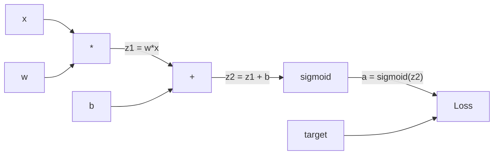
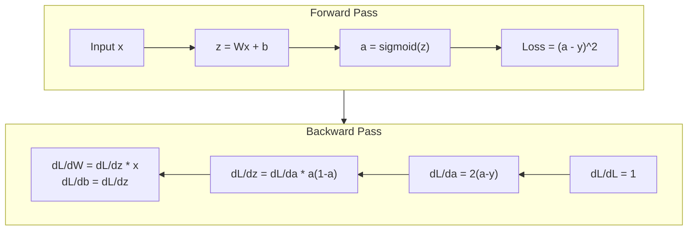
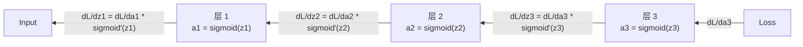

# 反向传播 from Scratch

> 反向传播 is the algorithm that makes learning possible. Without it, 神经网络s are just expensive random number generators.

**类型:** 实现
**语言:** Python
**Prerequisites:** Lesson 03.02 (Multi-层 Networks)
**Time:** ~120 minutes

## 学习目标

- Implement a Value-based 自动微分 engine that builds a 计算图 and computes 梯度s via topological sort
- Derive the backward pass for addition, multiplication, and sigmoid using the 链式法则
- Train a multi-层 network on XOR and circle classification using only your from-scratch 反向传播 engine
- Identify the vanishing 梯度 problem in deep sigmoid networks and explain why 梯度s shrink exponentially

## The Problem

Your network has a single hidden 层 with 768 inputs and 3072 outputs. That's 2,359,296 权重s. It made a wrong prediction. Which 权重s caused the error? Testing each 权重 individually means 2.3 million forward passes. 反向传播 computes all 2.3 million 梯度s in a single backward pass. That's not an optimization. That's the difference between trainable and impossible.

The naive approach: take one 权重, nudge it by a tiny amount, run the forward pass again, measure whether the loss went up or down. That gives you the 梯度 for that 权重. Now do it for every 权重 in the network. Multiply by thousands of training steps and millions of data points. You'd need geological time to train anything useful.

反向传播 solves this. One forward pass, one backward pass, all 梯度s computed. The trick is the 链式法则 from calculus, applied systematically to a 计算图. This is the algorithm that made deep learning practical. Without it, we'd still be stuck on toy problems.

## The Concept

### The 链式法则, Applied to Networks

You saw the 链式法则 in Phase 01, Lesson 05. Quick recap: if y = f(g(x)), then dy/dx = f'(g(x)) * g'(x). You multiply derivatives along the chain.

In a 神经网络, the "chain" is the sequence of operations from input to loss. Each 层 applies 权重s, adds 偏置es, passes through an activation. The 损失函数 compares the final output to the target. 反向传播 traces this chain backward, computing how each operation contributed to the error.

### 计算图s

Every forward pass builds a graph. Each node is an operation (multiply, add, sigmoid). Each edge carries a value forward and a 梯度 backward.



Forward pass: values flow left to right. x and w produce z1 = w*x. Add b to get z2. Sigmoid gives activation a. Compare a to target y using the 损失函数.

Backward pass: 梯度s flow right to left. Start with dL/da (how loss changes with the activation). Multiply by da/dz2 (sigmoid derivative). That gives dL/dz2. Split into dL/db (which equals dL/dz2, since z2 = z1 + b) and dL/dz1. Then dL/dw = dL/dz1 * x and dL/dx = dL/dz1 * w.

Every node in the graph has one job during the backward pass: take the 梯度 coming from above, multiply by its local derivative, and pass it down.

### Forward vs Backward



The forward pass stores every intermediate value: z, a, the inputs to each 层. The backward pass needs these stored values to compute 梯度s. This is the memory-computation tradeoff at the heart of backprop. You trade memory (storing activations) for speed (one pass instead of millions).

### 梯度 Flow Through a Network

For a 3-层 network, 梯度s chain through every 层:



At each 层, the 梯度 gets multiplied by the sigmoid derivative. The sigmoid derivative is a * (1 - a), which maxes out at 0.25 (when a = 0.5). Three 层s deep, the 梯度 has been multiplied by at most 0.25^3 = 0.0156. Ten 层s deep: 0.25^10 = 0.000001.

### Vanishing 梯度s

This is the vanishing 梯度 problem. Sigmoid squashes its output between 0 and 1. Its derivative is always less than 0.25. Stack enough sigmoid 层s and 梯度s shrink to nothing. Early 层s barely learn because they receive near-zero 梯度s.

```
sigmoid(z):     Output range [0, 1]
sigmoid'(z):    Max value 0.25 (at z = 0)

After 5 层s:   梯度 * 0.25^5 = 0.001x original
After 10 层s:  梯度 * 0.25^10 = 0.000001x original
```

This is why deep sigmoid networks are nearly impossible to train. The fix -- ReLU and its variants -- is the subject of Lesson 04. For now, understand that backprop works perfectly. The problem is what it's working through.

### Deriving 梯度s for a 2-层 Network

Concrete math for a network with input x, hidden 层 with sigmoid, output 层 with sigmoid, and 均方误差 loss.

Forward pass:
```
z1 = W1 * x + b1
a1 = sigmoid(z1)
z2 = W2 * a1 + b2
a2 = sigmoid(z2)
L = (a2 - y)^2
```

Backward pass (applying 链式法则 step by step):
```
dL/da2 = 2(a2 - y)
da2/dz2 = a2 * (1 - a2)
dL/dz2 = dL/da2 * da2/dz2 = 2(a2 - y) * a2 * (1 - a2)

dL/dW2 = dL/dz2 * a1
dL/db2 = dL/dz2

dL/da1 = dL/dz2 * W2
da1/dz1 = a1 * (1 - a1)
dL/dz1 = dL/da1 * da1/dz1

dL/dW1 = dL/dz1 * x
dL/db1 = dL/dz1
```

Every 梯度 is a product of local derivatives traced back from the loss. That's all 反向传播 is.

## Build It

### Step 1: The Value Node

Every number in our computation becomes a Value. It stores its data, its 梯度, and how it was created (so it knows how to compute 梯度s backward).

```python
class Value:
    def __init__(self, data, children=(), op=''):
        self.data = data
        self.grad = 0.0
        self._backward = lambda: None
        self._children = set(children)
        self._op = op

    def __repr__(self):
        return f"Value(data={self.data:.4f}, grad={self.grad:.4f})"
```

No 梯度 yet (0.0). No backward function yet (no-op). The `_children` track which Values produced this one, so we can topologically sort the graph later.

### Step 2: Operations with Backward Functions

Each operation creates a new Value and defines how 梯度s flow backward through it.

```python
def __add__(self, other):
    other = other if isinstance(other, Value) else Value(other)
    out = Value(self.data + other.data, (self, other), '+')

    def _backward():
        self.grad += out.grad
        other.grad += out.grad

    out._backward = _backward
    return out

def __mul__(self, other):
    other = other if isinstance(other, Value) else Value(other)
    out = Value(self.data * other.data, (self, other), '*')

    def _backward():
        self.grad += other.data * out.grad
        other.grad += self.data * out.grad

    out._backward = _backward
    return out
```

For addition: d(a+b)/da = 1, d(a+b)/db = 1. So both inputs get the output's 梯度 directly.

For multiplication: d(a*b)/da = b, d(a*b)/db = a. Each input gets the other's value times the output 梯度.

The `+=` is critical. A Value might be used in multiple operations. Its 梯度 is the sum of 梯度s from all paths.

### Step 3: Sigmoid and Loss

```python
import math

def sigmoid(self):
    x = self.data
    x = max(-500, min(500, x))
    s = 1.0 / (1.0 + math.exp(-x))
    out = Value(s, (self,), 'sigmoid')

    def _backward():
        self.grad += (s * (1 - s)) * out.grad

    out._backward = _backward
    return out
```

Sigmoid derivative: sigmoid(x) * (1 - sigmoid(x)). We computed sigmoid(x) = s during the forward pass. Reuse it. No extra work.

```python
def mse_loss(predicted, target):
    diff = predicted + Value(-target)
    return diff * diff
```

均方误差 for a single output: (predicted - target)^2. We express subtraction as addition with a negated Value.

### Step 4: Backward Pass

Topological sort ensures we process nodes in the right order -- a node's 梯度 is fully accumulated before we propagate through it.

```python
def backward(self):
    topo = []
    visited = set()

    def build_topo(v):
        if v not in visited:
            visited.add(v)
            for child in v._children:
                build_topo(child)
            topo.append(v)

    build_topo(self)
    self.grad = 1.0
    for v in reversed(topo):
        v._backward()
```

Start at the loss (梯度 = 1.0, since dL/dL = 1). Walk backward through the sorted graph. Each node's `_backward` pushes 梯度s to its children.

### Step 5: 层 and Network

```python
import random

class Neuron:
    def __init__(self, n_inputs):
        scale = (2.0 / n_inputs) ** 0.5
        self.权重s = [Value(random.uniform(-scale, scale)) for _ in range(n_inputs)]
        self.偏置 = Value(0.0)

    def __call__(self, x):
        act = sum((wi * xi for wi, xi in zip(self.权重s, x)), self.偏置)
        return act.sigmoid()

    def parameters(self):
        return self.权重s + [self.偏置]


class 层:
    def __init__(self, n_inputs, n_outputs):
        self.neurons = [Neuron(n_inputs) for _ in range(n_outputs)]

    def __call__(self, x):
        out = [n(x) for n in self.neurons]
        return out[0] if len(out) == 1 else out

    def parameters(self):
        params = []
        for n in self.neurons:
            params.extend(n.parameters())
        return params


class Network:
    def __init__(self, sizes):
        self.层s = []
        for i in range(len(sizes) - 1):
            self.层s.append(层(sizes[i], sizes[i + 1]))

    def __call__(self, x):
        for 层 in self.层s:
            x = 层(x)
            if not isinstance(x, list):
                x = [x]
        return x[0] if len(x) == 1 else x

    def parameters(self):
        params = []
        for 层 in self.层s:
            params.extend(层.parameters())
        return params

    def zero_grad(self):
        for p in self.parameters():
            p.grad = 0.0
```

A Neuron takes inputs, computes 权重ed sum + 偏置, and applies sigmoid. 权重 initialization scales by sqrt(2/n_inputs) to prevent sigmoid saturation in deeper networks. A 层 is a list of Neurons. A Network is a list of 层s. The `parameters()` method collects all learnable Values so we can update them.

### Step 6: Train on XOR

```python
random.seed(42)
net = Network([2, 4, 1])

xor_data = [
    ([0.0, 0.0], 0.0),
    ([0.0, 1.0], 1.0),
    ([1.0, 0.0], 1.0),
    ([1.0, 1.0], 0.0),
]

learning_rate = 1.0

for epoch in range(1000):
    total_loss = Value(0.0)
    for inputs, target in xor_data:
        x = [Value(i) for i in inputs]
        pred = net(x)
        loss = mse_loss(pred, target)
        total_loss = total_loss + loss

    net.zero_grad()
    total_loss.backward()

    for p in net.parameters():
        p.data -= learning_rate * p.grad

    if epoch % 100 == 0:
        print(f"Epoch {epoch:4d} | Loss: {total_loss.data:.6f}")

print("\nXOR Results:")
for inputs, target in xor_data:
    x = [Value(i) for i in inputs]
    pred = net(x)
    print(f"  {inputs} -> {pred.data:.4f} (expected {target})")
```

Watch the loss decrease. From random predictions to correct XOR outputs, driven entirely by 反向传播 computing 梯度s and nudging 权重s in the right direction.

### Step 7: Circle Classification

In Lesson 02, you hand-tuned 权重s for circle classification. Now let the network learn them.

```python
random.seed(7)

def generate_circle_data(n=100):
    data = []
    for _ in range(n):
        x1 = random.uniform(-1.5, 1.5)
        x2 = random.uniform(-1.5, 1.5)
        label = 1.0 if x1 * x1 + x2 * x2 < 1.0 else 0.0
        data.append(([x1, x2], label))
    return data

circle_data = generate_circle_data(80)

circle_net = Network([2, 8, 1])
learning_rate = 0.5

for epoch in range(2000):
    random.shuffle(circle_data)
    total_loss_val = 0.0
    for inputs, target in circle_data:
        x = [Value(i) for i in inputs]
        pred = circle_net(x)
        loss = mse_loss(pred, target)
        circle_net.zero_grad()
        loss.backward()
        for p in circle_net.parameters():
            p.data -= learning_rate * p.grad
        total_loss_val += loss.data

    if epoch % 200 == 0:
        correct = 0
        for inputs, target in circle_data:
            x = [Value(i) for i in inputs]
            pred = circle_net(x)
            predicted_class = 1.0 if pred.data > 0.5 else 0.0
            if predicted_class == target:
                correct += 1
        accuracy = correct / len(circle_data) * 100
        print(f"Epoch {epoch:4d} | Loss: {total_loss_val:.4f} | Accuracy: {accuracy:.1f}%")
```

We use online SGD here -- update 权重s after each sample instead of accumulating the full 批次. This breaks symmetry faster and avoids sigmoid saturation on the full loss landscape. Shuffling the data each epoch prevents the network from memorizing the order.

No hand-tuning. The network discovers the circular decision boundary on its own. That's the power of 反向传播: you define the architecture, the 损失函数, and the data. The algorithm figures out the 权重s.

## Use It

PyTorch does everything above in a few lines. The core idea is identical -- 自动微分 builds a 计算图 during the forward pass and traces it backward to compute 梯度s.

```python
import torch
import torch.nn as nn

model = nn.Sequential(
    nn.Linear(2, 4),
    nn.Sigmoid(),
    nn.Linear(4, 1),
    nn.Sigmoid(),
)
优化器 = torch.optim.SGD(model.parameters(), lr=1.0)
criterion = nn.均方误差Loss()

X = torch.tensor([[0,0],[0,1],[1,0],[1,1]], dtype=torch.float32)
y = torch.tensor([[0],[1],[1],[0]], dtype=torch.float32)

for epoch in range(1000):
    pred = model(X)
    loss = criterion(pred, y)
    优化器.zero_grad()
    loss.backward()
    优化器.step()

print("PyTorch XOR Results:")
with torch.no_grad():
    for i in range(4):
        pred = model(X[i])
        print(f"  {X[i].tolist()} -> {pred.item():.4f} (expected {y[i].item()})")
```

`loss.backward()` is your `total_loss.backward()`. `优化器.step()` is your manual `p.data -= lr * p.grad`. `优化器.zero_grad()` is your `net.zero_grad()`. Same algorithm, industrial-strength implementation. PyTorch handles GPU acceleration, mixed precision, 梯度 checkpointing, and hundreds of 层 types. But the backward pass is the same 链式法则 applied to the same 计算图.

Training runs the forward pass, then the backward pass, then updates 权重s. Inference runs only the forward pass. No 梯度s, no updates. This distinction matters because inference is what happens in production. When you call an API like Claude or GPT, you're running inference -- your prompt flows forward through the network, and tokens come out the other end. No 权重s change. Understanding backprop matters because it shaped every 权重 in that network.

## Ship It

This lesson produces:
- `outputs/prompt-梯度-debugger.md` -- a reusable prompt for diagnosing 梯度 problems (vanishing, exploding, NaN) in any 神经网络

## Exercises

1. Add a `__sub__` method to the Value class (a - b = a + (-1 * b)). Then implement a `__neg__` method. Verify that the 梯度s are correct by comparing with manual calculation for a simple expression like (a - b)^2.

2. Add a `relu` method to Value (output max(0, x), derivative is 1 if x > 0, else 0). Replace sigmoid with relu in the hidden 层s and train on XOR again. Compare 收敛 speed. You should see faster training -- this previews Lesson 04.

3. Implement a `__pow__` method on Value for integer powers. Use it to replace `mse_loss` with a proper `(predicted - target) ** 2` expression. Verify 梯度s match the original implementation.

4. Add 梯度 clipping to the training loop: after calling `backward()`, clip all 梯度s to [-1, 1]. Train a deeper network (4+ 层s with sigmoid) and compare loss curves with and without clipping. This is your first defense against exploding 梯度s.

5. Build a visualization: after training on XOR, print the 梯度 of every parameter in the network. Identify which 层 has the smallest 梯度s. This demonstrates the vanishing 梯度 problem you read about in the Concept section.

## Key Terms

| Term | What people say | What it actually means |
|------|----------------|----------------------|
| 反向传播 | "The network learns" | An algorithm that computes dL/dw for every 权重 by applying the 链式法则 backward through the 计算图 |
| Computational graph | "The network structure" | A directed acyclic graph where nodes are operations and edges carry values (forward) and 梯度s (backward) |
| Chain rule | "Multiply the derivatives" | If y = f(g(x)), then dy/dx = f'(g(x)) * g'(x) -- the mathematical foundation of 反向传播 |
| 梯度 | "The direction of steepest ascent" | The partial derivative of the loss with respect to a parameter -- tells you how to change that parameter to reduce the loss |
| Vanishing 梯度 | "Deep networks don't learn" | 梯度s shrink exponentially as they propagate through 层s with saturating activations like sigmoid |
| Forward pass | "Running the network" | Computing the output from inputs by sequentially applying each 层's operations and storing intermediate values |
| Backward pass | "Computing 梯度s" | Traversing the 计算图 in reverse, accumulating 梯度s at each node using the 链式法则 |
| Learning rate | "How fast it learns" | A scalar that controls the step size when updating 权重s: w_new = w_old - lr * 梯度 |
| Topological sort | "The right order" | An ordering of graph nodes where each node appears after all nodes it depends on -- ensures 梯度s are fully accumulated before propagation |
| 自动微分 | "Automatic differentiation" | A system that builds 计算图s during forward computation and automatically computes 梯度s -- what PyTorch's engine does |

## Further Reading

- Rumelhart, Hinton & Williams, "Learning representations by back-propagating errors" (1986) -- the paper that made 反向传播 mainstream and unlocked multi-层 network training
- 3Blue1Brown, "神经网络s" series (https://www.youtube.com/playlist?list=PLZHQObOWTQDNU6R1_67000Dx_ZCJB-3pi) -- the best visual explanation of 反向传播 and 梯度 flow through networks
