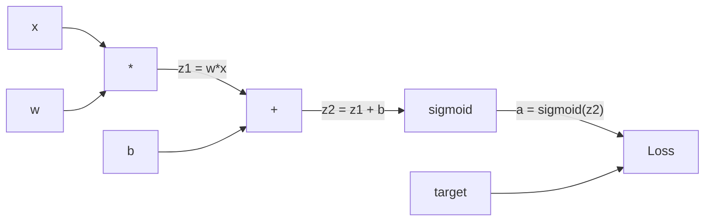
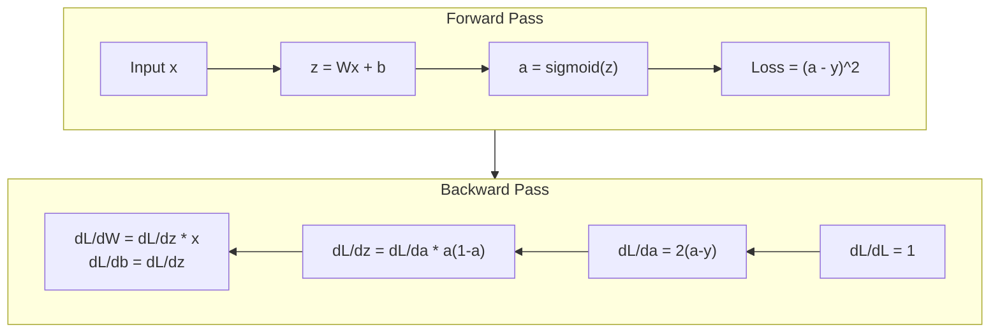
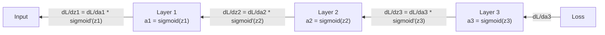

# 反向传播 从 Scratch

> 反向传播 是 算法 makes learning possible. Without it, 神经网络 是 just expensive random number generators.

**Type:** Build
**Languages:** Python
**Prerequisites:** Lesson 03.02 (Multi-层 Networks)
**Time:** ~120 minutes

## Learning Objectives

- Implement Value-based autograd engine builds computational graph 和 computes gradients via topological sort
- Derive backward pass 为了 addition, multiplication, 和 sigmoid using chain rule
- Train multi-层 network 在 XOR 和 circle 分类 using only your 从-scratch 反向传播 engine
- Identify vanishing gradient problem 在 deep sigmoid networks 和 explain why gradients shrink exponentially

## Problem

Your network has single hidden 层 使用 768 输入 和 3072 输出. That's 2,359,296 权重. It made wrong prediction. Which 权重 caused error? 测试 each 权重 individually means 2.3 million forward passes. 反向传播 computes all 2.3 million gradients 在 single backward pass. That's not optimization. That's difference between trainable 和 impossible.

naive approach: take one 权重, nudge it 通过 tiny amount, run forward pass again, measure whether loss went up 或 down. That gives you gradient 为了 权重. Now do it 为了 every 权重 在 network. Multiply 通过 thousands 的 训练 steps 和 millions 的 数据 points. You'd need geological time 到 train anything useful.

反向传播 solves 这个. One forward pass, one backward pass, all gradients computed. trick 是 chain rule 从 微积分, applied systematically 到 computational graph. 这是 算法 made deep learning practical. Without it, we'd still be stuck 在 toy problems.

## Concept

### Chain Rule, Applied 到 Networks

You saw chain rule 在 Phase 01, Lesson 05. Quick recap: if y = f(g(x)), then dy/dx = f'(g(x)) * g'(x). You multiply derivatives along chain.

In 神经网络, "chain" 是 sequence 的 operations 从 输入 到 loss. Each 层 applies 权重, adds 偏置, passes through activation. 损失函数 compares final 输出 到 target. 反向传播 traces 这个 chain backward, computing how each operation contributed 到 error.

### Computational Graphs

Every forward pass builds graph. Each 节点 是 operation (multiply, add, sigmoid). Each edge carries value forward 和 gradient backward.



Forward pass: values flow left 到 right. x 和 w produce z1 = w*x. Add b 到 get z2. Sigmoid gives activation . Compare 到 target y using 损失函数.

Backward pass: gradients flow right 到 left. Start 使用 dL/da (how loss changes 使用 activation). Multiply 通过 da/dz2 (sigmoid derivative). That gives dL/dz2. Split into dL/db (which equals dL/dz2, since z2 = z1 + b) 和 dL/dz1. Then dL/dw = dL/dz1 * x 和 dL/dx = dL/dz1 * w.

Every 节点 在 graph has one job during backward pass: take gradient coming 从 above, multiply 通过 its local derivative, 和 pass it down.

### Forward vs Backward



forward pass stores every intermediate value: z, , 输入 到 each 层. backward pass needs 这些 stored values 到 compute gradients. 这是 memory-computation tradeoff 在 heart 的 backprop. You trade memory (storing activations) 为了 speed (one pass instead 的 millions).

### Gradient Flow Through Network

For 3-层 network, gradients chain through every 层:



At each 层, gradient gets multiplied 通过 sigmoid derivative. sigmoid derivative 是 * (1 - ), which maxes out 在 0.25 (when = 0.5). Three 层 deep, gradient has been multiplied 通过 在 most 0.25^3 = 0.0156. Ten 层 deep: 0.25^10 = 0.000001.

### Vanishing Gradients

这是 vanishing gradient problem. Sigmoid squashes its 输出 between 0 和 1. Its derivative 是 always less than 0.25. Stack enough sigmoid 层 和 gradients shrink 到 nothing. Early 层 barely learn because they receive near-zero gradients.

```
sigmoid(z):     Output range [0, 1]
sigmoid'(z):    Max value 0.25 (at z = 0)

After 5 layers:   gradient * 0.25^5 = 0.001x original
After 10 layers:  gradient * 0.25^10 = 0.000001x original
```

这是 why deep sigmoid networks 是 nearly impossible 到 train. fix -- ReLU 和 its variants -- 是 subject 的 Lesson 04. For now, understand backprop works perfectly. problem 是 what it's working through.

### Deriving Gradients 为了 2-层 Network

Concrete math 为了 network 使用 输入 x, hidden 层 使用 sigmoid, 输出 层 使用 sigmoid, 和 MSE loss.

Forward pass:
```
z1 = W1 * x + b1
a1 = sigmoid(z1)
z2 = W2 * a1 + b2
a2 = sigmoid(z2)
L = (a2 - y)^2
```

Backward pass (applying chain rule step 通过 step):
```
dL/da2 = 2(a2 - y)
da2/dz2 = a2 * (1 - a2)
dL/dz2 = dL/da2 * da2/dz2 = 2(a2 - y) * a2 * (1 - a2)

dL/dW2 = dL/dz2 * a1
dL/db2 = dL/dz2

dL/da1 = dL/dz2 * W2
da1/dz1 = a1 * (1 - a1)
dL/dz1 = dL/da1 * da1/dz1

dL/dW1 = dL/dz1 * x
dL/db1 = dL/dz1
```

Every gradient 是 product 的 local derivatives traced back 从 loss. That's all 反向传播 是.

## Build It

### Step 1: Value 节点

Every number 在 our computation becomes Value. It stores its 数据, its gradient, 和 how it was created (so it knows how 到 compute gradients backward).

```python
class Value:
    def __init__(self, data, children=(), op=''):
        self.data = data
        self.grad = 0.0
        self._backward = lambda: None
        self._children = set(children)
        self._op = op

    def __repr__(self):
        return f"Value(data={self.data:.4f}, grad={self.grad:.4f})"
```

No gradient yet (0.0). No backward 函数 yet (no-op). `_children` track which Values produced 这个 one, so we can topologically sort graph later.

### Step 2: Operations 使用 Backward Functions

Each operation creates new Value 和 defines how gradients flow backward through it.

```python
def __add__(self, other):
    other = other if isinstance(other, Value) else Value(other)
    out = Value(self.data + other.data, (self, other), '+')

    def _backward():
        self.grad += out.grad
        other.grad += out.grad

    out._backward = _backward
    return out

def __mul__(self, other):
    other = other if isinstance(other, Value) else Value(other)
    out = Value(self.data * other.data, (self, other), '*')

    def _backward():
        self.grad += other.data * out.grad
        other.grad += self.data * out.grad

    out._backward = _backward
    return out
```

For addition: d(+b)/da = 1, d(+b)/db = 1. So both 输入 get 输出's gradient directly.

For multiplication: d(*b)/da = b, d(*b)/db = . Each 输入 gets other's value times 输出 gradient.

`+=` 是 critical. Value might be used 在 multiple operations. Its gradient 是 sum 的 gradients 从 all paths.

### Step 3: Sigmoid 和 Loss

```python
import math

def sigmoid(self):
    x = self.data
    x = max(-500, min(500, x))
    s = 1.0 / (1.0 + math.exp(-x))
    out = Value(s, (self,), 'sigmoid')

    def _backward():
        self.grad += (s * (1 - s)) * out.grad

    out._backward = _backward
    return out
```

Sigmoid derivative: sigmoid(x) * (1 - sigmoid(x)). We computed sigmoid(x) = s during forward pass. Reuse it. No extra work.

```python
def mse_loss(predicted, target):
    diff = predicted + Value(-target)
    return diff * diff
```

MSE 为了 single 输出: (predicted - target)^2. We express subtraction 作为 addition 使用 negated Value.

### Step 4: Backward Pass

Topological sort ensures we process 节点 在 right order -- 节点's gradient 是 fully accumulated before we propagate through it.

```python
def backward(self):
    topo = []
    visited = set()

    def build_topo(v):
        if v not in visited:
            visited.add(v)
            for child in v._children:
                build_topo(child)
            topo.append(v)

    build_topo(self)
    self.grad = 1.0
    for v in reversed(topo):
        v._backward()
```

Start 在 loss (gradient = 1.0, since dL/dL = 1). Walk backward through sorted graph. Each 节点's `_backward` pushes gradients 到 its children.

### Step 5: 层 和 Network

```python
import random

class Neuron:
    def __init__(self, n_inputs):
        scale = (2.0 / n_inputs) ** 0.5
        self.weights = [Value(random.uniform(-scale, scale)) for _ in range(n_inputs)]
        self.bias = Value(0.0)

    def __call__(self, x):
        act = sum((wi * xi for wi, xi in zip(self.weights, x)), self.bias)
        return act.sigmoid()

    def parameters(self):
        return self.weights + [self.bias]


class Layer:
    def __init__(self, n_inputs, n_outputs):
        self.neurons = [Neuron(n_inputs) for _ in range(n_outputs)]

    def __call__(self, x):
        out = [n(x) for n in self.neurons]
        return out[0] if len(out) == 1 else out

    def parameters(self):
        params = []
        for n in self.neurons:
            params.extend(n.parameters())
        return params


class Network:
    def __init__(self, sizes):
        self.layers = []
        for i in range(len(sizes) - 1):
            self.layers.append(Layer(sizes[i], sizes[i + 1]))

    def __call__(self, x):
        for layer in self.layers:
            x = layer(x)
            if not isinstance(x, list):
                x = [x]
        return x[0] if len(x) == 1 else x

    def parameters(self):
        params = []
        for layer in self.layers:
            params.extend(layer.parameters())
        return params

    def zero_grad(self):
        for p in self.parameters():
            p.grad = 0.0
```

神经元 takes 输入, computes weighted sum + 偏置, 和 applies sigmoid. 权重 initialization scales 通过 sqrt(2/n_inputs) 到 prevent sigmoid saturation 在 deeper networks. 层 是 list 的 Neurons. Network 是 list 的 Layers. `参数()` method collects all learnable Values so we can update them.

### Step 6: Train 在 XOR

```python
random.seed(42)
net = Network([2, 4, 1])

xor_data = [
    ([0.0, 0.0], 0.0),
    ([0.0, 1.0], 1.0),
    ([1.0, 0.0], 1.0),
    ([1.0, 1.0], 0.0),
]

learning_rate = 1.0

for epoch in range(1000):
    total_loss = Value(0.0)
    for inputs, target in xor_data:
        x = [Value(i) for i in inputs]
        pred = net(x)
        loss = mse_loss(pred, target)
        total_loss = total_loss + loss

    net.zero_grad()
    total_loss.backward()

    for p in net.parameters():
        p.data -= learning_rate * p.grad

    if epoch % 100 == 0:
        print(f"Epoch {epoch:4d} | Loss: {total_loss.data:.6f}")

print("\nXOR Results:")
for inputs, target in xor_data:
    x = [Value(i) for i in inputs]
    pred = net(x)
    print(f"  {inputs} -> {pred.data:.4f} (expected {target})")
```

Watch loss decrease. From random predictions 到 correct XOR 输出, driven entirely 通过 反向传播 computing gradients 和 nudging 权重 在 right direction.

### Step 7: Circle 分类

In Lesson 02, you hand-tuned 权重 为了 circle 分类. Now let network learn them.

```python
random.seed(7)

def generate_circle_data(n=100):
    data = []
    for _ in range(n):
        x1 = random.uniform(-1.5, 1.5)
        x2 = random.uniform(-1.5, 1.5)
        label = 1.0 if x1 * x1 + x2 * x2 < 1.0 else 0.0
        data.append(([x1, x2], label))
    return data

circle_data = generate_circle_data(80)

circle_net = Network([2, 8, 1])
learning_rate = 0.5

for epoch in range(2000):
    random.shuffle(circle_data)
    total_loss_val = 0.0
    for inputs, target in circle_data:
        x = [Value(i) for i in inputs]
        pred = circle_net(x)
        loss = mse_loss(pred, target)
        circle_net.zero_grad()
        loss.backward()
        for p in circle_net.parameters():
            p.data -= learning_rate * p.grad
        total_loss_val += loss.data

    if epoch % 200 == 0:
        correct = 0
        for inputs, target in circle_data:
            x = [Value(i) for i in inputs]
            pred = circle_net(x)
            predicted_class = 1.0 if pred.data > 0.5 else 0.0
            if predicted_class == target:
                correct += 1
        accuracy = correct / len(circle_data) * 100
        print(f"Epoch {epoch:4d} | Loss: {total_loss_val:.4f} | Accuracy: {accuracy:.1f}%")
```

We use online SGD here -- update 权重 after each sample instead 的 accumulating full 批次. This breaks symmetry faster 和 avoids sigmoid saturation 在 full loss landscape. Shuffling 数据 each 轮次 prevents network 从 memorizing order.

No hand-tuning. network discovers circular decision boundary 在 its own. That's power 的 反向传播: you define architecture, 损失函数, 和 数据. 算法 figures out 权重.

## Use It

PyTorch does everything above 在 few lines. core idea 是 identical -- autograd builds computational graph during forward pass 和 traces it backward 到 compute gradients.

```python
import torch
import torch.nn as nn

model = nn.Sequential(
    nn.Linear(2, 4),
    nn.Sigmoid(),
    nn.Linear(4, 1),
    nn.Sigmoid(),
)
optimizer = torch.optim.SGD(model.parameters(), lr=1.0)
criterion = nn.MSELoss()

X = torch.tensor([[0,0],[0,1],[1,0],[1,1]], dtype=torch.float32)
y = torch.tensor([[0],[1],[1],[0]], dtype=torch.float32)

for epoch in range(1000):
    pred = model(X)
    loss = criterion(pred, y)
    optimizer.zero_grad()
    loss.backward()
    optimizer.step()

print("PyTorch XOR Results:")
with torch.no_grad():
    for i in range(4):
        pred = model(X[i])
        print(f"  {X[i].tolist()} -> {pred.item():.4f} (expected {y[i].item()})")
```

`loss.backward()` 是 your `total_loss.backward()`. `优化器.step()` 是 your manual `p.数据 -= lr * p.grad`. `优化器.zero_grad()` 是 your `net.zero_grad()`. Same 算法, industrial-strength implementation. PyTorch handles GPU acceleration, mixed 精确率, gradient checkpointing, 和 hundreds 的 层 types. But backward pass 是 same chain rule applied 到 same computational graph.

训练 runs forward pass, then backward pass, then updates 权重. Inference runs only forward pass. No gradients, no updates. This distinction matters because inference 是 what happens 在 production. When you call API like Claude 或 GPT, you're running inference -- your prompt flows forward through network, 和 tokens come out other end. No 权重 change. Understanding backprop matters because it shaped every 权重 在 network.

## Ship It

This lesson produces:
- `输出/prompt-gradient-debugger.md` -- reusable prompt 为了 diagnosing gradient problems (vanishing, exploding, NaN) 在 any 神经网络

## Exercises

1. Add `__sub__` method 到 Value class ( - b = + (-1 * b)). Then implement `__neg__` method. Verify gradients 是 correct 通过 comparing 使用 manual calculation 为了 simple expression like ( - b)^2.

2. Add `relu` method 到 Value (输出 max(0, x), derivative 是 1 if x > 0, else 0). Replace sigmoid 使用 relu 在 hidden 层 和 train 在 XOR again. Compare 收敛 speed. 你应该 see faster 训练 -- 这个 previews Lesson 04.

3. Implement `__pow__` method 在 Value 为了 integer powers. Use it 到 replace `mse_loss` 使用 proper `(predicted - target) ** 2` expression. Verify gradients match original implementation.

4. Add gradient clipping 到 训练 loop: after calling `backward()`, clip all gradients 到 [-1, 1]. Train deeper network (4+ 层 使用 sigmoid) 和 compare loss curves 使用 和 without clipping. 这是 your first defense against exploding gradients.

5. Build visualization: after 训练 在 XOR, print gradient 的 every 参数 在 network. Identify which 层 has smallest gradients. This demonstrates vanishing gradient problem you read about 在 Concept section.

## Key Terms

| Term | What people say | What it actually means |
|------|----------------|----------------------|
| 反向传播 | " network learns" | 算法 computes dL/dw 为了 every 权重 通过 applying chain rule backward through computational graph |
| Computational graph | " network structure" | directed acyclic graph where 节点 是 operations 和 edges carry values (forward) 和 gradients (backward) |
| Chain rule | "Multiply derivatives" | If y = f(g(x)), then dy/dx = f'(g(x)) * g'(x) -- mathematical foundation 的 反向传播 |
| Gradient | " direction 的 steepest ascent" | partial derivative 的 loss 使用 respect 到 参数 -- tells you how 到 change 参数 到 reduce loss |
| Vanishing gradient | "Deep networks don't learn" | Gradients shrink exponentially 作为 they propagate through 层 使用 saturating activations like sigmoid |
| Forward pass | "Running network" | Computing 输出 从 输入 通过 sequentially applying each 层's operations 和 storing intermediate values |
| Backward pass | "Computing gradients" | Traversing computational graph 在 reverse, accumulating gradients 在 each 节点 using chain rule |
| Learning rate | "How fast it learns" | scalar controls step size when updating 权重: w_new = w_old - lr * gradient |
| Topological sort | " right order" | ordering 的 graph 节点 where each 节点 appears after all 节点 it depends 在 -- ensures gradients 是 fully accumulated before propagation |
| Autograd | "Automatic differentiation" | system builds computational graphs during forward computation 和 automatically computes gradients -- what PyTorch's engine does |

## Further Reading

- Rumelhart, Hinton & Williams, "Learning representations 通过 back-propagating errors" (1986) -- paper made 反向传播 mainstream 和 unlocked multi-层 network 训练
- 3Blue1Brown, "Neural Networks" series (https://www.youtube.com/playlist?list=PLZHQObOWTQDNU6R1_67000Dx_ZCJB-3pi) -- best visual explanation 的 反向传播 和 gradient flow through networks
