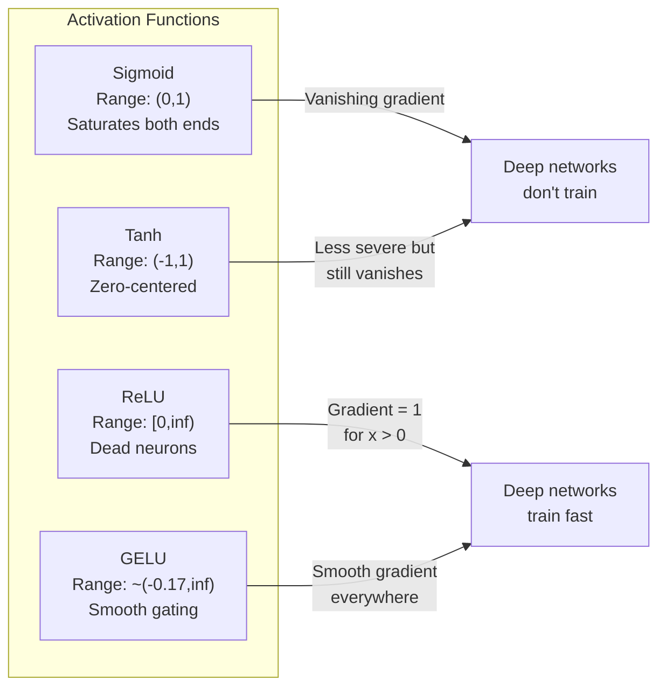
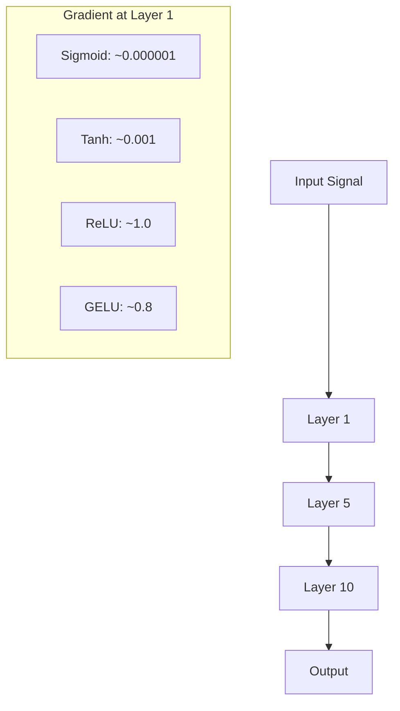
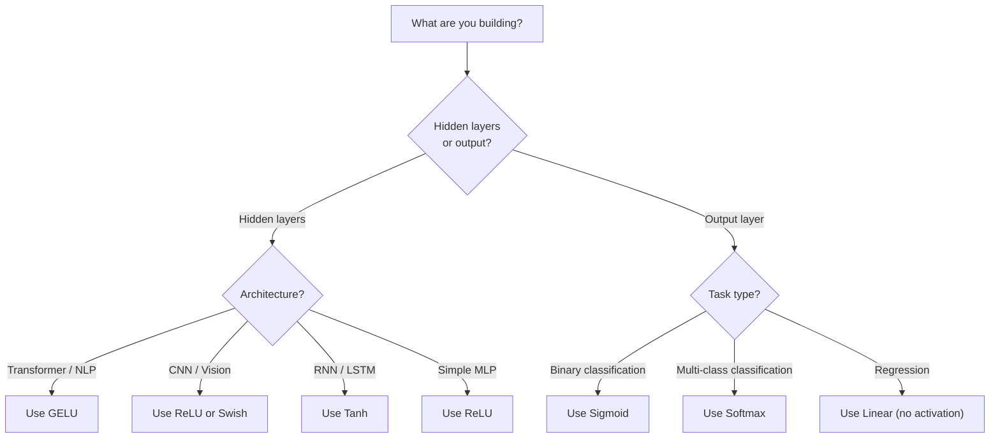

# Activation Functions

> Without nonlinearity, your 100-层 network 是 fancy 矩阵 multiply. Activations 是 gates let 神经网络 think 在 curves.

**Type:** Build
**Languages:** Python
**Prerequisites:** Lesson 03.03 (反向传播)
**Time:** ~75 minutes

## Learning Objectives

- Implement sigmoid, tanh, ReLU, Leaky ReLU, GELU, Swish, 和 softmax 使用 their derivatives 从 scratch
- Diagnose vanishing gradient problem 通过 measuring activation magnitudes through 10+ 层 使用 different activations
- Detect dead 神经元 在 ReLU network 和 explain why GELU avoids 这个 failure mode
- Select correct 激活函数 为了 given architecture (transformer, CNN, RNN, 输出 层)

## Problem

Stack two linear transformations: y = W2(W1x + b1) + b2. Expand it: y = W2W1x + W2b1 + b2. That's just y = Ax + c -- single linear transformation. No matter how many linear 层 you stack, result collapses 到 one 矩阵 multiply. Your 100-层 network has same representational power 作为 single 层.

这是 not theoretical curiosity. It means deep linear network literally cannot learn XOR, cannot classify spiral 数据集, cannot recognize face. Without activation 函数, depth 是 illusion.

Activation 函数 break linearity. They warp 输出 的 each 层 through nonlinear 函数, giving network ability 到 bend decision boundaries, approximate arbitrary 函数, 和 actually learn. But pick wrong activation 和 your gradients vanish 到 zero (sigmoid 在 deep networks), explode 到 infinity (unbounded activations without careful initialization), 或 your 神经元 die permanently (ReLU 使用 large negative 偏置). choice 的 激活函数 directly determines whether your network learns 在 all.

## Concept

### Why Nonlinearity Is Necessary

矩阵 multiplication 是 composable. Multiplying 向量 通过 矩阵 then 矩阵 B 是 identical 到 multiplying 通过 AB. This means stacking ten linear 层 是 mathematically equivalent 到 one linear 层 使用 one big 矩阵. All 那些 参数, all depth -- wasted. 你需要 something 到 break chain. That's what activation 函数 do.

Here 是 proof. linear 层 computes f(x) = Wx + b. Stack two:

```
Layer 1: h = W1 * x + b1
Layer 2: y = W2 * h + b2
```

Substitute:

```
y = W2 * (W1 * x + b1) + b2
y = (W2 * W1) * x + (W2 * b1 + b2)
y = A * x + c
```

One 层. Insert nonlinear activation g() between 层:

```
h = g(W1 * x + b1)
y = W2 * h + b2
```

Now substitution breaks. W2 * g(W1 * x + b1) + b2 cannot be reduced 到 single linear transformation. network can represent nonlinear 函数. Each additional 层 使用 activation adds representational capacity.

### Sigmoid

original 激活函数 为了 神经网络.

```
sigmoid(x) = 1 / (1 + e^(-x))
```

输出 range: (0, 1). Smooth, differentiable, maps any real number 到 概率-like value.

derivative:

```
sigmoid'(x) = sigmoid(x) * (1 - sigmoid(x))
```

maximum value 的 这个 derivative 是 0.25, occurring 在 x = 0. In 反向传播, gradients multiply through 层. Ten 层 的 sigmoid means gradient gets multiplied 通过 在 most 0.25 ten times:

```
0.25^10 = 0.000000953674
```

Less than one millionth 的 original signal. 这是 vanishing gradient problem. Gradients 在 early 层 become so small 权重 barely update. network appears 到 learn -- loss decreases 在 later 层 -- but first 层 是 frozen. Deep sigmoid networks simply do not train.

Additional problem: sigmoid 输出 是 always positive (0 到 1), which means gradients 在 权重 是 always same sign. This causes zig-zagging during 梯度下降.

### Tanh

centered version 的 sigmoid.

```
tanh(x) = (e^x - e^(-x)) / (e^x + e^(-x))
```

输出 range: (-1, 1). Zero-centered, which eliminates zig-zag problem.

derivative:

```
tanh'(x) = 1 - tanh(x)^2
```

Maximum derivative 是 1.0 在 x = 0 -- four times better than sigmoid. But vanishing gradient problem still exists. For large positive 或 negative 输入, derivative approaches zero. Ten 层 still crush gradient, just less aggressively.

### ReLU: Breakthrough

Rectified Linear Unit. Popularized 为了 deep learning 通过 Nair 和 Hinton 在 2010 ( 函数 itself dates 到 Fukushima's 1969 work), it changed everything.

```
relu(x) = max(0, x)
```

输出 range: [0, infinity). derivative 是 trivially simple:

```
relu'(x) = 1  if x > 0
            0  if x <= 0
```

No vanishing gradient 为了 positive 输入. gradient 是 exactly 1, passed straight through. 这是 why deep networks became trainable -- ReLU preserves gradient magnitude across 层.

But there 是 failure mode: dead 神经元 problem. If 神经元's weighted 输入 是 always negative (due 到 large negative 偏置 或 unfortunate 权重 initialization), its 输出 是 always zero, its gradient 是 always zero, 和 it never updates. 它是 permanently dead. In practice, 10-40% 的 神经元 在 ReLU network can die during 训练.

### Leaky ReLU

simplest fix 为了 dead 神经元.

```
leaky_relu(x) = x        if x > 0
                alpha * x if x <= 0
```

Where alpha 是 small constant, typically 0.01. negative side has small slope instead 的 zero, so dead 神经元 still get gradient signal 和 can recover.

### GELU: Modern Default

Gaussian Error Linear Unit. Introduced 通过 Hendrycks 和 Gimpel 在 2016. Default activation 在 BERT, GPT, 和 most modern transformers.

```
gelu(x) = x * Phi(x)
```

Where Phi(x) 是 cumulative distribution 函数 的 standard normal distribution. approximation used 在 practice:

```
gelu(x) ~= 0.5 * x * (1 + tanh(sqrt(2/pi) * (x + 0.044715 * x^3)))
```

GELU 是 smooth everywhere, allows small negative values (unlike ReLU which hard-clips 到 zero), 和 has probabilistic interpretation: it 权重 each 输入 通过 how likely it 是 到 be positive under Gaussian distribution. This smooth gating outperforms ReLU 在 transformer architectures because it provides better gradient flow 和 avoids dead 神经元 problem entirely.

### Swish / SiLU

Self-gated activation discovered 通过 Ramachandran et al. 在 2017 through automated search.

```
swish(x) = x * sigmoid(x)
```

Swish 是 formally x * sigmoid(x). Google discovered it through automated search over 激活函数 space -- 神经网络 designing parts 的 神经网络.

Like GELU, it 是 smooth, non-monotonic, 和 allows small negative values. difference 是 subtle: Swish uses sigmoid 为了 gating while GELU uses Gaussian CDF. In practice, performance 是 nearly identical. Swish 是 used 在 EfficientNet 和 some vision 模型. GELU dominates 在 language 模型.

### Softmax: 输出 Activation

Not used 在 hidden 层. Softmax converts 向量 的 raw scores (logits) into 概率 distribution.

```
softmax(x_i) = e^(x_i) / sum(e^(x_j) for all j)
```

Every 输出 是 between 0 和 1. All 输出 sum 到 1. This makes it standard final activation 为了 multi-class 分类. largest logit gets highest 概率, but unlike argmax, softmax 是 differentiable 和 preserves information about relative confidence.

### Comparison 的 Shapes



### Gradient Flow Comparison



### Which Activation When



## Build It

### Step 1: Implement All Activation Functions 使用 Derivatives

Each 函数 takes single float 和 returns float. Each derivative 函数 takes same 输入 和 returns gradient.

```python
import math

def sigmoid(x):
    x = max(-500, min(500, x))
    return 1.0 / (1.0 + math.exp(-x))

def sigmoid_derivative(x):
    s = sigmoid(x)
    return s * (1 - s)

def tanh_act(x):
    return math.tanh(x)

def tanh_derivative(x):
    t = math.tanh(x)
    return 1 - t * t

def relu(x):
    return max(0.0, x)

def relu_derivative(x):
    return 1.0 if x > 0 else 0.0

def leaky_relu(x, alpha=0.01):
    return x if x > 0 else alpha * x

def leaky_relu_derivative(x, alpha=0.01):
    return 1.0 if x > 0 else alpha

def gelu(x):
    return 0.5 * x * (1 + math.tanh(math.sqrt(2 / math.pi) * (x + 0.044715 * x ** 3)))

def gelu_derivative(x):
    phi = 0.5 * (1 + math.erf(x / math.sqrt(2)))
    pdf = math.exp(-0.5 * x * x) / math.sqrt(2 * math.pi)
    return phi + x * pdf

def swish(x):
    return x * sigmoid(x)

def swish_derivative(x):
    s = sigmoid(x)
    return s + x * s * (1 - s)

def softmax(xs):
    max_x = max(xs)
    exps = [math.exp(x - max_x) for x in xs]
    total = sum(exps)
    return [e / total for e in exps]
```

### Step 2: Visualize Where Gradients Die

Compute gradient 在 100 evenly-spaced points 从 -5 到 5. Print text histogram showing where each activation's gradient 是 near-zero.

```python
def gradient_scan(name, derivative_fn, start=-5, end=5, n=100):
    step = (end - start) / n
    near_zero = 0
    healthy = 0
    for i in range(n):
        x = start + i * step
        g = derivative_fn(x)
        if abs(g) < 0.01:
            near_zero += 1
        else:
            healthy += 1
    pct_dead = near_zero / n * 100
    print(f"{name:15s}: {healthy:3d} healthy, {near_zero:3d} near-zero ({pct_dead:.0f}% dead zone)")

gradient_scan("Sigmoid", sigmoid_derivative)
gradient_scan("Tanh", tanh_derivative)
gradient_scan("ReLU", relu_derivative)
gradient_scan("Leaky ReLU", leaky_relu_derivative)
gradient_scan("GELU", gelu_derivative)
gradient_scan("Swish", swish_derivative)
```

### Step 3: Vanishing Gradient Experiment

Forward-pass signal through N 层 using sigmoid vs ReLU. Measure how activation magnitude changes.

```python
import random

def vanishing_gradient_experiment(activation_fn, name, n_layers=10, n_inputs=5):
    random.seed(42)
    values = [random.gauss(0, 1) for _ in range(n_inputs)]

    print(f"\n{name} through {n_layers} layers:")
    for layer in range(n_layers):
        weights = [random.gauss(0, 1) for _ in range(n_inputs)]
        z = sum(w * v for w, v in zip(weights, values))
        activated = activation_fn(z)
        magnitude = abs(activated)
        bar = "#" * int(magnitude * 20)
        print(f"  Layer {layer+1:2d}: magnitude = {magnitude:.6f} {bar}")
        values = [activated] * n_inputs

vanishing_gradient_experiment(sigmoid, "Sigmoid")
vanishing_gradient_experiment(relu, "ReLU")
vanishing_gradient_experiment(gelu, "GELU")
```

### Step 4: Dead 神经元 Detector

Create ReLU network, pass random 输入 through it, count how many 神经元 never fire.

```python
def dead_neuron_detector(n_inputs=5, hidden_size=20, n_samples=1000):
    random.seed(0)
    weights = [[random.gauss(0, 1) for _ in range(n_inputs)] for _ in range(hidden_size)]
    biases = [random.gauss(0, 1) for _ in range(hidden_size)]

    fire_counts = [0] * hidden_size

    for _ in range(n_samples):
        inputs = [random.gauss(0, 1) for _ in range(n_inputs)]
        for neuron_idx in range(hidden_size):
            z = sum(w * x for w, x in zip(weights[neuron_idx], inputs)) + biases[neuron_idx]
            if relu(z) > 0:
                fire_counts[neuron_idx] += 1

    dead = sum(1 for c in fire_counts if c == 0)
    rarely_fire = sum(1 for c in fire_counts if 0 < c < n_samples * 0.05)
    healthy = hidden_size - dead - rarely_fire

    print(f"\nDead Neuron Report ({hidden_size} neurons, {n_samples} samples):")
    print(f"  Dead (never fired):     {dead}")
    print(f"  Barely alive (<5%):     {rarely_fire}")
    print(f"  Healthy:                {healthy}")
    print(f"  Dead neuron rate:       {dead/hidden_size*100:.1f}%")

    for i, c in enumerate(fire_counts):
        status = "DEAD" if c == 0 else "WEAK" if c < n_samples * 0.05 else "OK"
        bar = "#" * (c * 40 // n_samples)
        print(f"  Neuron {i:2d}: {c:4d}/{n_samples} fires [{status:4s}] {bar}")

dead_neuron_detector()
```

### Step 5: 训练 Comparison -- Sigmoid vs ReLU vs GELU

Train same two-层 network 在 circle 数据集 (points inside circle = class 1, outside = class 0) 使用 three different activations. Compare 收敛 speed.

```python
def make_circle_data(n=200, seed=42):
    random.seed(seed)
    data = []
    for _ in range(n):
        x = random.uniform(-2, 2)
        y = random.uniform(-2, 2)
        label = 1.0 if x * x + y * y < 1.5 else 0.0
        data.append(([x, y], label))
    return data


class ActivationNetwork:
    def __init__(self, activation_fn, activation_deriv, hidden_size=8, lr=0.1):
        random.seed(0)
        self.act = activation_fn
        self.act_d = activation_deriv
        self.lr = lr
        self.hidden_size = hidden_size

        self.w1 = [[random.gauss(0, 0.5) for _ in range(2)] for _ in range(hidden_size)]
        self.b1 = [0.0] * hidden_size
        self.w2 = [random.gauss(0, 0.5) for _ in range(hidden_size)]
        self.b2 = 0.0

    def forward(self, x):
        self.x = x
        self.z1 = []
        self.h = []
        for i in range(self.hidden_size):
            z = self.w1[i][0] * x[0] + self.w1[i][1] * x[1] + self.b1[i]
            self.z1.append(z)
            self.h.append(self.act(z))

        self.z2 = sum(self.w2[i] * self.h[i] for i in range(self.hidden_size)) + self.b2
        self.out = sigmoid(self.z2)
        return self.out

    def backward(self, target):
        error = self.out - target
        d_out = error * self.out * (1 - self.out)

        for i in range(self.hidden_size):
            d_h = d_out * self.w2[i] * self.act_d(self.z1[i])
            self.w2[i] -= self.lr * d_out * self.h[i]
            for j in range(2):
                self.w1[i][j] -= self.lr * d_h * self.x[j]
            self.b1[i] -= self.lr * d_h
        self.b2 -= self.lr * d_out

    def train(self, data, epochs=200):
        losses = []
        for epoch in range(epochs):
            total_loss = 0
            correct = 0
            for x, y in data:
                pred = self.forward(x)
                self.backward(y)
                total_loss += (pred - y) ** 2
                if (pred >= 0.5) == (y >= 0.5):
                    correct += 1
            avg_loss = total_loss / len(data)
            accuracy = correct / len(data) * 100
            losses.append(avg_loss)
            if epoch % 50 == 0 or epoch == epochs - 1:
                print(f"    Epoch {epoch:3d}: loss={avg_loss:.4f}, accuracy={accuracy:.1f}%")
        return losses


data = make_circle_data()

configs = [
    ("Sigmoid", sigmoid, sigmoid_derivative),
    ("ReLU", relu, relu_derivative),
    ("GELU", gelu, gelu_derivative),
]

results = {}
for name, act_fn, act_d_fn in configs:
    print(f"\n=== Training with {name} ===")
    net = ActivationNetwork(act_fn, act_d_fn, hidden_size=8, lr=0.1)
    losses = net.train(data, epochs=200)
    results[name] = losses

print("\n=== Final Loss Comparison ===")
for name, losses in results.items():
    print(f"  {name:10s}: start={losses[0]:.4f} -> end={losses[-1]:.4f} (improvement: {(1 - losses[-1]/losses[0])*100:.1f}%)")
```

## Use It

PyTorch provides all 的 这些 作为 both functional 和 module forms:

```python
import torch
import torch.nn as nn
import torch.nn.functional as F

x = torch.randn(4, 10)

relu_out = F.relu(x)
gelu_out = F.gelu(x)
sigmoid_out = torch.sigmoid(x)
swish_out = F.silu(x)

logits = torch.randn(4, 5)
probs = F.softmax(logits, dim=1)

model = nn.Sequential(
    nn.Linear(10, 64),
    nn.GELU(),
    nn.Linear(64, 32),
    nn.GELU(),
    nn.Linear(32, 5),
)
```

Hidden 层 在 transformer: GELU. Hidden 层 在 CNN: ReLU. 输出 层 为了 分类: softmax. 输出 层 为了 回归: none (linear). 输出 层 为了 probabilities: sigmoid. That's it. Start 使用 这些 defaults. Change them only when you have evidence.

RNNs 和 LSTMs use tanh 为了 hidden state 和 sigmoid 为了 gates, but if you're building 从 scratch today, you're probably not using RNNs. If 神经元 是 dying 在 your ReLU network, switch 到 GELU. Don't reach 为了 Leaky ReLU unless you have specific reason -- GELU solves dead 神经元 problem 和 gives better gradient flow.

## Ship It

This lesson produces:
- `输出/prompt-activation-selector.md` -- reusable prompt helps you pick right 激活函数 为了 any architecture

## Exercises

1. Implement Parametric ReLU (PReLU) where negative slope alpha 是 learnable 参数. Train it 在 circle 数据集 和 compare 到 fixed Leaky ReLU.

2. Run vanishing gradient experiment 使用 50 层 instead 的 10. Plot magnitude 在 each 层 为了 sigmoid, tanh, ReLU, 和 GELU. At which 层 does each activation's signal effectively reach zero?

3. Implement ELU (Exponential Linear Unit): elu(x) = x if x > 0, alpha * (e^x - 1) if x <= 0. Compare its dead 神经元 rate 到 ReLU 在 same network.

4. Build "gradient health monitor" runs during 训练: 在 each 轮次, compute average gradient magnitude 在 each 层. Print warning when any 层's gradient drops below 0.001 或 exceeds 100.

5. Modify 训练 comparison 到 use XOR 数据集 从 Lesson 01 instead 的 circles. Which activation converges fastest 在 XOR? Why does 这个 differ 从 circle results?

## Key Terms

| Term | What people say | What it actually means |
|------|----------------|----------------------|
| Activation 函数 | " nonlinear part" | 函数 applied 到 each 神经元's 输出 breaks linearity, enabling network 到 learn nonlinear mappings |
| Vanishing gradient | "Gradients disappear 在 deep networks" | Gradients shrink exponentially through 层 when activation's derivative 是 less than 1, making early 层 untrainable |
| Exploding gradient | "Gradients blow up" | Gradients grow exponentially through 层 when effective multiplier exceeds 1, causing unstable 训练 |
| Dead 神经元 | " 神经元 stopped learning" | ReLU 神经元 whose 输入 是 permanently negative, producing zero 输出 和 zero gradient |
| Sigmoid | "Squishes values 到 0-1" | logistic 函数 1/(1+e^-x), historically important but causes vanishing gradients 在 deep networks |
| ReLU | "Clips negatives 到 zero" | max(0, x) -- activation made deep learning practical 通过 preserving gradient magnitude |
| GELU | " transformer activation" | Gaussian Error Linear Unit, smooth activation 权重 输入 通过 their 概率 的 being positive |
| Swish/SiLU | "Self-gated ReLU" | x * sigmoid(x), discovered through automated search, used 在 EfficientNet |
| Softmax | "Turns scores into probabilities" | Normalizes 向量 的 logits into 概率 distribution where all values 是 在 (0,1) 和 sum 到 1 |
| Leaky ReLU | "ReLU doesn't die" | max(alpha*x, x) where alpha 是 small (0.01), preventing dead 神经元 通过 allowing small negative gradients |
| Saturation | " flat part 的 sigmoid" | Regions where activation's derivative approaches zero, blocking gradient flow |
| Logit | " raw score before softmax" | unnormalized 输出 的 final 层 before applying softmax 或 sigmoid |

## Further Reading

- Nair & Hinton, "Rectified Linear Units Improve Restricted Boltzmann Machines" (2010) -- paper introduced ReLU 和 enabled 训练 的 deep networks
- Hendrycks & Gimpel, "Gaussian Error Linear Units (GELUs)" (2016) -- introduced 激活函数 became default 为了 transformers
- Ramachandran et al., "Searching 为了 Activation Functions" (2017) -- used automated search 到 discover Swish, showing activation design can be automated
- Glorot & Bengio, "Understanding difficulty 的 训练 deep feedforward 神经网络" (2010) -- paper diagnosed vanishing/exploding gradients 和 proposed Xavier initialization
- Goodfellow, Bengio, Courville, "Deep Learning" Chapter 6.3 (https://www.deeplearningbook.org/) -- rigorous treatment 的 hidden units 和 activation 函数
