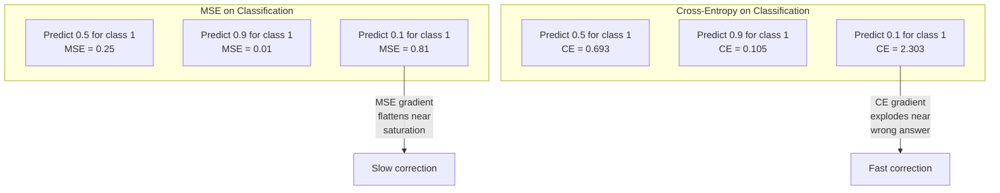
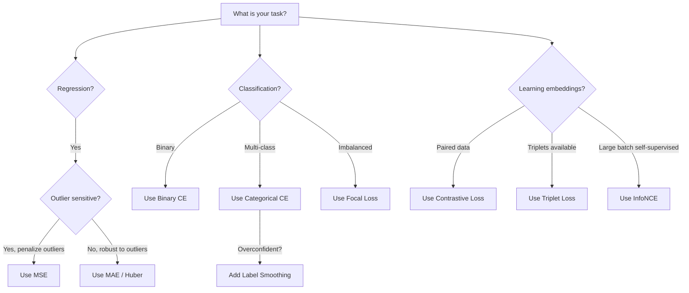
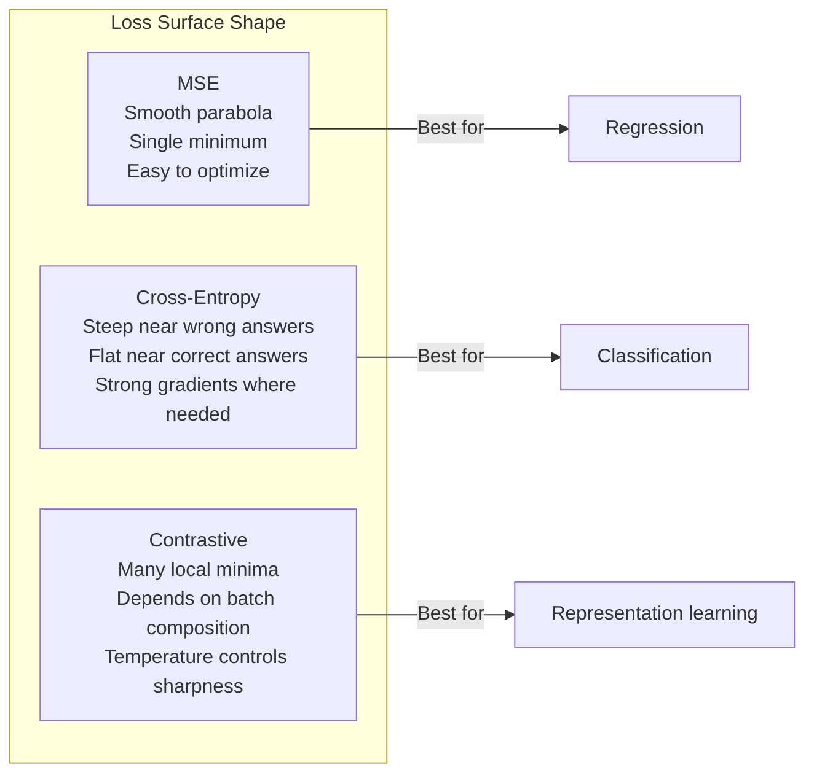

# Loss Functions

> Your network makes prediction. ground truth says otherwise. How wrong 是 it? That number 是 loss. Pick wrong 损失函数 和 your 模型 optimizes 为了 wrong thing entirely.

**Type:** Build
**Languages:** Python
**Prerequisites:** Lesson 03.04 (Activation Functions)
**Time:** ~75 minutes

## Learning Objectives

- Implement MSE, binary cross-entropy, categorical cross-entropy, 和 contrastive loss (InfoNCE) 从 scratch 使用 their gradients
- Explain why MSE fails 为了 分类 通过 demonstrating "predict 0.5 为了 everything" failure mode
- Apply label smoothing 到 cross-entropy 和 describe how it prevents overconfident predictions
- Choose correct 损失函数 为了 回归, binary 分类, multi-class 分类, 和 embedding learning tasks

## Problem

模型 minimizing MSE 在 分类 problem will confidently predict 0.5 为了 everything. It's minimizing loss. It's also useless.

损失函数 是 only thing your 模型 actually optimizes. Not 准确率. Not F1 score. Not whatever metric you report 到 your manager. 优化器 takes gradient 的 损失函数 和 adjusts 权重 到 make number smaller. If 损失函数 doesn't capture what you care about, 模型 will find mathematically cheapest way 到 satisfy it, 和 way 是 almost never what you wanted.

Here 是 concrete example. You have binary 分类 task. Two classes, 50/50 split. You use MSE 作为 your loss. 模型 predicts 0.5 为了 every single 输入. average MSE 是 0.25, which 是 minimum possible without actually learning anything. 模型 has zero discriminative ability but it has technically minimized your 损失函数. Switch 到 cross-entropy 和 same 模型 是 forced 到 push predictions toward 0 或 1, because -log(0.5) = 0.693 是 terrible loss, while -log(0.99) = 0.01 rewards confident correct predictions. choice 的 损失函数 是 difference between 模型 learns 和 模型 games metric.

It gets worse. In self-supervised learning, you don't even have labels. Contrastive loss defines learning signal entirely: what counts 作为 similar, what counts 作为 different, 和 how hard 模型 should push them apart. Get contrastive loss wrong 和 your embeddings collapse 到 single point -- every 输入 maps 到 same 向量. Technically zero loss. Completely worthless.

## Concept

### Mean Squared Error (MSE)

default 为了 回归. Compute squared difference between prediction 和 target, average over all samples.

```
MSE = (1/n) * sum((y_pred - y_true)^2)
```

Why squaring matters: it penalizes large errors quadratically. error 的 2 costs 4x 作为 much 作为 error 的 1. error 的 10 costs 100x. This makes MSE sensitive 到 outliers -- single wildly wrong prediction dominates loss.

Real numbers: if your 模型 predicts housing prices 和 是 off 通过 $10,000 在 most houses but off 通过 $200,000 在 one mansion, MSE will aggressively try 到 fix one mansion, potentially hurting performance 在 other 99 houses.

gradient 的 MSE 使用 respect 到 prediction 是:

```
dMSE/dy_pred = (2/n) * (y_pred - y_true)
```

Linear 在 error. Bigger errors get bigger gradients. 这是 特征 为了 回归 (large errors need large corrections) 和 bug 为了 分类 (you want 到 penalize confident wrong answers exponentially, not linearly).

### Cross-Entropy Loss

损失函数 为了 分类. Rooted 在 information theory -- it measures divergence between predicted 概率 distribution 和 true distribution.

**Binary Cross-Entropy (BCE):**

```
BCE = -(y * log(p) + (1 - y) * log(1 - p))
```

Where y 是 true label (0 或 1) 和 p 是 predicted 概率.

Why -log(p) works: when true label 是 1 和 you predict p = 0.99, loss 是 -log(0.99) = 0.01. When you predict p = 0.01, loss 是 -log(0.01) = 4.6. That 460x difference 是 why cross-entropy works. It brutally punishes confident wrong predictions while barely penalizing confident correct ones.

gradient tells same story:

```
dBCE/dp = -(y/p) + (1-y)/(1-p)
```

When y = 1 和 p 是 near zero, gradient 是 -1/p which approaches negative infinity. 模型 gets enormous signal 到 fix its mistake. When p 是 near 1, gradient 是 tiny. Already correct, nothing 到 fix.

**Categorical Cross-Entropy:**

For multi-class 分类 使用 one-hot encoded targets.

```
CCE = -sum(y_i * log(p_i))
```

Only true class contributes 到 loss (because all other y_i 是 zero). If there 是 10 classes 和 correct class gets 概率 0.1 (random guessing), loss 是 -log(0.1) = 2.3. If correct class gets 概率 0.9, loss 是 -log(0.9) = 0.105. 模型 learns 到 concentrate 概率 mass 在 right answer.

### Why MSE Fails 为了 分类



MSE gradients flatten when predictions 是 near 0 或 1 (due 到 sigmoid saturation). Cross-entropy gradients compensate 为了 这个 -- -log cancels sigmoid's flat regions, giving strong gradients exactly where they 是 needed most.

### Label Smoothing

Standard one-hot labels say "这个 是 100% class 3 和 0% everything else." That's strong claim. Label smoothing softens it:

```
smooth_label = (1 - alpha) * one_hot + alpha / num_classes
```

With alpha = 0.1 和 10 classes: instead 的 [0, 0, 1, 0, ...], target becomes [0.01, 0.01, 0.91, 0.01, ...]. 模型 targets 0.91 instead 的 1.0.

Why 这个 works: 模型 trying 到 输出 exactly 1.0 through softmax needs 到 push logits 到 infinity. This causes overconfidence, hurts generalization, 和 makes 模型 brittle 到 distribution shift. Label smoothing caps target 在 0.9 (使用 alpha=0.1), keeping logits 在 reasonable range. GPT 和 most modern 模型 use label smoothing 或 its equivalent.

### Contrastive Loss

No labels. No classes. Just pairs 的 输入 和 question: 是 这些 similar 或 different?

**SimCLR-style contrastive loss (NT-Xent / InfoNCE):**

Take one image. Create two augmented views 的 it (crop, rotate, color jitter). These 是 "positive pair" -- they should have similar embeddings. Every other image 在 批次 forms "negative pair" -- they should have different embeddings.

```
L = -log(exp(sim(z_i, z_j) / tau) / sum(exp(sim(z_i, z_k) / tau)))
```

Where sim() 是 cosine similarity, z_i 和 z_j 是 positive pair, sum 是 over all negatives, 和 tau (temperature) controls how sharp distribution 是. Lower temperature = harder negatives = more aggressive separation.

Real numbers: 批次 size 256 means 255 negatives per positive pair. Temperature tau = 0.07 (SimCLR default). loss looks like softmax over similarities -- it wants positive pair's similarity 到 be highest among all 256 options.

**Triplet Loss:**

Takes three 输入: anchor, positive (same class), negative (different class).

```
L = max(0, d(anchor, positive) - d(anchor, negative) + margin)
```

margin (typically 0.2-1.0) enforces minimum gap between positive 和 negative distances. If negative 是 already far enough away, loss 是 zero -- no gradient, no update. This makes 训练 efficient but requires careful triplet mining (choosing hard negatives 是 close 到 anchor).

### Focal Loss

For imbalanced 数据集. Standard cross-entropy treats all correctly classified examples equally. Focal loss down-权重 easy examples:

```
FL = -alpha * (1 - p_t)^gamma * log(p_t)
```

Where p_t 是 predicted 概率 的 true class 和 gamma controls focusing. With gamma = 0, 这个 是 standard cross-entropy. With gamma = 2 ( default):

- Easy example (p_t = 0.9): 权重 = (0.1)^2 = 0.01. Effectively ignored.
- Hard example (p_t = 0.1): 权重 = (0.9)^2 = 0.81. Full gradient signal.

Focal loss was introduced 通过 Lin et al. 为了 object detection, where 99% 的 candidate regions 是 background (easy negatives). Without focal loss, 模型 drowns 在 easy background examples 和 never learns 到 detect objects. With it, 模型 focuses its capacity 在 hard, ambiguous cases matter.

### 损失函数 Decision Tree



### Loss Landscape



## Build It

### Step 1: MSE 和 Its Gradient

```python
def mse(predictions, targets):
    n = len(predictions)
    total = 0.0
    for p, t in zip(predictions, targets):
        total += (p - t) ** 2
    return total / n

def mse_gradient(predictions, targets):
    n = len(predictions)
    grads = []
    for p, t in zip(predictions, targets):
        grads.append(2.0 * (p - t) / n)
    return grads
```

### Step 2: Binary Cross-Entropy

log(0) problem 是 real. If 模型 predicts exactly 0 为了 positive example, log(0) = negative infinity. Clipping prevents 这个.

```python
import math

def binary_cross_entropy(predictions, targets, eps=1e-15):
    n = len(predictions)
    total = 0.0
    for p, t in zip(predictions, targets):
        p_clipped = max(eps, min(1 - eps, p))
        total += -(t * math.log(p_clipped) + (1 - t) * math.log(1 - p_clipped))
    return total / n

def bce_gradient(predictions, targets, eps=1e-15):
    grads = []
    for p, t in zip(predictions, targets):
        p_clipped = max(eps, min(1 - eps, p))
        grads.append(-(t / p_clipped) + (1 - t) / (1 - p_clipped))
    return grads
```

### Step 3: Categorical Cross-Entropy 使用 Softmax

Softmax converts raw logits 到 probabilities. Then we compute cross-entropy against one-hot targets.

```python
def softmax(logits):
    max_val = max(logits)
    exps = [math.exp(x - max_val) for x in logits]
    total = sum(exps)
    return [e / total for e in exps]

def categorical_cross_entropy(logits, target_index, eps=1e-15):
    probs = softmax(logits)
    p = max(eps, probs[target_index])
    return -math.log(p)

def cce_gradient(logits, target_index):
    probs = softmax(logits)
    grads = list(probs)
    grads[target_index] -= 1.0
    return grads
```

gradient 的 softmax + cross-entropy simplifies beautifully: it's just (predicted 概率 - 1) 为了 true class, 和 (predicted 概率) 为了 all other classes. This elegant simplification 是 not coincidence -- it's why softmax 和 cross-entropy 是 paired.

### Step 4: Label Smoothing

```python
def label_smoothed_cce(logits, target_index, num_classes, alpha=0.1, eps=1e-15):
    probs = softmax(logits)
    loss = 0.0
    for i in range(num_classes):
        if i == target_index:
            smooth_target = 1.0 - alpha + alpha / num_classes
        else:
            smooth_target = alpha / num_classes
        p = max(eps, probs[i])
        loss += -smooth_target * math.log(p)
    return loss
```

### Step 5: Contrastive Loss (Simplified InfoNCE)

```python
def cosine_similarity(a, b):
    dot = sum(x * y for x, y in zip(a, b))
    norm_a = math.sqrt(sum(x * x for x in a))
    norm_b = math.sqrt(sum(x * x for x in b))
    if norm_a < 1e-10 or norm_b < 1e-10:
        return 0.0
    return dot / (norm_a * norm_b)

def contrastive_loss(anchor, positive, negatives, temperature=0.07):
    sim_pos = cosine_similarity(anchor, positive) / temperature
    sim_negs = [cosine_similarity(anchor, neg) / temperature for neg in negatives]

    max_sim = max(sim_pos, max(sim_negs)) if sim_negs else sim_pos
    exp_pos = math.exp(sim_pos - max_sim)
    exp_negs = [math.exp(s - max_sim) for s in sim_negs]
    total_exp = exp_pos + sum(exp_negs)

    return -math.log(max(1e-15, exp_pos / total_exp))
```

### Step 6: MSE vs Cross-Entropy 在 分类

Train same network 从 lesson 04 (circle 数据集) 使用 both loss 函数. Watch cross-entropy converge faster.

```python
import random

def sigmoid(x):
    x = max(-500, min(500, x))
    return 1.0 / (1.0 + math.exp(-x))

def make_circle_data(n=200, seed=42):
    random.seed(seed)
    data = []
    for _ in range(n):
        x = random.uniform(-2, 2)
        y = random.uniform(-2, 2)
        label = 1.0 if x * x + y * y < 1.5 else 0.0
        data.append(([x, y], label))
    return data


class LossComparisonNetwork:
    def __init__(self, loss_type="bce", hidden_size=8, lr=0.1):
        random.seed(0)
        self.loss_type = loss_type
        self.lr = lr
        self.hidden_size = hidden_size

        self.w1 = [[random.gauss(0, 0.5) for _ in range(2)] for _ in range(hidden_size)]
        self.b1 = [0.0] * hidden_size
        self.w2 = [random.gauss(0, 0.5) for _ in range(hidden_size)]
        self.b2 = 0.0

    def forward(self, x):
        self.x = x
        self.z1 = []
        self.h = []
        for i in range(self.hidden_size):
            z = self.w1[i][0] * x[0] + self.w1[i][1] * x[1] + self.b1[i]
            self.z1.append(z)
            self.h.append(max(0.0, z))

        self.z2 = sum(self.w2[i] * self.h[i] for i in range(self.hidden_size)) + self.b2
        self.out = sigmoid(self.z2)
        return self.out

    def backward(self, target):
        if self.loss_type == "mse":
            d_loss = 2.0 * (self.out - target)
        else:
            eps = 1e-15
            p = max(eps, min(1 - eps, self.out))
            d_loss = -(target / p) + (1 - target) / (1 - p)

        d_sigmoid = self.out * (1 - self.out)
        d_out = d_loss * d_sigmoid

        for i in range(self.hidden_size):
            d_relu = 1.0 if self.z1[i] > 0 else 0.0
            d_h = d_out * self.w2[i] * d_relu
            self.w2[i] -= self.lr * d_out * self.h[i]
            for j in range(2):
                self.w1[i][j] -= self.lr * d_h * self.x[j]
            self.b1[i] -= self.lr * d_h
        self.b2 -= self.lr * d_out

    def compute_loss(self, pred, target):
        if self.loss_type == "mse":
            return (pred - target) ** 2
        else:
            eps = 1e-15
            p = max(eps, min(1 - eps, pred))
            return -(target * math.log(p) + (1 - target) * math.log(1 - p))

    def train(self, data, epochs=200):
        losses = []
        for epoch in range(epochs):
            total_loss = 0.0
            correct = 0
            for x, y in data:
                pred = self.forward(x)
                self.backward(y)
                total_loss += self.compute_loss(pred, y)
                if (pred >= 0.5) == (y >= 0.5):
                    correct += 1
            avg_loss = total_loss / len(data)
            accuracy = correct / len(data) * 100
            losses.append((avg_loss, accuracy))
            if epoch % 50 == 0 or epoch == epochs - 1:
                print(f"    Epoch {epoch:3d}: loss={avg_loss:.4f}, accuracy={accuracy:.1f}%")
        return losses
```

## Use It

PyTorch provides all standard loss 函数 使用 numerical stability built 在:

```python
import torch
import torch.nn as nn
import torch.nn.functional as F

predictions = torch.tensor([0.9, 0.1, 0.7], requires_grad=True)
targets = torch.tensor([1.0, 0.0, 1.0])

mse_loss = F.mse_loss(predictions, targets)
bce_loss = F.binary_cross_entropy(predictions, targets)

logits = torch.randn(4, 10)
labels = torch.tensor([3, 7, 1, 9])
ce_loss = F.cross_entropy(logits, labels)
ce_smooth = F.cross_entropy(logits, labels, label_smoothing=0.1)
```

Use `F.cross_entropy` (not `F.nll_loss` plus manual softmax). It combines log-softmax 和 negative log-likelihood 在 one numerically stable operation. Applying softmax separately then taking log 是 less stable -- you lose 精确率 在 subtraction 的 large exponentials.

For contrastive learning, most teams use custom implementations 或 libraries like `lightly` 或 `pytorch-metric-learning`. core loop 是 always same: compute pairwise similarities, create softmax over positives 和 negatives, backpropagate.

## Ship It

This lesson produces:
- `输出/prompt-loss-函数-selector.md` -- reusable prompt 为了 choosing right 损失函数
- `输出/prompt-loss-debugger.md` -- diagnostic prompt 为了 when your loss curve looks wrong

## Exercises

1. Implement Huber loss (smooth L1 loss), which 是 MSE 为了 small errors 和 MAE 为了 large errors. Train 回归 network predicting y = sin(x) 使用 MSE vs Huber when 5% 的 训练 targets have random noise added (outliers). Compare final test error.

2. Add focal loss 到 binary 分类 训练 loop. Create imbalanced 数据集 (90% class 0, 10% class 1). Compare standard BCE vs focal loss (gamma=2) 在 minority class 召回率 after 200 轮次.

3. Implement triplet loss 使用 semi-hard negative mining. Generate 2D embedding 数据 为了 5 classes. For each anchor, find hardest negative 是 still farther than positive (semi-hard). Compare 收敛 到 random triplet selection.

4. Run MSE vs cross-entropy comparison but track gradient magnitudes 在 each 层 during 训练. Plot average gradient norm per 轮次. Verify cross-entropy produces larger gradients 在 early 轮次 when 模型 是 most uncertain.

5. Implement KL divergence loss 和 verify minimizing KL(true || predicted) gives same gradients 作为 cross-entropy when true distribution 是 one-hot. Then try soft targets (like knowledge distillation) where "true" distribution comes 从 teacher 模型's softmax 输出.

## Key Terms

| Term | What people say | What it actually means |
|------|----------------|----------------------|
| Loss 函数 | "How wrong 模型 是" | differentiable 函数 mapping predictions 和 targets 到 scalar 优化器 minimizes |
| MSE | "Average squared error" | Mean 的 squared differences between predictions 和 targets; penalizes large errors quadratically |
| Cross-entropy | " 分类 loss" | Measures divergence between predicted 概率 distribution 和 true distribution using -log(p) |
| Binary cross-entropy | "BCE" | Cross-entropy 为了 two classes: -(y*log(p) + (1-y)*log(1-p)) |
| Label smoothing | "Softening targets" | Replacing hard 0/1 targets 使用 soft values (e.g., 0.1/0.9) 到 prevent overconfidence 和 improve generalization |
| Contrastive loss | "Pull together, push apart" | loss learns representations 通过 making similar pairs close 和 dissimilar pairs far 在 embedding space |
| InfoNCE | " CLIP/SimCLR loss" | Normalized temperature-scaled cross-entropy over similarity scores; treats contrastive learning 作为 分类 |
| Focal loss | " imbalanced 数据 fix" | Cross-entropy weighted 通过 (1-p_t)^gamma 到 down-权重 easy examples 和 focus 在 hard ones |
| Triplet loss | "Anchor-positive-negative" | Pushes anchor closer 到 positive than negative 通过 在 least margin 在 embedding space |
| Temperature | "Sharpness knob" | scalar divisor 在 logits/similarities controls how peaked resulting distribution 是; lower = sharper |

## Further Reading

- Lin et al., "Focal Loss 为了 Dense Object Detection" (2017) -- introduced focal loss 为了 handling extreme class imbalance 在 object detection (RetinaNet)
- Chen et al., " Simple Framework 为了 Contrastive Learning 的 Visual Representations" (SimCLR, 2020) -- defined modern contrastive learning pipeline 使用 NT-Xent loss
- Szegedy et al., "Rethinking Inception Architecture" (2016) -- introduced label smoothing 作为 正则化 technique, now standard 在 most large 模型
- Hinton et al., "Distilling Knowledge 在 神经网络" (2015) -- knowledge distillation using soft targets 和 KL divergence, foundational 为了 模型 compression
