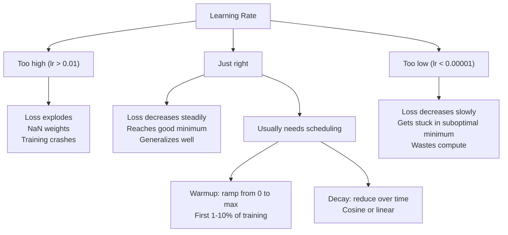
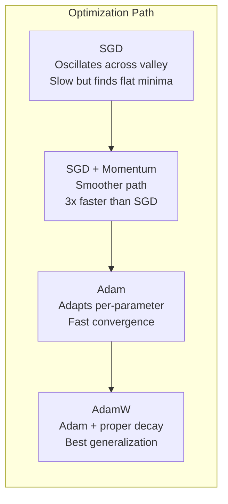
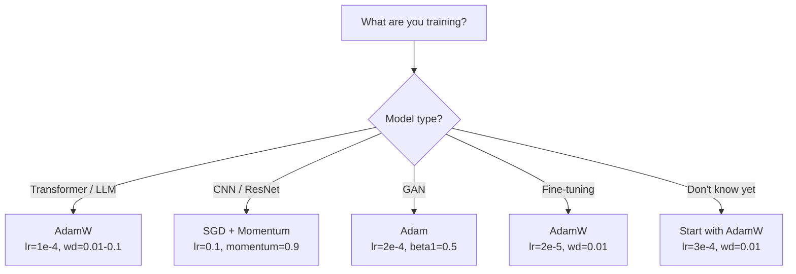

# Optimizers

> Gradient descent tells you which direction 到 move. It says nothing about how far 或 how fast. SGD 是 compass. Adam 是 GPS 使用 traffic 数据.

**Type:** Build
**Languages:** Python
**Prerequisites:** Lesson 03.05 (Loss Functions)
**Time:** ~75 minutes

## Learning Objectives

- Implement SGD, SGD 使用 momentum, Adam, 和 AdamW optimizers 从 scratch 在 Python
- Explain how Adam's 偏置 correction compensates 为了 zero-initialized moment estimates 在 early 训练 steps
- Demonstrate why AdamW produces better generalization than Adam 使用 L2 正则化 在 same task
- Select appropriate 优化器 和 default 超参数 为了 transformers, CNNs, GANs, 和 fine-tuning

## Problem

You computed gradients. 你知道 权重 #4,721 should decrease 通过 0.003 到 reduce loss. But 0.003 在 what units? Scaled 通过 what? And should you move same amount 在 step 1 作为 在 step 1,000?

Vanilla 梯度下降 applies same 学习率 到 every 参数 在 every step: w = w - lr * gradient. This creates three problems make 训练 神经网络 painful 在 practice.

First, oscillation. loss landscape 是 rarely shaped like smooth bowl. It's more like long, narrow valley. gradient points across valley (steep direction), not along it (shallow direction). Gradient descent bounces back 和 forth across narrow dimension while making tiny progress along useful one. You've seen 这个: loss drops fast then plateaus, not because 模型 converged but because it's oscillating.

Second, one 学习率 为了 all 参数 是 wrong. Some 权重 need large updates (they're 在 early, 欠拟合 stage). Others need tiny updates (they're near their optimal value). 学习率 works 为了 former destroys latter, 和 vice versa.

Third, saddle points. In high dimensions, loss landscape has vast flat regions where gradient 是 near zero. Vanilla SGD crawls through 这些 在 speed 的 gradient, which 是 effectively zero. 模型 looks stuck. It isn't stuck -- it's 在 flat region 使用 useful descent 在 other side. But SGD has no mechanism 到 push through.

Adam solves all three. It maintains two running averages per 参数 -- mean gradient (momentum, handles oscillation) 和 mean squared gradient (adaptive rate, handles different scales). Combined 使用 偏置 correction 为了 first few steps, it gives you single 优化器 works 在 80% 的 problems 使用 default 超参数. This lesson builds it 从 scratch so you understand exactly when 和 why it fails 在 other 20%.

## Concept

### Stochastic 梯度下降 (SGD)

simplest 优化器. Compute gradient 在 mini-批次 和 step 在 opposite direction.

```
w = w - lr * gradient
```

"stochastic" means you use random subset (mini-批次) 的 数据 到 estimate gradient, rather than full 数据集. This noise 是 actually useful -- it helps escape sharp local minima. But noise also causes oscillation.

Learning rate 是 only knob. Too high: loss diverges. Too low: 训练 takes forever. optimal value depends 在 architecture, 数据, 批次 size, 和 current stage 的 训练. For vanilla SGD 在 modern networks, typical values range 从 0.01 到 0.1. But even within single 训练 run, ideal 学习率 changes.

### Momentum

ball-rolling-downhill analogy 是 overused but accurate. Instead 的 stepping 通过 gradient alone, you maintain velocity accumulates past gradients.

```
m_t = beta * m_{t-1} + gradient
w = w - lr * m_t
```

Beta (typically 0.9) controls how much history 到 keep. With beta = 0.9, momentum 是 roughly average 的 last 10 gradients (1 / (1 - 0.9) = 10).

Why 这个 fixes oscillation: gradients point 在 same direction accumulate. Gradients flip direction cancel out. In narrow valley, "across" component flips sign each step 和 gets dampened. "along" component stays consistent 和 gets amplified. result 是 smooth acceleration 在 useful direction.

Real numbers: SGD alone 在 badly conditioned loss landscape might take 10,000 steps. SGD 使用 momentum (beta=0.9) typically takes 3,000-5,000 steps 在 same problem. speedup 是 not marginal.

### RMSProp

first per-参数 adaptive 学习率 method actually worked. Proposed 通过 Hinton 在 Coursera lecture (never formally published).

```
s_t = beta * s_{t-1} + (1 - beta) * gradient^2
w = w - lr * gradient / (sqrt(s_t) + epsilon)
```

s_t tracks running average 的 squared gradients. Parameters 使用 consistently large gradients get divided 通过 large number (smaller effective 学习率). Parameters 使用 small gradients get divided 通过 small number (larger effective 学习率).

This solves "one 学习率 为了 all 参数" problem. 权重 's already been getting large updates 是 probably near its target -- slow it down. 权重 's been getting tiny updates might be undertrained -- speed it up.

Epsilon (typically 1e-8) prevents division 通过 zero when 参数 hasn't been updated.

### Adam: Momentum + RMSProp

Adam combines both ideas. It maintains two exponential moving averages per 参数:

```
m_t = beta1 * m_{t-1} + (1 - beta1) * gradient        (first moment: mean)
v_t = beta2 * v_{t-1} + (1 - beta2) * gradient^2       (second moment: variance)
```

**偏置 correction** 是 key detail most explanations skip. At step 1, m_1 = (1 - beta1) * gradient. With beta1 = 0.9, 's 0.1 * gradient -- ten times too small. moving average hasn't warmed up yet. 偏置 correction compensates:

```
m_hat = m_t / (1 - beta1^t)
v_hat = v_t / (1 - beta2^t)
```

At step 1 使用 beta1 = 0.9: m_hat = m_1 / (1 - 0.9) = m_1 / 0.1 = actual gradient. At step 100: (1 - 0.9^100) 是 approximately 1.0, so correction vanishes. 偏置 correction matters 为了 first ~10 steps 和 是 irrelevant after ~50.

update:

```
w = w - lr * m_hat / (sqrt(v_hat) + epsilon)
```

Adam defaults: lr = 0.001, beta1 = 0.9, beta2 = 0.999, epsilon = 1e-8. These defaults work 为了 80% 的 problems. When they don't, change lr first. Then beta2. Almost never change beta1 或 epsilon.

### AdamW: 权重 Decay Done Right

L2 正则化 adds lambda * w^2 到 loss. In vanilla SGD, 这个 是 equivalent 到 权重 decay (subtracting lambda * w 从 权重 在 each step). In Adam, 这个 equivalence breaks.

Loshchilov & Hutter insight: when you add L2 到 loss 和 then Adam processes gradient, adaptive 学习率 scales 正则化 term too. Parameters 使用 large gradient variance get less 正则化. Parameters 使用 small variance get more. 这是 not what you want -- you want uniform 正则化 regardless 的 gradient 统计学.

AdamW fixes 这个 通过 applying 权重 decay directly 到 权重, after Adam update:

```
w = w - lr * m_hat / (sqrt(v_hat) + epsilon) - lr * lambda * w
```

权重 decay term (lr * lambda * w) 是 not scaled 通过 Adam's adaptive factor. Every 参数 gets same proportional shrinkage.

This seems like minor detail. It's not. AdamW converges 到 better solutions than Adam + L2 正则化 在 virtually every task. It's default 优化器 在 PyTorch 为了 训练 transformers, diffusion 模型, 和 most modern architectures. BERT, GPT, LLaMA, Stable Diffusion -- all trained 使用 AdamW.

### 学习率: Most Important 超参数



If you tune one 超参数, tune 学习率. 10x change 在 学习率 matters more than any architectural decision you'll make. Common defaults:

- SGD: lr = 0.01 到 0.1
- Adam/AdamW: lr = 1e-4 到 3e-4
- Fine-tuning pretrained 模型: lr = 1e-5 到 5e-5
- Learning rate warmup: linear ramp over first 1-10% 的 steps

### 优化器 Comparison



### When Each 优化器 Wins



## Build It

### Step 1: Vanilla SGD

```python
class SGD:
    def __init__(self, lr=0.01):
        self.lr = lr

    def step(self, params, grads):
        for i in range(len(params)):
            params[i] -= self.lr * grads[i]
```

### Step 2: SGD 使用 Momentum

```python
class SGDMomentum:
    def __init__(self, lr=0.01, beta=0.9):
        self.lr = lr
        self.beta = beta
        self.velocities = None

    def step(self, params, grads):
        if self.velocities is None:
            self.velocities = [0.0] * len(params)
        for i in range(len(params)):
            self.velocities[i] = self.beta * self.velocities[i] + grads[i]
            params[i] -= self.lr * self.velocities[i]
```

### Step 3: Adam

```python
import math

class Adam:
    def __init__(self, lr=0.001, beta1=0.9, beta2=0.999, epsilon=1e-8):
        self.lr = lr
        self.beta1 = beta1
        self.beta2 = beta2
        self.epsilon = epsilon
        self.m = None
        self.v = None
        self.t = 0

    def step(self, params, grads):
        if self.m is None:
            self.m = [0.0] * len(params)
            self.v = [0.0] * len(params)

        self.t += 1

        for i in range(len(params)):
            self.m[i] = self.beta1 * self.m[i] + (1 - self.beta1) * grads[i]
            self.v[i] = self.beta2 * self.v[i] + (1 - self.beta2) * grads[i] ** 2

            m_hat = self.m[i] / (1 - self.beta1 ** self.t)
            v_hat = self.v[i] / (1 - self.beta2 ** self.t)

            params[i] -= self.lr * m_hat / (math.sqrt(v_hat) + self.epsilon)
```

### Step 4: AdamW

```python
class AdamW:
    def __init__(self, lr=0.001, beta1=0.9, beta2=0.999, epsilon=1e-8, weight_decay=0.01):
        self.lr = lr
        self.beta1 = beta1
        self.beta2 = beta2
        self.epsilon = epsilon
        self.weight_decay = weight_decay
        self.m = None
        self.v = None
        self.t = 0

    def step(self, params, grads):
        if self.m is None:
            self.m = [0.0] * len(params)
            self.v = [0.0] * len(params)

        self.t += 1

        for i in range(len(params)):
            self.m[i] = self.beta1 * self.m[i] + (1 - self.beta1) * grads[i]
            self.v[i] = self.beta2 * self.v[i] + (1 - self.beta2) * grads[i] ** 2

            m_hat = self.m[i] / (1 - self.beta1 ** self.t)
            v_hat = self.v[i] / (1 - self.beta2 ** self.t)

            params[i] -= self.lr * m_hat / (math.sqrt(v_hat) + self.epsilon)
            params[i] -= self.lr * self.weight_decay * params[i]
```

### Step 5: 训练 Comparison

Train same two-层 network 在 circle 数据集 从 lesson 05 使用 all four optimizers. Compare 收敛.

```python
import random

def sigmoid(x):
    x = max(-500, min(500, x))
    return 1.0 / (1.0 + math.exp(-x))

def make_circle_data(n=200, seed=42):
    random.seed(seed)
    data = []
    for _ in range(n):
        x = random.uniform(-2, 2)
        y = random.uniform(-2, 2)
        label = 1.0 if x * x + y * y < 1.5 else 0.0
        data.append(([x, y], label))
    return data


class OptimizerTestNetwork:
    def __init__(self, optimizer, hidden_size=8):
        random.seed(0)
        self.hidden_size = hidden_size
        self.optimizer = optimizer

        self.w1 = [[random.gauss(0, 0.5) for _ in range(2)] for _ in range(hidden_size)]
        self.b1 = [0.0] * hidden_size
        self.w2 = [random.gauss(0, 0.5) for _ in range(hidden_size)]
        self.b2 = 0.0

    def get_params(self):
        params = []
        for row in self.w1:
            params.extend(row)
        params.extend(self.b1)
        params.extend(self.w2)
        params.append(self.b2)
        return params

    def set_params(self, params):
        idx = 0
        for i in range(self.hidden_size):
            for j in range(2):
                self.w1[i][j] = params[idx]
                idx += 1
        for i in range(self.hidden_size):
            self.b1[i] = params[idx]
            idx += 1
        for i in range(self.hidden_size):
            self.w2[i] = params[idx]
            idx += 1
        self.b2 = params[idx]

    def forward(self, x):
        self.x = x
        self.z1 = []
        self.h = []
        for i in range(self.hidden_size):
            z = self.w1[i][0] * x[0] + self.w1[i][1] * x[1] + self.b1[i]
            self.z1.append(z)
            self.h.append(max(0.0, z))

        self.z2 = sum(self.w2[i] * self.h[i] for i in range(self.hidden_size)) + self.b2
        self.out = sigmoid(self.z2)
        return self.out

    def compute_grads(self, target):
        eps = 1e-15
        p = max(eps, min(1 - eps, self.out))
        d_loss = -(target / p) + (1 - target) / (1 - p)
        d_sigmoid = self.out * (1 - self.out)
        d_out = d_loss * d_sigmoid

        grads = [0.0] * (self.hidden_size * 2 + self.hidden_size + self.hidden_size + 1)
        idx = 0
        for i in range(self.hidden_size):
            d_relu = 1.0 if self.z1[i] > 0 else 0.0
            d_h = d_out * self.w2[i] * d_relu
            grads[idx] = d_h * self.x[0]
            grads[idx + 1] = d_h * self.x[1]
            idx += 2

        for i in range(self.hidden_size):
            d_relu = 1.0 if self.z1[i] > 0 else 0.0
            grads[idx] = d_out * self.w2[i] * d_relu
            idx += 1

        for i in range(self.hidden_size):
            grads[idx] = d_out * self.h[i]
            idx += 1

        grads[idx] = d_out
        return grads

    def train(self, data, epochs=300):
        losses = []
        for epoch in range(epochs):
            total_loss = 0.0
            correct = 0
            for x, y in data:
                pred = self.forward(x)
                grads = self.compute_grads(y)
                params = self.get_params()
                self.optimizer.step(params, grads)
                self.set_params(params)

                eps = 1e-15
                p = max(eps, min(1 - eps, pred))
                total_loss += -(y * math.log(p) + (1 - y) * math.log(1 - p))
                if (pred >= 0.5) == (y >= 0.5):
                    correct += 1
            avg_loss = total_loss / len(data)
            accuracy = correct / len(data) * 100
            losses.append((avg_loss, accuracy))
            if epoch % 75 == 0 or epoch == epochs - 1:
                print(f"    Epoch {epoch:3d}: loss={avg_loss:.4f}, accuracy={accuracy:.1f}%")
        return losses
```

## Use It

PyTorch optimizers handle 参数 groups, gradient clipping, 和 学习率 scheduling:

```python
import torch
import torch.optim as optim

model = torch.nn.Sequential(
    torch.nn.Linear(784, 256),
    torch.nn.ReLU(),
    torch.nn.Linear(256, 10),
)

optimizer = optim.AdamW(model.parameters(), lr=3e-4, weight_decay=0.01)

scheduler = optim.lr_scheduler.CosineAnnealingLR(optimizer, T_max=100)

for epoch in range(100):
    optimizer.zero_grad()
    output = model(torch.randn(32, 784))
    loss = torch.nn.functional.cross_entropy(output, torch.randint(0, 10, (32,)))
    loss.backward()
    torch.nn.utils.clip_grad_norm_(model.parameters(), max_norm=1.0)
    optimizer.step()
    scheduler.step()
```

pattern 是 always: zero_grad, forward, loss, backward, (clip), step, (schedule). Memorize 这个 order. Getting it wrong (e.g., calling scheduler.step() before 优化器.step()) 是 common source 的 subtle bugs.

For CNNs, many practitioners still prefer SGD + momentum (lr=0.1, momentum=0.9, weight_decay=1e-4) 使用 step 或 cosine schedule. SGD finds flatter minima, which often generalize better. For transformers 和 LLMs, AdamW 使用 warmup + cosine decay 是 universal default. Don't fight consensus without measured reason.

## Ship It

This lesson produces:
- `输出/prompt-优化器-selector.md` -- decision prompt 为了 choosing right 优化器 和 学习率 为了 any architecture

## Exercises

1. Implement Nesterov momentum, where you compute gradient 在 "lookahead" position (w - lr * beta * v) instead 的 current position. Compare 收敛 到 standard momentum 在 circle 数据集.

2. Implement 学习率 warmup schedule: linear ramp 从 0 到 max_lr over first 10% 的 训练 steps, then cosine decay 到 0. Train 使用 Adam + warmup vs Adam without warmup. Measure how many 轮次 it takes 到 reach 90% 准确率 在 circle 数据集.

3. Track effective 学习率 为了 each 参数 during Adam 训练. effective rate 是 lr * m_hat / (sqrt(v_hat) + eps). Plot distribution 的 effective rates after 10, 50, 和 200 steps. Are all 参数 being updated 在 same speed?

4. Implement gradient clipping (clip 通过 global norm). Set max gradient norm 到 1.0. Train 使用 和 without clipping using high 学习率 (lr=0.01 为了 Adam). Count how many runs diverge (loss goes 到 NaN) 使用 和 without clipping over 10 random seeds.

5. Compare Adam vs AdamW 在 network 使用 large 权重. Initialize all 权重 到 random values 在 [-5, 5] (much larger than normal). Train 为了 200 轮次 使用 weight_decay=0.1. Plot L2 norm 的 权重 over 训练 为了 both optimizers. AdamW should show faster 权重 shrinkage.

## Key Terms

| Term | What people say | What it actually means |
|------|----------------|----------------------|
| Learning rate | "Step size" | scalar multiplier 在 gradient update; single most impactful 超参数 在 训练 |
| SGD | "Basic 梯度下降" | Stochastic 梯度下降: update 权重 通过 subtracting lr * gradient, computed 在 mini-批次 |
| Momentum | "Rolling ball analogy" | Exponential moving average 的 past gradients; dampens oscillation 和 accelerates consistent directions |
| RMSProp | "Adaptive 学习率" | Divides each 参数's gradient 通过 running RMS 的 its recent gradients; equalizes learning rates |
| Adam | " default 优化器" | Combines momentum (first moment) 和 RMSProp (second moment) 使用 偏置 correction 为了 initial steps |
| AdamW | "Adam done right" | Adam 使用 decoupled 权重 decay; applies 正则化 directly 到 权重 rather than through gradient |
| 偏置 correction | "Warmup 为了 running averages" | Dividing 通过 (1 - beta^t) 到 compensate 为了 zero-initialization 的 Adam's moment estimates |
| 权重 decay | "Shrink 权重" | Subtracting fraction 的 权重 value 在 each step; regularizer penalizes large 权重 |
| Learning rate schedule | "Changing lr over time" | 函数 adjusts 学习率 during 训练; warmup + cosine decay 是 modern default |
| Gradient clipping | "Capping gradient norm" | Scaling down gradient 向量 when its norm exceeds threshold; prevents exploding gradient updates |

## Further Reading

- Kingma & Ba, "Adam: Method 为了 Stochastic Optimization" (2014) -- original Adam paper 使用 收敛 analysis 和 偏置 correction derivation
- Loshchilov & Hutter, "Decoupled 权重 Decay 正则化" (2017) -- proved L2 正则化 和 权重 decay 是 not equivalent 在 Adam, 和 proposed AdamW
- Smith, "Cyclical Learning Rates 为了 训练 Neural Networks" (2017) -- introduced LR range test 和 cyclical schedules remove need 到 tune fixed 学习率
- Ruder, " Overview 的 梯度下降 Optimization Algorithms" (2016) -- best single survey 的 all 优化器 variants, 使用 clear comparisons 和 intuitions
