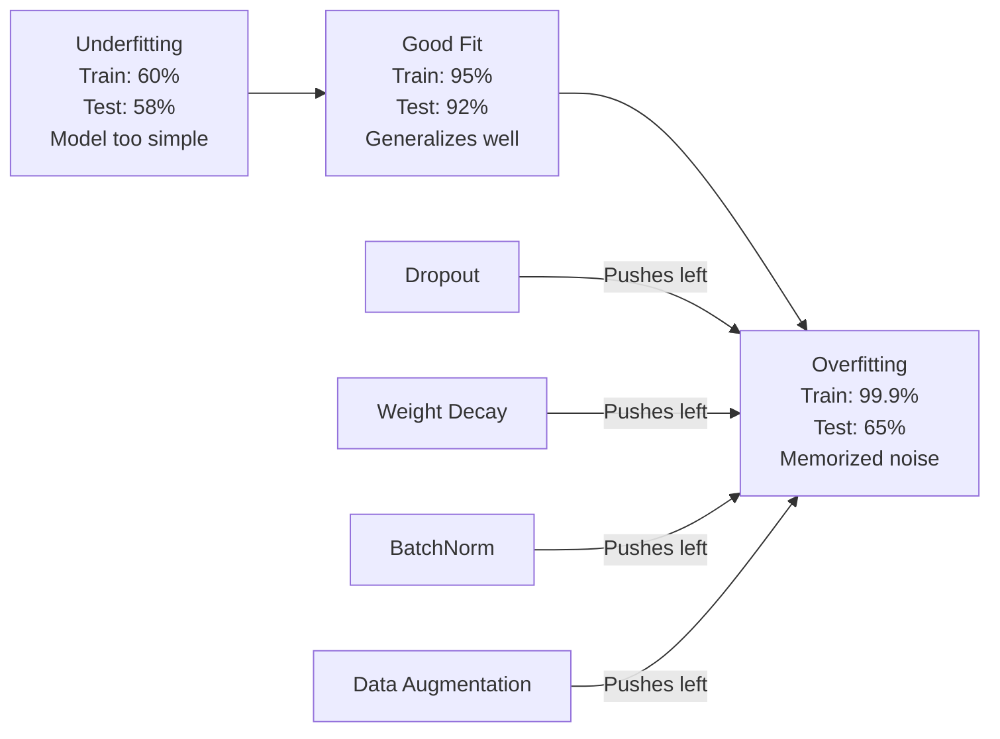
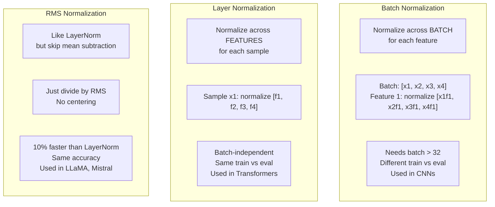
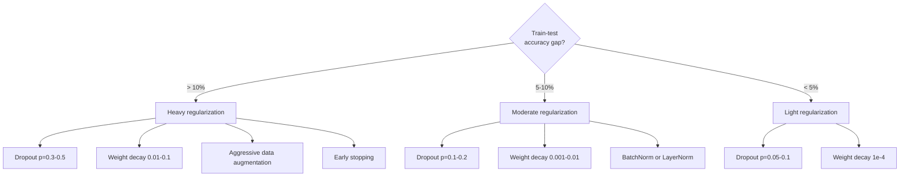

# 正则化

> Your 模型 gets 99% 在 训练 数据 和 60% 在 test 数据. It memorized instead 的 learning. 正则化 是 tax you impose 在 complexity 到 force generalization.

**Type:** Build
**Languages:** Python
**Prerequisites:** Lesson 03.06 (Optimizers)
**Time:** ~75 minutes

## Learning Objectives

- Implement dropout 使用 inverted scaling, L2 权重 decay, 批次 normalization, 层 normalization, 和 RMSNorm 从 scratch
- Measure train-test 准确率 gap 和 diagnose 过拟合 using 正则化 experiments
- Explain why transformers use LayerNorm instead 的 BatchNorm 和 why modern LLMs prefer RMSNorm
- Apply correct combination 的 正则化 techniques based 在 severity 的 过拟合

## Problem

神经网络 使用 enough 参数 can memorize any 数据集. 这是 not hypothetical -- Zhang et al. (2017) proved it 通过 训练 standard networks 在 ImageNet 使用 random labels. networks reached near-zero 训练 loss 在 completely random label assignments. They memorized million random 输入-输出 pairs 使用 no pattern 到 learn. 训练 loss was perfect. Test 准确率 was zero.

这是 过拟合 problem, 和 it gets worse 作为 模型 get larger. GPT-3 has 175 billion 参数. 训练 set has about 500 billion tokens. With many 参数, 模型 has enough capacity 到 memorize significant chunks 的 训练 数据 verbatim. Without 正则化, it would just regurgitate 训练 examples instead 的 learning generalizable patterns.

gap between 训练 performance 和 test performance 是 过拟合 gap. Every technique 在 这个 lesson attacks gap 从 different angle. Dropout forces network 到 not rely 在 any single 神经元. 权重 decay prevents any single 权重 从 growing too large. 批次 normalization smooths loss landscape so 优化器 finds flatter, more generalizable minima. 层 normalization does same thing but works where 批次 normalization fails (small 批次, variable-length sequences). RMSNorm does it 10% faster 通过 dropping mean calculation. Each technique 是 simple. Together, they're difference between 模型 memorizes 和 one generalizes.

## Concept

### 过拟合 Spectrum

Every 模型 sits somewhere 在 spectrum 从 欠拟合 (too simple 到 capture pattern) 到 过拟合 (so complex it captures noise). sweet spot 是 在 between, 和 正则化 pushes 模型 toward it 从 overfit side.



### Dropout

simplest 正则化 technique 使用 most elegant interpretation. During 训练, randomly set each 神经元's 输出 到 zero 使用 概率 p.

```
output = activation(z) * mask    where mask[i] ~ Bernoulli(1 - p)
```

With p = 0.5, half 神经元 是 zeroed 在 every forward pass. network must learn redundant representations because it can't predict which 神经元 will be available. This prevents co-adaptation -- 神经元 learning 到 rely 在 specific other 神经元 being present.

ensemble interpretation: network 使用 N 神经元 和 dropout creates 2^N possible subnetworks (every combination 的 which 神经元 是 在 或 off). 训练 使用 dropout approximately trains all 2^N subnetworks simultaneously, each 在 different mini-批次. At test time, you use all 神经元 (no dropout) 和 scale 输出 通过 (1 - p) 到 match expected value during 训练. 这是 equivalent 到 averaging predictions 的 2^N subnetworks -- massive ensemble 从 single 模型.

In practice, scaling 是 applied during 训练 instead 的 测试 (inverted dropout):

```
During training:  output = activation(z) * mask / (1 - p)
During testing:   output = activation(z)   (no change needed)
```

这是 cleaner because test 代码 doesn't need 到 know about dropout 在 all.

Default rates: p = 0.1 为了 transformers, p = 0.5 为了 MLPs, p = 0.2-0.3 为了 CNNs. Higher dropout = stronger 正则化 = more 欠拟合 risk.

### 权重 Decay (L2 正则化)

Add squared magnitude 的 all 权重 到 loss:

```
total_loss = task_loss + (lambda / 2) * sum(w_i^2)
```

gradient 的 正则化 term 是 lambda * w. This means 在 every step, each 权重 是 shrunk toward zero 通过 fraction proportional 到 its magnitude. Large 权重 get penalized more. 模型 是 pushed toward solutions where no single 权重 dominates.

Why 这个 helps generalization: overfit 模型 tend 到 have large 权重 amplify noise 在 训练 数据. 权重 decay keeps 权重 small, which limits 模型's effective capacity 和 forces it 到 rely 在 robust, generalizable 特征 rather than memorized quirks.

lambda 超参数 controls strength. Typical values:

- 0.01 为了 AdamW 在 transformers
- 1e-4 为了 SGD 在 CNNs
- 0.1 为了 heavily overfit 模型

As discussed 在 lesson 06: 权重 decay 和 L2 正则化 是 equivalent 在 SGD but not 在 Adam. Always use AdamW (decoupled 权重 decay) when 训练 使用 Adam.

### 批次 Normalization

Normalize 输出 的 each 层 across mini-批次 before passing it 到 next 层.

For mini-批次 的 activations 在 some 层:

```
mu = (1/B) * sum(x_i)           (batch mean)
sigma^2 = (1/B) * sum((x_i - mu)^2)   (batch variance)
x_hat = (x_i - mu) / sqrt(sigma^2 + eps)   (normalize)
y = gamma * x_hat + beta        (scale and shift)
```

Gamma 和 beta 是 learnable 参数 let network undo normalization if 's optimal. Without them, you'd be forcing every 层's 输出 到 be zero-mean unit-variance, which might not be what network wants.

**训练 vs inference split:** During 训练, mu 和 sigma come 从 current mini-批次. During inference, you use running averages accumulated during 训练 (exponential moving average 使用 momentum = 0.1, meaning 90% old + 10% new).

Why BatchNorm works 是 still debated. original paper claimed it reduces "internal covariate shift" ( distribution 的 层 输入 changing 作为 earlier 层 update). Santurkar et al. (2018) showed 这个 explanation 是 wrong. actual reason: BatchNorm makes loss landscape smoother. gradients 是 more predictive, Lipschitz constants 是 smaller, 和 优化器 can take larger steps safely. 这是 why BatchNorm lets you use higher learning rates 和 converge faster.

BatchNorm has fundamental limitation: it depends 在 批次 统计学. With 批次 size 1, mean 和 variance 是 meaningless. With small 批次 (< 32), 统计学 是 noisy 和 hurt performance. This matters 为了 tasks like object detection (where memory limits 批次 size) 和 language modeling (where sequence lengths vary).

### 层 Normalization

Normalize across 特征 instead 的 across 批次. For single sample:

```
mu = (1/D) * sum(x_j)           (feature mean)
sigma^2 = (1/D) * sum((x_j - mu)^2)   (feature variance)
x_hat = (x_j - mu) / sqrt(sigma^2 + eps)
y = gamma * x_hat + beta
```

D 是 特征 dimension. Each sample 是 normalized independently -- no dependence 在 批次 size. 这是 why transformers use LayerNorm instead 的 BatchNorm. Sequences have variable lengths, 批次 sizes 是 often small (或 1 during generation), 和 computation 是 identical between 训练 和 inference.

LayerNorm 在 transformers 是 applied after each self-attention block 和 each feed-forward block (Post-LN), 或 before them (Pre-LN, which 是 more stable 为了 训练).

### RMSNorm

LayerNorm without mean subtraction. Proposed 通过 Zhang & Sennrich (2019).

```
rms = sqrt((1/D) * sum(x_j^2))
y = gamma * x / rms
```

That's it. No mean computation, no beta 参数. observation: re-centering (mean subtraction) 在 LayerNorm contributes very little 到 模型's performance, but costs computation. Removing it gives same 准确率 使用 about 10% less overhead.

LLaMA, LLaMA 2, LLaMA 3, Mistral, 和 most modern LLMs use RMSNorm instead 的 LayerNorm. At scale 的 billions 的 参数 和 trillions 的 tokens, 10% savings 是 significant.

### Normalization Comparison



### 数据 Augmentation 作为 正则化

Not 模型 modification but 数据 modification. Transform 训练 输入 while preserving labels:

- Images: random crop, flip, rotation, color jitter, cutout
- Text: synonym replacement, back-translation, random deletion
- Audio: time stretch, pitch shift, noise addition

effect 是 identical 到 正则化: it increases effective size 的 训练 set, making it harder 为了 模型 到 memorize specific examples. 模型 only sees each image once 在 its original form can memorize it. 模型 sees 50 augmented versions 的 each image 是 forced 到 learn invariant structure.

### Early Stopping

simplest regularizer: stop 训练 when 验证 loss starts increasing. 模型 hasn't overfit yet 在 point. In practice, you track 验证 loss every 轮次, save best 模型, 和 continue 训练 为了 "patience" window (typically 5-20 轮次). If 验证 loss doesn't improve within patience window, you stop 和 load best saved 模型.

### When 到 Apply What



## Build It

### Step 1: Dropout (Train 和 Eval Mode)

```python
import random
import math


class Dropout:
    def __init__(self, p=0.5):
        self.p = p
        self.training = True
        self.mask = None

    def forward(self, x):
        if not self.training:
            return list(x)
        self.mask = []
        output = []
        for val in x:
            if random.random() < self.p:
                self.mask.append(0)
                output.append(0.0)
            else:
                self.mask.append(1)
                output.append(val / (1 - self.p))
        return output

    def backward(self, grad_output):
        grads = []
        for g, m in zip(grad_output, self.mask):
            if m == 0:
                grads.append(0.0)
            else:
                grads.append(g / (1 - self.p))
        return grads
```

### Step 2: L2 权重 Decay

```python
def l2_regularization(weights, lambda_reg):
    penalty = 0.0
    for w in weights:
        penalty += w * w
    return lambda_reg * 0.5 * penalty

def l2_gradient(weights, lambda_reg):
    return [lambda_reg * w for w in weights]
```

### Step 3: 批次 Normalization

```python
class BatchNorm:
    def __init__(self, num_features, momentum=0.1, eps=1e-5):
        self.gamma = [1.0] * num_features
        self.beta = [0.0] * num_features
        self.eps = eps
        self.momentum = momentum
        self.running_mean = [0.0] * num_features
        self.running_var = [1.0] * num_features
        self.training = True
        self.num_features = num_features

    def forward(self, batch):
        batch_size = len(batch)
        if self.training:
            mean = [0.0] * self.num_features
            for sample in batch:
                for j in range(self.num_features):
                    mean[j] += sample[j]
            mean = [m / batch_size for m in mean]

            var = [0.0] * self.num_features
            for sample in batch:
                for j in range(self.num_features):
                    var[j] += (sample[j] - mean[j]) ** 2
            var = [v / batch_size for v in var]

            for j in range(self.num_features):
                self.running_mean[j] = (1 - self.momentum) * self.running_mean[j] + self.momentum * mean[j]
                self.running_var[j] = (1 - self.momentum) * self.running_var[j] + self.momentum * var[j]
        else:
            mean = list(self.running_mean)
            var = list(self.running_var)

        self.x_hat = []
        output = []
        for sample in batch:
            normalized = []
            out_sample = []
            for j in range(self.num_features):
                x_h = (sample[j] - mean[j]) / math.sqrt(var[j] + self.eps)
                normalized.append(x_h)
                out_sample.append(self.gamma[j] * x_h + self.beta[j])
            self.x_hat.append(normalized)
            output.append(out_sample)
        return output
```

### Step 4: 层 Normalization

```python
class LayerNorm:
    def __init__(self, num_features, eps=1e-5):
        self.gamma = [1.0] * num_features
        self.beta = [0.0] * num_features
        self.eps = eps
        self.num_features = num_features

    def forward(self, x):
        mean = sum(x) / len(x)
        var = sum((xi - mean) ** 2 for xi in x) / len(x)

        self.x_hat = []
        output = []
        for j in range(self.num_features):
            x_h = (x[j] - mean) / math.sqrt(var + self.eps)
            self.x_hat.append(x_h)
            output.append(self.gamma[j] * x_h + self.beta[j])
        return output
```

### Step 5: RMSNorm

```python
class RMSNorm:
    def __init__(self, num_features, eps=1e-6):
        self.gamma = [1.0] * num_features
        self.eps = eps
        self.num_features = num_features

    def forward(self, x):
        rms = math.sqrt(sum(xi * xi for xi in x) / len(x) + self.eps)
        output = []
        for j in range(self.num_features):
            output.append(self.gamma[j] * x[j] / rms)
        return output
```

### Step 6: 训练 With 和 Without 正则化

```python
def sigmoid(x):
    x = max(-500, min(500, x))
    return 1.0 / (1.0 + math.exp(-x))


def make_circle_data(n=200, seed=42):
    random.seed(seed)
    data = []
    for _ in range(n):
        x = random.uniform(-2, 2)
        y = random.uniform(-2, 2)
        label = 1.0 if x * x + y * y < 1.5 else 0.0
        data.append(([x, y], label))
    return data


class RegularizedNetwork:
    def __init__(self, hidden_size=16, lr=0.05, dropout_p=0.0, weight_decay=0.0):
        random.seed(0)
        self.hidden_size = hidden_size
        self.lr = lr
        self.dropout_p = dropout_p
        self.weight_decay = weight_decay
        self.dropout = Dropout(p=dropout_p) if dropout_p > 0 else None

        self.w1 = [[random.gauss(0, 0.5) for _ in range(2)] for _ in range(hidden_size)]
        self.b1 = [0.0] * hidden_size
        self.w2 = [random.gauss(0, 0.5) for _ in range(hidden_size)]
        self.b2 = 0.0

    def forward(self, x, training=True):
        self.x = x
        self.z1 = []
        self.h = []
        for i in range(self.hidden_size):
            z = self.w1[i][0] * x[0] + self.w1[i][1] * x[1] + self.b1[i]
            self.z1.append(z)
            self.h.append(max(0.0, z))

        if self.dropout and training:
            self.dropout.training = True
            self.h = self.dropout.forward(self.h)
        elif self.dropout:
            self.dropout.training = False
            self.h = self.dropout.forward(self.h)

        self.z2 = sum(self.w2[i] * self.h[i] for i in range(self.hidden_size)) + self.b2
        self.out = sigmoid(self.z2)
        return self.out

    def backward(self, target):
        eps = 1e-15
        p = max(eps, min(1 - eps, self.out))
        d_loss = -(target / p) + (1 - target) / (1 - p)
        d_sigmoid = self.out * (1 - self.out)
        d_out = d_loss * d_sigmoid

        for i in range(self.hidden_size):
            d_relu = 1.0 if self.z1[i] > 0 else 0.0
            d_h = d_out * self.w2[i] * d_relu
            self.w2[i] -= self.lr * (d_out * self.h[i] + self.weight_decay * self.w2[i])
            for j in range(2):
                self.w1[i][j] -= self.lr * (d_h * self.x[j] + self.weight_decay * self.w1[i][j])
            self.b1[i] -= self.lr * d_h
        self.b2 -= self.lr * d_out

    def evaluate(self, data):
        correct = 0
        total_loss = 0.0
        for x, y in data:
            pred = self.forward(x, training=False)
            eps = 1e-15
            p = max(eps, min(1 - eps, pred))
            total_loss += -(y * math.log(p) + (1 - y) * math.log(1 - p))
            if (pred >= 0.5) == (y >= 0.5):
                correct += 1
        return total_loss / len(data), correct / len(data) * 100

    def train_model(self, train_data, test_data, epochs=300):
        history = []
        for epoch in range(epochs):
            total_loss = 0.0
            correct = 0
            for x, y in train_data:
                pred = self.forward(x, training=True)
                self.backward(y)
                eps = 1e-15
                p = max(eps, min(1 - eps, pred))
                total_loss += -(y * math.log(p) + (1 - y) * math.log(1 - p))
                if (pred >= 0.5) == (y >= 0.5):
                    correct += 1
            train_loss = total_loss / len(train_data)
            train_acc = correct / len(train_data) * 100
            test_loss, test_acc = self.evaluate(test_data)
            history.append((train_loss, train_acc, test_loss, test_acc))
            if epoch % 75 == 0 or epoch == epochs - 1:
                gap = train_acc - test_acc
                print(f"    Epoch {epoch:3d}: train_acc={train_acc:.1f}%, test_acc={test_acc:.1f}%, gap={gap:.1f}%")
        return history
```

## Use It

PyTorch provides all normalization 和 正则化 作为 modules:

```python
import torch
import torch.nn as nn

model = nn.Sequential(
    nn.Linear(784, 256),
    nn.BatchNorm1d(256),
    nn.ReLU(),
    nn.Dropout(0.3),
    nn.Linear(256, 128),
    nn.BatchNorm1d(128),
    nn.ReLU(),
    nn.Dropout(0.3),
    nn.Linear(128, 10),
)

model.train()
out_train = model(torch.randn(32, 784))

model.eval()
out_test = model(torch.randn(1, 784))
```

`模型.train()` / `模型.eval()` toggle 是 critical. It switches dropout 在/off 和 tells BatchNorm 到 use 批次 统计学 vs running 统计学. Forgetting `模型.eval()` before inference 是 one 的 most common bugs 在 deep learning. Your test 准确率 will fluctuate randomly because dropout 是 still active 和 BatchNorm 是 using mini-批次 统计学.

For transformers, pattern 是 different:

```python
class TransformerBlock(nn.Module):
    def __init__(self, d_model=512, nhead=8, dropout=0.1):
        super().__init__()
        self.attention = nn.MultiheadAttention(d_model, nhead, dropout=dropout)
        self.norm1 = nn.LayerNorm(d_model)
        self.ff = nn.Sequential(
            nn.Linear(d_model, d_model * 4),
            nn.GELU(),
            nn.Linear(d_model * 4, d_model),
            nn.Dropout(dropout),
        )
        self.norm2 = nn.LayerNorm(d_model)
        self.dropout = nn.Dropout(dropout)

    def forward(self, x):
        attended, _ = self.attention(x, x, x)
        x = self.norm1(x + self.dropout(attended))
        x = self.norm2(x + self.ff(x))
        return x
```

LayerNorm, not BatchNorm. Dropout p=0.1, not p=0.5. These 是 transformer defaults.

## Ship It

This lesson produces:
- `输出/prompt-正则化-advisor.md` -- prompt diagnoses 过拟合 和 recommends right 正则化 strategy

## Exercises

1. Implement spatial dropout 为了 2D 数据: instead 的 dropping individual 神经元, drop entire 特征 channels. Simulate 这个 通过 treating groups 的 consecutive 特征 作为 channels 和 dropping whole groups. Compare train-test gap 到 standard dropout 在 circle 数据集 使用 hidden_size=32.

2. Implement label smoothing 从 lesson 05 combined 使用 dropout 从 这个 lesson. Train 使用 four configurations: neither, dropout only, label smoothing only, both. Measure final train-test 准确率 gap 为了 each. Which combination gives smallest gap?

3. Add BatchNorm 层 between hidden 层 和 activation 在 your circle-数据集 network. Train 使用 和 without BatchNorm 在 learning rates 0.01, 0.05, 和 0.1. BatchNorm should allow stable 训练 在 higher learning rates where vanilla network diverges.

4. Implement early stopping: track test loss each 轮次, save best 权重, 和 stop if test loss hasn't improved 为了 20 轮次. Run regularized network 为了 1000 轮次. Report which 轮次 had best test 准确率 和 how many 轮次 的 computation you saved.

5. Compare LayerNorm vs RMSNorm 在 4-层 network (not just 2). Initialize both 使用 same 权重. Train 为了 200 轮次 和 compare final 准确率, 训练 speed (time per 轮次), 和 gradient magnitudes 在 first 层. Verify RMSNorm 是 faster 使用 same 准确率.

## Key Terms

| Term | What people say | What it actually means |
|------|----------------|----------------------|
| 过拟合 | "模型 memorized 数据" | When 模型's 训练 performance significantly exceeds its test performance, indicating it learned noise rather than signal |
| 正则化 | "Preventing 过拟合" | Any technique constrains 模型 complexity 到 improve generalization: dropout, 权重 decay, normalization, augmentation |
| Dropout | "Random 神经元 deletion" | Zeroing random 神经元 during 训练 使用 概率 p, forcing redundant representations; equivalent 到 训练 ensemble |
| 权重 decay | "L2 penalty" | Shrinking all 权重 toward zero 通过 subtracting lambda * w 在 each step; penalizes complexity through 权重 magnitude |
| 批次 normalization | "Normalize per 批次" | Normalizing 层 输出 across 批次 dimension using 批次 统计学 during 训练 和 running averages during inference |
| 层 normalization | "Normalize per sample" | Normalizing across 特征 within each sample; 批次-independent, used 在 transformers where 批次 size varies |
| RMSNorm | "LayerNorm without mean" | Root mean square normalization; drops mean subtraction 从 LayerNorm 为了 10% speedup 使用 equal 准确率 |
| Early stopping | "Stop before overfit" | Halting 训练 when 验证 loss stops improving; simplest regularizer, often used alongside others |
| 数据 augmentation | "More 数据 从 less" | Transforming 训练 输入 (flip, crop, noise) 到 increase effective 数据集 size 和 force invariance learning |
| Generalization gap | "Train-test split" | difference between 训练 和 test performance; 正则化 aims 到 minimize 这个 gap |

## Further Reading

- Srivastava et al., "Dropout: Simple Way 到 Prevent Neural Networks 从 过拟合" (2014) -- original dropout paper 使用 ensemble interpretation 和 extensive experiments
- Ioffe & Szegedy, "批次 Normalization: Accelerating Deep Network 训练 通过 Reducing Internal Covariate Shift" (2015) -- introduced BatchNorm 和 its 训练 procedure, one 的 most cited deep learning papers
- Zhang & Sennrich, "Root Mean Square 层 Normalization" (2019) -- showed RMSNorm matches LayerNorm 准确率 使用 reduced computation; adopted 通过 LLaMA 和 Mistral
- Zhang et al., "Understanding Deep Learning Requires Rethinking Generalization" (2017) -- landmark paper showing 神经网络 can memorize random labels, challenging traditional views 的 generalization
