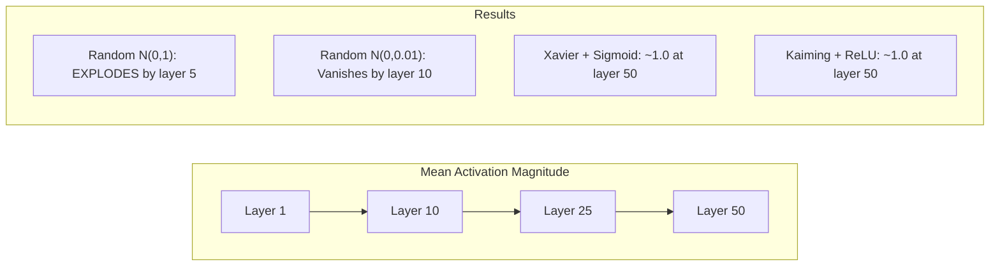
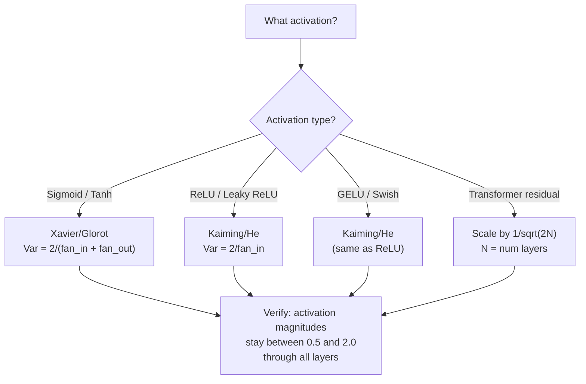

# 权重 Initialization 和 训练 Stability

> Initialize wrong 和 训练 never starts. Initialize right 和 50 层 train 作为 smoothly 作为 3.

**Type:** Build
**Languages:** Python
**Prerequisites:** Lesson 03.04 (Activation Functions), Lesson 03.07 (正则化)
**Time:** ~90 minutes

## Learning Objectives

- Implement zero, random, Xavier/Glorot, 和 Kaiming/He initialization strategies 和 measure their effect 在 activation magnitudes through 50 层
- Derive why Xavier init uses Var(w) = 2/(fan_in + fan_out) 和 Kaiming uses Var(w) = 2/fan_in
- Demonstrate symmetry problem 使用 zero initialization 和 explain why random scale alone 是 insufficient
- Match correct initialization strategy 到 激活函数: Xavier 为了 sigmoid/tanh, Kaiming 为了 ReLU/GELU

## Problem

Initialize all 权重 到 zero. Nothing learns. Every 神经元 computes same 函数, receives same gradient, 和 updates identically. After 10,000 轮次, your 512-神经元 hidden 层 是 still 512 copies 的 same 神经元. You paid 为了 512 参数 和 got 1.

Initialize them too large. Activations explode through network. By 层 10, values hit 1e15. By 层 20, they overflow 到 infinity. Gradients follow same trajectory 在 reverse.

Initialize them randomly 从 standard normal distribution. Works 为了 3 层. At 50 层, signal collapses 到 zero 或 detonates 到 infinity depending 在 whether random scale was slightly too small 或 slightly too large. boundary between "works" 和 "broken" 是 razor-thin.

权重 initialization 是 most underrated decision 在 deep learning. Architecture gets papers. Optimizers get blog posts. Initialization gets footnote. But get it wrong 和 nothing else matters -- your network 是 dead before 训练 begins.

## Concept

### Symmetry Problem

Every 神经元 在 层 has same structure: multiply 输入 通过 权重, add 偏置, apply activation. If all 权重 start 在 same value (zero 是 extreme case), every 神经元 computes same 输出. During 反向传播, every 神经元 receives same gradient. During update step, every 神经元 changes 通过 same amount.

You're stuck. network has hundreds 的 参数, but they all move 在 lockstep. 这是 called symmetry, 和 random initialization 是 brute-force way 到 break it. Each 神经元 starts 在 different point 在 权重 space, so each learns different 特征.

But "random" 是 not enough. *scale* 的 randomness determines whether network trains.

### Variance Propagation Through Layers

Consider single 层 使用 fan_in 输入:

```
z = w1*x1 + w2*x2 + ... + w_n*x_n
```

If each 权重 wi 是 drawn 从 distribution 使用 variance Var(w) 和 each 输入 xi has variance Var(x), 输出 variance 是:

```
Var(z) = fan_in * Var(w) * Var(x)
```

If Var(w) = 1 和 fan_in = 512, 输出 variance 是 512x 输入 variance. After 10 层: 512^10 = 1.2e27. Your signal has exploded.

If Var(w) = 0.001, 输出 variance shrinks 通过 0.001 * 512 = 0.512 per 层. After 10 层: 0.512^10 = 0.00013. Your signal has vanished.

goal: choose Var(w) so Var(z) = Var(x). Signal magnitude stays constant across 层.

### Xavier/Glorot Initialization

Glorot 和 Bengio (2010) derived solution 为了 sigmoid 和 tanh activations. To keep variance constant 在 both forward 和 backward pass:

```
Var(w) = 2 / (fan_in + fan_out)
```

In practice, 权重 是 drawn 从:

```
w ~ Uniform(-limit, limit)  where limit = sqrt(6 / (fan_in + fan_out))
```

或:

```
w ~ Normal(0, sqrt(2 / (fan_in + fan_out)))
```

This works because sigmoid 和 tanh 是 roughly linear near zero, where properly initialized activations live. variance stays stable through dozens 的 层.

### Kaiming/He Initialization

ReLU kills half 输出 (everything negative becomes zero). effective fan_in 是 halved because 在 average half 输入 是 zeroed. Xavier init doesn't account 为了 这个 -- it underestimates variance needed.

He et al. (2015) adjusted formula:

```
Var(w) = 2 / fan_in
```

Weights 是 drawn 从:

```
w ~ Normal(0, sqrt(2 / fan_in))
```

factor 的 2 compensates 为了 ReLU zeroing half activations. Without it, signal shrinks 通过 ~0.5x per 层. With 50 层: 0.5^50 = 8.8e-16. Kaiming init prevents 这个.

### Transformer Initialization

GPT-2 introduced different pattern. Residual connections add 输出 的 each sub-层 到 its 输入:

```
x = x + sublayer(x)
```

Each addition increases variance. With N residual 层, variance grows proportionally 到 N. GPT-2 scales 权重 的 residual 层 通过 1/sqrt(2N), where N 是 number 的 层. This keeps accumulated signal magnitude stable.

Llama 3 (405B 参数, 126 层) uses similar scheme. Without 这个 scaling, residual stream would grow unbounded through 126 层 的 attention 和 feedforward blocks.

```mermaid
flowchart TD
    subgraph "Zero Init"
        Z1["Layer 1<br/>All weights = 0"] --> Z2["Layer 2<br/>All neurons identical"]
        Z2 --> Z3["Layer 3<br/>Still identical"]
        Z3 --> ZR["Result: 1 effective neuron<br/>regardless of width"]
    end

    subgraph "Xavier Init"
        X1["Layer 1<br/>Var = 2/(fan_in+fan_out)"] --> X2["Layer 2<br/>Signal stable"]
        X2 --> X3["Layer 50<br/>Signal stable"]
        X3 --> XR["Result: Trains with<br/>sigmoid/tanh"]
    end

    subgraph "Kaiming Init"
        K1["Layer 1<br/>Var = 2/fan_in"] --> K2["Layer 2<br/>Signal stable"]
        K2 --> K3["Layer 50<br/>Signal stable"]
        K3 --> KR["Result: Trains with<br/>ReLU/GELU"]
    end
```



### Activation Magnitude Through 50 Layers



### Choosing Right Init



## Build It

### Step 1: Initialization Strategies

Four ways 到 initialize 权重 矩阵. Each returns list 的 lists ( 2D 矩阵) 使用 fan_in columns 和 fan_out rows.

```python
import math
import random


def zero_init(fan_in, fan_out):
    return [[0.0 for _ in range(fan_in)] for _ in range(fan_out)]


def random_init(fan_in, fan_out, scale=1.0):
    return [[random.gauss(0, scale) for _ in range(fan_in)] for _ in range(fan_out)]


def xavier_init(fan_in, fan_out):
    std = math.sqrt(2.0 / (fan_in + fan_out))
    return [[random.gauss(0, std) for _ in range(fan_in)] for _ in range(fan_out)]


def kaiming_init(fan_in, fan_out):
    std = math.sqrt(2.0 / fan_in)
    return [[random.gauss(0, std) for _ in range(fan_in)] for _ in range(fan_out)]
```

### Step 2: Activation Functions

We need sigmoid, tanh, 和 ReLU 到 test each init strategy 使用 its intended activation.

```python
def sigmoid(x):
    x = max(-500, min(500, x))
    return 1.0 / (1.0 + math.exp(-x))


def tanh_act(x):
    return math.tanh(x)


def relu(x):
    return max(0.0, x)
```

### Step 3: Forward Pass Through 50 Layers

Pass random 数据 through deep network 和 measure mean activation magnitude 在 each 层.

```python
def forward_deep(init_fn, activation_fn, n_layers=50, width=64, n_samples=100):
    random.seed(42)
    layer_magnitudes = []

    inputs = [[random.gauss(0, 1) for _ in range(width)] for _ in range(n_samples)]

    for layer_idx in range(n_layers):
        weights = init_fn(width, width)
        biases = [0.0] * width

        new_inputs = []
        for sample in inputs:
            output = []
            for neuron_idx in range(width):
                z = sum(weights[neuron_idx][j] * sample[j] for j in range(width)) + biases[neuron_idx]
                output.append(activation_fn(z))
            new_inputs.append(output)
        inputs = new_inputs

        magnitudes = []
        for sample in inputs:
            magnitudes.append(sum(abs(v) for v in sample) / width)
        mean_mag = sum(magnitudes) / len(magnitudes)
        layer_magnitudes.append(mean_mag)

    return layer_magnitudes
```

### Step 4: Experiment

Run all combinations: zero init, random N(0,1), random N(0,0.01), Xavier 使用 sigmoid, Xavier 使用 tanh, Kaiming 使用 ReLU. Print magnitude 在 key 层.

```python
def run_experiment():
    configs = [
        ("Zero init + Sigmoid", lambda fi, fo: zero_init(fi, fo), sigmoid),
        ("Random N(0,1) + ReLU", lambda fi, fo: random_init(fi, fo, 1.0), relu),
        ("Random N(0,0.01) + ReLU", lambda fi, fo: random_init(fi, fo, 0.01), relu),
        ("Xavier + Sigmoid", xavier_init, sigmoid),
        ("Xavier + Tanh", xavier_init, tanh_act),
        ("Kaiming + ReLU", kaiming_init, relu),
    ]

    print(f"{'Strategy':<30} {'L1':>10} {'L5':>10} {'L10':>10} {'L25':>10} {'L50':>10}")
    print("-" * 80)

    for name, init_fn, act_fn in configs:
        mags = forward_deep(init_fn, act_fn)
        row = f"{name:<30}"
        for idx in [0, 4, 9, 24, 49]:
            val = mags[idx]
            if val > 1e6:
                row += f" {'EXPLODED':>10}"
            elif val < 1e-6:
                row += f" {'VANISHED':>10}"
            else:
                row += f" {val:>10.4f}"
        print(row)
```

### Step 5: Symmetry Demonstration

Show zero init produces identical 神经元.

```python
def symmetry_demo():
    random.seed(42)
    weights = zero_init(2, 4)
    biases = [0.0] * 4

    inputs = [0.5, -0.3]
    outputs = []
    for neuron_idx in range(4):
        z = sum(weights[neuron_idx][j] * inputs[j] for j in range(2)) + biases[neuron_idx]
        outputs.append(sigmoid(z))

    print("\nSymmetry Demo (4 neurons, zero init):")
    for i, out in enumerate(outputs):
        print(f"  Neuron {i}: output = {out:.6f}")
    all_same = all(abs(outputs[i] - outputs[0]) < 1e-10 for i in range(len(outputs)))
    print(f"  All identical: {all_same}")
    print(f"  Effective parameters: 1 (not {len(weights) * len(weights[0])})")
```

### Step 6: 层-通过-层 Magnitude Report

Print visual bar chart 的 activation magnitudes through 50 层.

```python
def magnitude_report(name, magnitudes):
    print(f"\n{name}:")
    for i, mag in enumerate(magnitudes):
        if i % 5 == 0 or i == len(magnitudes) - 1:
            if mag > 1e6:
                bar = "X" * 50 + " EXPLODED"
            elif mag < 1e-6:
                bar = "." + " VANISHED"
            else:
                bar_len = min(50, max(1, int(mag * 10)))
                bar = "#" * bar_len
            print(f"  Layer {i+1:3d}: {bar} ({mag:.6f})")
```

## Use It

PyTorch provides 这些 作为 built-在 函数:

```python
import torch
import torch.nn as nn

layer = nn.Linear(512, 256)

nn.init.xavier_uniform_(layer.weight)
nn.init.xavier_normal_(layer.weight)

nn.init.kaiming_uniform_(layer.weight, nonlinearity='relu')
nn.init.kaiming_normal_(layer.weight, nonlinearity='relu')

nn.init.zeros_(layer.bias)
```

When you call `nn.Linear(512, 256)`, PyTorch defaults 到 Kaiming uniform initialization. That's why most simple networks "just work" -- PyTorch already made right choice. But when you build custom architectures 或 go deeper than 20 层, you need 到 understand what's happening 和 potentially override default.

For transformers, HuggingFace 模型 typically handle initialization 在 their `_init_weights` method. GPT-2's implementation scales residual projections 通过 1/sqrt(N). If you're building transformer 从 scratch, you need 到 add 这个 yourself.

## Ship It

This lesson produces:
- `输出/prompt-init-strategy.md` -- prompt diagnoses 权重 initialization problems 和 recommends right strategy

## Exercises

1. Add LeCun initialization (Var = 1/fan_in, designed 为了 SELU activation). Run 50-层 experiment 使用 LeCun init + tanh 和 compare 到 Xavier + tanh.

2. Implement GPT-2 residual scaling: multiply 输出 的 each 层 通过 1/sqrt(2*N) before adding 到 residual stream. Run 50 层 使用 和 without scaling, measure how fast residual magnitude grows.

3. Create "init health check" 函数 takes network's 层 dimensions 和 activation type, then recommends correct initialization 和 warns if current init will cause problems.

4. Run experiment 使用 fan_in = 16 vs fan_in = 1024. Xavier 和 Kaiming adapt 到 fan_in, but random init doesn't. Show how gap between "works" 和 "breaks" widens 使用 larger 层.

5. Implement orthogonal initialization (generate random 矩阵, compute its SVD, use orthogonal 矩阵 U). Compare 到 Kaiming 为了 ReLU networks 在 50 层.

## Key Terms

| Term | What people say | What it actually means |
|------|----------------|----------------------|
| 权重 initialization | "Set starting 权重 randomly" | strategy 为了 choosing initial 权重 values determines whether network can train 在 all |
| Symmetry breaking | "Make 神经元 different" | Using random initialization 到 ensure 神经元 learn distinct 特征 instead 的 computing identical 函数 |
| Fan-在 | "Number 的 输入 到 神经元" | number 的 incoming connections, which determines how 输入 variance accumulates 在 weighted sum |
| Fan-out | "Number 的 输出 从 神经元" | number 的 outgoing connections, relevant 为了 maintaining gradient variance during 反向传播 |
| Xavier/Glorot init | " sigmoid initialization" | Var(w) = 2/(fan_in + fan_out), designed 到 preserve variance through sigmoid 和 tanh activations |
| Kaiming/He init | " ReLU initialization" | Var(w) = 2/fan_in, accounts 为了 ReLU zeroing half activations |
| Variance propagation | "How signals grow 或 shrink through 层" | mathematical analysis 的 how activation variance changes 层 通过 层 based 在 权重 scale |
| Residual scaling | "GPT-2's init trick" | Scaling residual connection 权重 通过 1/sqrt(2N) 到 prevent variance growth through N transformer 层 |
| Dead network | "Nothing trains" | network where poor initialization causes all gradients 到 be zero 或 all activations 到 saturate |
| Exploding activations | "Values go 到 infinity" | When 权重 variance 是 too high, causing activation magnitudes 到 grow exponentially through 层 |

## Further Reading

- Glorot & Bengio, "Understanding difficulty 的 训练 deep feedforward 神经网络" (2010) -- original Xavier initialization paper 使用 variance analysis
- He et al., "Delving Deep into Rectifiers" (2015) -- introduced Kaiming initialization 为了 ReLU networks
- Radford et al., "Language Models 是 Unsupervised Multitask Learners" (2019) -- GPT-2 paper 使用 residual scaling initialization
- Mishkin & Matas, "All You Need 是 Good Init" (2016) -- 层-sequential unit-variance initialization, empirical alternative 到 analytical formulas
