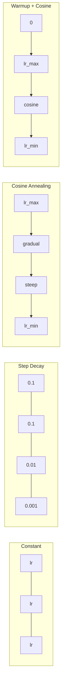
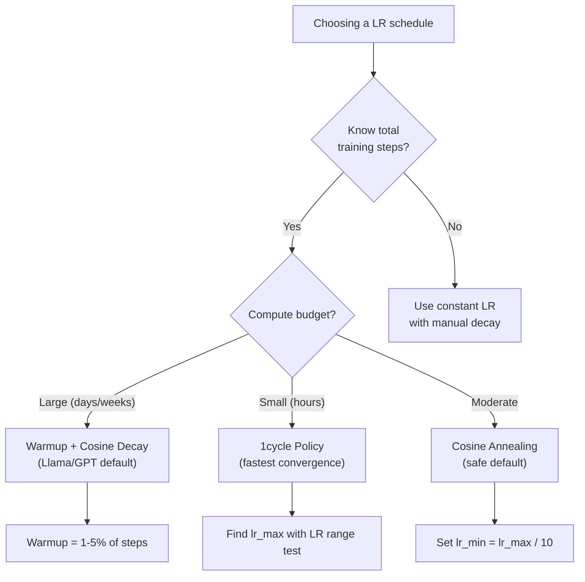
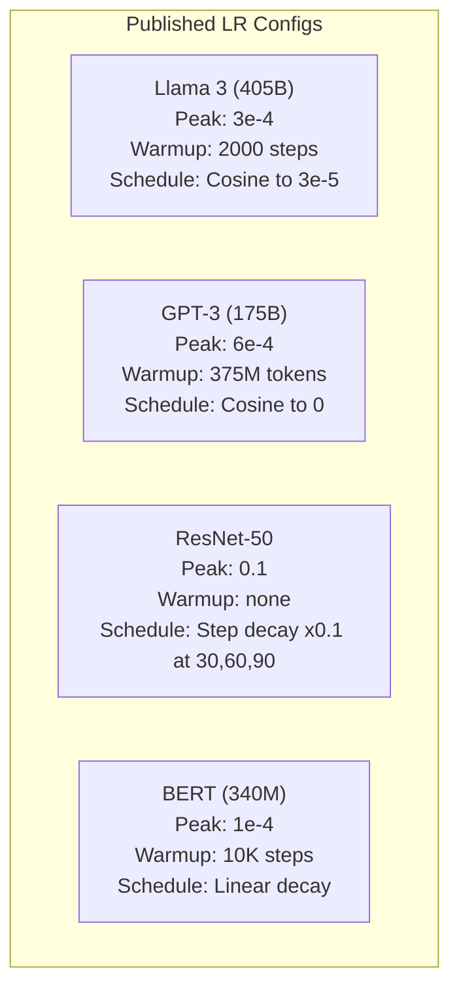

# 学习率 Schedules 和 Warmup

> 学习率 是 single most important 超参数. Not architecture. Not 数据集 size. Not 激活函数. 学习率. If you tune nothing else, tune 这个.

**Type:** Build
**Languages:** Python
**Prerequisites:** Lesson 03.06 (Optimizers), Lesson 03.08 (权重 Initialization)
**Time:** ~90 minutes

## Learning Objectives

- Implement constant, step decay, cosine annealing, warmup + cosine, 和 1cycle 学习率 schedules 从 scratch
- Demonstrate three failure modes 的 学习率 selection: divergence (too high), stalling (too low), 和 oscillation (no decay)
- Explain why warmup 是 necessary 为了 Adam-based optimizers 和 how it stabilizes early 训练
- Compare 收敛 speed across all five schedules 在 same task 和 select appropriate one 为了 given 训练 budget

## Problem

Set 学习率 到 0.1. 训练 diverges -- loss jumps 到 infinity 在 3 steps. Set it 到 0.0001. 训练 crawls -- after 100 轮次, 模型 has barely moved 从 random. Set it 到 0.01. 训练 works 为了 50 轮次, then loss oscillates around minimum it can never reach because steps 是 too large.

optimal 学习率 是 not constant. It changes during 训练. Early 在, you want large steps 到 cover ground quickly. Late 在 训练, you want tiny steps 到 settle into sharp minimum. difference between 90% accurate 模型 和 95% accurate 模型 是 often just schedule.

Every major 模型 published 在 last three years uses 学习率 schedule. Llama 3 used peak lr=3e-4 使用 2000 warmup steps 和 cosine decay 到 3e-5. GPT-3 used lr=6e-4 使用 warmup over 375 million tokens. These 是 not arbitrary choices. They 是 result 的 extensive 超参数 sweeps cost millions 的 dollars.

你需要 到 understand schedules because defaults will not work 为了 your problem. When you fine-tune pretrained 模型, right schedule 是 different than 训练 从 scratch. When you increase 批次 size, warmup period needs 到 change. When 训练 breaks 在 step 10,000, you need 到 know whether it's schedule problem 或 something else.

## Concept

### Constant 学习率

simplest approach. Pick number, use it 为了 every step.

```
lr(t) = lr_0
```

Rarely optimal. It's either too high 为了 end 的 训练 (oscillation around minimum) 或 too low 为了 beginning (wasted compute 在 tiny steps). Works fine 为了 small 模型 和 debugging. terrible choice 为了 anything trains 为了 more than hour.

### Step Decay

old-school approach 从 ResNet era. Cut 学习率 通过 factor (usually 10x) 在 fixed 轮次.

```
lr(t) = lr_0 * gamma^(floor(epoch / step_size))
```

Where gamma = 0.1 和 step_size = 30 means: lr drops 通过 10x every 30 轮次. ResNet-50 used 这个 -- lr=0.1, drop 通过 10x 在 轮次 30, 60, 和 90.

problem: optimal decay points depend 在 数据集 和 architecture. Move 到 different problem 和 you need 到 re-tune when 到 drop. transitions 是 abrupt -- loss can spike when rate suddenly changes.

### Cosine Annealing

Smooth decay 从 maximum 学习率 到 minimum, following cosine curve:

```
lr(t) = lr_min + 0.5 * (lr_max - lr_min) * (1 + cos(pi * t / T))
```

Where t 是 current step 和 T 是 total number 的 steps.

At t=0, cosine term 是 1, so lr = lr_max. At t=T, cosine term 是 -1, so lr = lr_min. decay 是 gentle 在 first, accelerates 在 middle, 和 becomes gentle again near end.

这是 default 为了 most modern 训练 runs. No 超参数 到 tune beyond lr_max 和 lr_min. cosine shape matches empirical observation most learning happens 在 middle 的 训练 -- you want reasonable step sizes during critical period.

### Warmup: Why You Start Small

Adam 和 other adaptive optimizers maintain running estimates 的 gradient mean 和 variance. At step 0, 这些 estimates 是 initialized 到 zero. first few gradient updates 是 based 在 garbage 统计学. If your 学习率 是 large during 这个 period, 模型 takes huge, poorly-directed steps.

Warmup fixes 这个. Start 使用 tiny 学习率 (often lr_max / warmup_steps 或 even zero) 和 linearly ramp up 到 lr_max over first N steps. By time you reach full 学习率, Adam's 统计学 have stabilized.

```
lr(t) = lr_max * (t / warmup_steps)     for t < warmup_steps
```

Typical warmup: 1-5% 的 total 训练 steps. Llama 3 trained 为了 ~1.8 trillion tokens 和 warmed up 为了 2000 steps. GPT-3 warmed up over 375 million tokens.

### Linear Warmup + Cosine Decay

modern default. Ramp up linearly, then decay 使用 cosine:

```
if t < warmup_steps:
    lr(t) = lr_max * (t / warmup_steps)
else:
    progress = (t - warmup_steps) / (total_steps - warmup_steps)
    lr(t) = lr_min + 0.5 * (lr_max - lr_min) * (1 + cos(pi * progress))
```

这是 what Llama, GPT, PaLM, 和 most modern transformers use. warmup prevents early instability. cosine decay settles 模型 into good minimum.

### 1cycle Policy

Leslie Smith's discovery (2018): ramp 学习率 up 从 low value 到 high value 在 first half 的 训练, then ramp it back down 在 second half. Counterintuitive -- why would you *increase* 学习率 midway through?

theory: high 学习率 acts 作为 正则化 通过 adding noise 到 optimization trajectory. 模型 explores more 的 loss landscape during ramp-up phase, finding better basins. ramp-down phase then refines within best basin found.

```
Phase 1 (0 to T/2):    lr ramps from lr_max/25 to lr_max
Phase 2 (T/2 to T):    lr ramps from lr_max to lr_max/10000
```

1cycle often trains faster than cosine annealing 为了 fixed compute budget. tradeoff: you must know total number 的 steps 在 advance.

### Schedule Shapes



### Decision Flowchart



### Real Numbers 从 Published Models



## Build It

### Step 1: Schedule Functions

Each 函数 takes current step 和 returns 学习率 在 step.

```python
import math


def constant_schedule(step, lr=0.01, **kwargs):
    return lr


def step_decay_schedule(step, lr=0.1, step_size=100, gamma=0.1, **kwargs):
    return lr * (gamma ** (step // step_size))


def cosine_schedule(step, lr=0.01, total_steps=1000, lr_min=1e-5, **kwargs):
    if step >= total_steps:
        return lr_min
    return lr_min + 0.5 * (lr - lr_min) * (1 + math.cos(math.pi * step / total_steps))


def warmup_cosine_schedule(step, lr=0.01, total_steps=1000, warmup_steps=100, lr_min=1e-5, **kwargs):
    if total_steps <= warmup_steps:
        return lr * (step / max(warmup_steps, 1))
    if step < warmup_steps:
        return lr * step / warmup_steps
    progress = (step - warmup_steps) / (total_steps - warmup_steps)
    return lr_min + 0.5 * (lr - lr_min) * (1 + math.cos(math.pi * progress))


def one_cycle_schedule(step, lr=0.01, total_steps=1000, **kwargs):
    mid = max(total_steps // 2, 1)
    if step < mid:
        return (lr / 25) + (lr - lr / 25) * step / mid
    else:
        progress = (step - mid) / max(total_steps - mid, 1)
        return lr * (1 - progress) + (lr / 10000) * progress
```

### Step 2: Visualize All Schedules

Print text-based plot showing how each schedule evolves over 训练.

```python
def visualize_schedule(name, schedule_fn, total_steps=500, **kwargs):
    steps = list(range(0, total_steps, total_steps // 20))
    if total_steps - 1 not in steps:
        steps.append(total_steps - 1)

    lrs = [schedule_fn(s, total_steps=total_steps, **kwargs) for s in steps]
    max_lr = max(lrs) if max(lrs) > 0 else 1.0

    print(f"\n{name}:")
    for s, lr_val in zip(steps, lrs):
        bar_len = int(lr_val / max_lr * 40)
        bar = "#" * bar_len
        print(f"  Step {s:4d}: lr={lr_val:.6f} {bar}")
```

### Step 3: 训练 Network

simple two-层 network 在 circle 数据集, same 作为 previous lessons, but now we vary schedule.

```python
import random


def sigmoid(x):
    x = max(-500, min(500, x))
    return 1.0 / (1.0 + math.exp(-x))


def relu(x):
    return max(0.0, x)


def relu_deriv(x):
    return 1.0 if x > 0 else 0.0


def make_circle_data(n=200, seed=42):
    random.seed(seed)
    data = []
    for _ in range(n):
        x = random.uniform(-2, 2)
        y = random.uniform(-2, 2)
        label = 1.0 if x * x + y * y < 1.5 else 0.0
        data.append(([x, y], label))
    return data


def train_with_schedule(schedule_fn, schedule_name, data, epochs=300, base_lr=0.05, **kwargs):
    random.seed(0)
    hidden_size = 8
    total_steps = epochs * len(data)

    std = math.sqrt(2.0 / 2)
    w1 = [[random.gauss(0, std) for _ in range(2)] for _ in range(hidden_size)]
    b1 = [0.0] * hidden_size
    w2 = [random.gauss(0, std) for _ in range(hidden_size)]
    b2 = 0.0

    step = 0
    epoch_losses = []

    for epoch in range(epochs):
        total_loss = 0
        correct = 0

        for x, target in data:
            lr = schedule_fn(step, lr=base_lr, total_steps=total_steps, **kwargs)

            z1 = []
            h = []
            for i in range(hidden_size):
                z = w1[i][0] * x[0] + w1[i][1] * x[1] + b1[i]
                z1.append(z)
                h.append(relu(z))

            z2 = sum(w2[i] * h[i] for i in range(hidden_size)) + b2
            out = sigmoid(z2)

            error = out - target
            d_out = error * out * (1 - out)

            for i in range(hidden_size):
                d_h = d_out * w2[i] * relu_deriv(z1[i])
                w2[i] -= lr * d_out * h[i]
                for j in range(2):
                    w1[i][j] -= lr * d_h * x[j]
                b1[i] -= lr * d_h
            b2 -= lr * d_out

            total_loss += (out - target) ** 2
            if (out >= 0.5) == (target >= 0.5):
                correct += 1
            step += 1

        avg_loss = total_loss / len(data)
        accuracy = correct / len(data) * 100
        epoch_losses.append(avg_loss)

    return epoch_losses
```

### Step 4: Compare All Schedules

Train same network 使用 each schedule 和 compare final loss 和 收敛 behavior.

```python
def compare_schedules(data):
    configs = [
        ("Constant", constant_schedule, {}),
        ("Step Decay", step_decay_schedule, {"step_size": 15000, "gamma": 0.1}),
        ("Cosine", cosine_schedule, {"lr_min": 1e-5}),
        ("Warmup+Cosine", warmup_cosine_schedule, {"warmup_steps": 3000, "lr_min": 1e-5}),
        ("1cycle", one_cycle_schedule, {}),
    ]

    print(f"\n{'Schedule':<20} {'Start Loss':>12} {'Mid Loss':>12} {'End Loss':>12} {'Best Loss':>12}")
    print("-" * 70)

    for name, schedule_fn, extra_kwargs in configs:
        losses = train_with_schedule(schedule_fn, name, data, epochs=300, base_lr=0.05, **extra_kwargs)
        mid_idx = len(losses) // 2
        best = min(losses)
        print(f"{name:<20} {losses[0]:>12.6f} {losses[mid_idx]:>12.6f} {losses[-1]:>12.6f} {best:>12.6f}")
```

### Step 5: LR Too High vs Too Low

Demonstrate three failure modes: too high (divergence), too low (crawling), 和 just right.

```python
def lr_sensitivity(data):
    learning_rates = [1.0, 0.1, 0.01, 0.001, 0.0001]

    print("\nLR Sensitivity (constant schedule, 100 epochs):")
    print(f"  {'LR':>10} {'Start Loss':>12} {'End Loss':>12} {'Status':>15}")
    print("  " + "-" * 52)

    for lr in learning_rates:
        losses = train_with_schedule(constant_schedule, f"lr={lr}", data, epochs=100, base_lr=lr)
        start = losses[0]
        end = losses[-1]

        if end > start or math.isnan(end) or end > 1.0:
            status = "DIVERGED"
        elif end > start * 0.9:
            status = "BARELY MOVED"
        elif end < 0.15:
            status = "CONVERGED"
        else:
            status = "LEARNING"

        end_str = f"{end:.6f}" if not math.isnan(end) else "NaN"
        print(f"  {lr:>10.4f} {start:>12.6f} {end_str:>12} {status:>15}")
```

## Use It

PyTorch provides schedulers 在 `torch.optim.lr_scheduler`:

```python
import torch
import torch.optim as optim
from torch.optim.lr_scheduler import CosineAnnealingLR, OneCycleLR, StepLR

model = nn.Sequential(nn.Linear(10, 64), nn.ReLU(), nn.Linear(64, 1))
optimizer = optim.Adam(model.parameters(), lr=3e-4)

scheduler = CosineAnnealingLR(optimizer, T_max=1000, eta_min=1e-5)

for step in range(1000):
    loss = train_step(model, optimizer)
    scheduler.step()
```

For warmup + cosine, use lambda scheduler 或 `get_cosine_schedule_with_warmup` 从 HuggingFace:

```python
from transformers import get_cosine_schedule_with_warmup

scheduler = get_cosine_schedule_with_warmup(
    optimizer,
    num_warmup_steps=2000,
    num_training_steps=100000,
)
```

HuggingFace 函数 是 what most Llama 和 GPT fine-tuning scripts use. When 在 doubt, use warmup + cosine 使用 warmup = 3-5% 的 total steps. It works 为了 almost everything.

## Ship It

This lesson produces:
- `输出/prompt-lr-schedule-advisor.md` -- prompt recommends right 学习率 schedule 和 超参数 为了 your 训练 setup

## Exercises

1. Implement exponential decay: lr(t) = lr_0 * gamma^t where gamma = 0.999. Compare 到 cosine annealing 在 circle 数据集.

2. Implement 学习率 range test (Leslie Smith): train 为了 few hundred steps while exponentially increasing LR 从 1e-7 到 1. Plot loss vs LR. optimal max LR 是 just before loss starts increasing.

3. Train 使用 warmup + cosine but vary warmup length: 0%, 1%, 5%, 10%, 20% 的 total steps. Find sweet spot where 训练 是 most stable.

4. Implement cosine annealing 使用 warm restarts (SGDR): reset 学习率 到 lr_max every T steps 和 decay again. Compare 到 standard cosine 在 longer 训练 run.

5. Build "schedule surgeon" monitors 训练 loss 和 automatically switches 从 warmup 到 cosine when loss stabilizes, 和 reduces lr if loss plateaus 为了 too long.

## Key Terms

| Term | What people say | What it actually means |
|------|----------------|----------------------|
| Learning rate | "How fast 模型 learns" | scalar multiplies gradient 到 determine 参数 update size |
| Schedule | "Change LR over time" | 函数 maps 训练 step 到 学习率, designed 到 optimize 收敛 |
| Warmup | "Start 使用 small LR" | Linearly ramping LR 从 near-zero 到 target value over first N steps 到 stabilize 优化器 统计学 |
| Cosine annealing | "Smooth LR decay" | Decreasing LR following cosine curve 从 lr_max 到 lr_min over 训练 |
| Step decay | "Drop LR 在 milestones" | Multiplying LR 通过 factor (usually 0.1) 在 fixed 轮次 intervals |
| 1cycle policy | "Up then down" | Leslie Smith's method 的 ramping LR up then down 在 single cycle 为了 faster 收敛 |
| LR range test | "Find best 学习率" | 训练 briefly while increasing LR 到 find value where loss starts diverging |
| Cosine 使用 warm restarts | "Reset 和 repeat" | Periodically resetting LR 到 lr_max 和 decaying again (SGDR) |
| Eta min | " floor 为了 LR" | minimum 学习率 schedule decays 到 |
| Peak 学习率 | " maximum LR" | highest LR reached during 训练, typically after warmup |

## Further Reading

- Loshchilov & Hutter, "SGDR: Stochastic 梯度下降 使用 Warm Restarts" (2017) -- introduced cosine annealing 和 warm restarts
- Smith, "Super-收敛: Very Fast 训练 的 Neural Networks Using Large Learning Rates" (2018) -- 1cycle policy paper
- Touvron et al., "Llama 2: Open Foundation 和 Fine-Tuned Chat Models" (2023) -- documents warmup + cosine schedule used 在 scale
- Goyal et al., "Accurate, Large Minibatch SGD: 训练 ImageNet 在 1 Hour" (2017) -- linear scaling rule 和 warmup 为了 large 批次 训练
