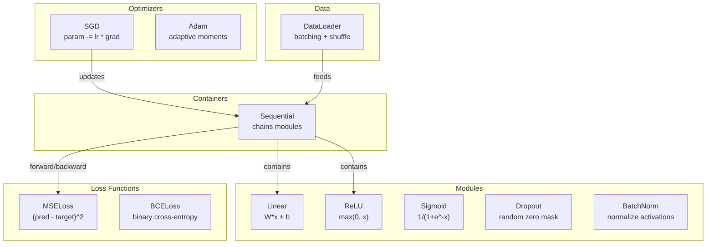
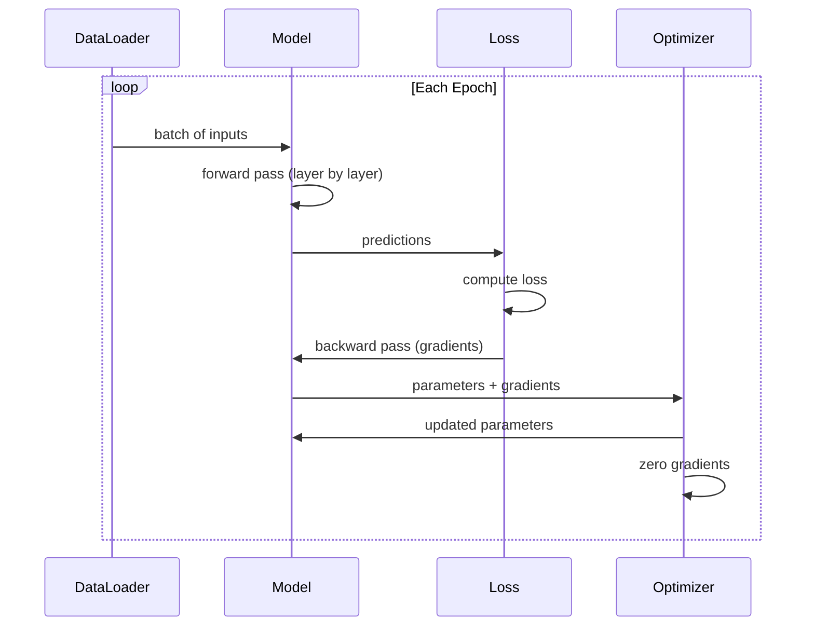
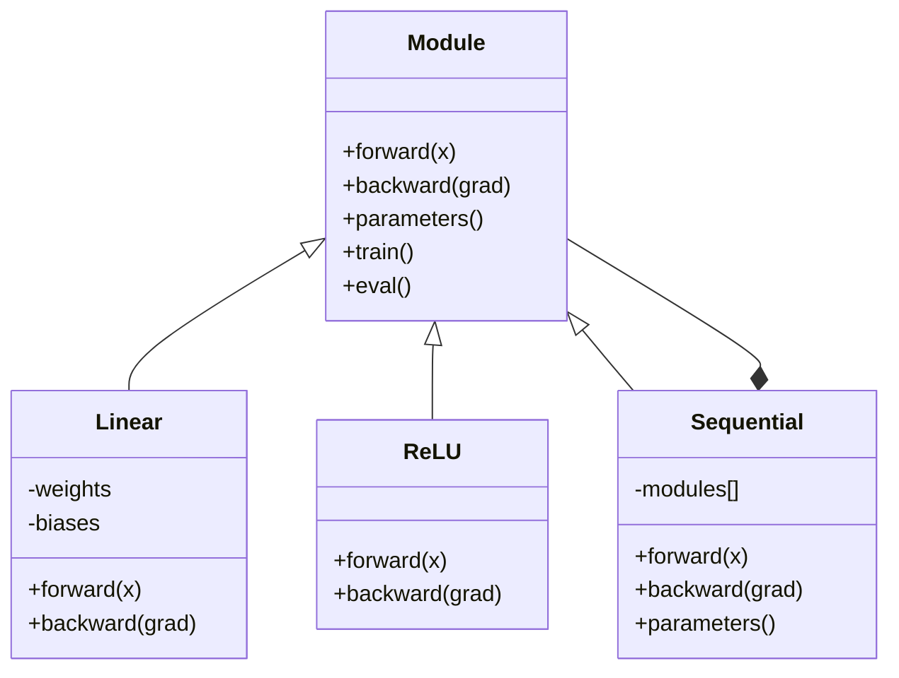

# Build Your Own Mini Framework

> You have built 神经元, 层, networks, backprop, activations, loss 函数, optimizers, 正则化, initialization, 和 LR schedules. All 作为 separate pieces. Now wire them together into framework. Not PyTorch. Not TensorFlow. Yours.

**Type:** Build
**Languages:** Python
**Prerequisites:** All 的 Phase 03 (Lessons 01-09)
**Time:** ~120 minutes

## Learning Objectives

- Build complete deep learning framework (~500 lines) 使用 Module, Linear, ReLU, Sigmoid, Dropout, BatchNorm, Sequential, loss 函数, optimizers, 和 DataLoader
- Explain Module abstraction (forward, backward, 参数) 和 why train/eval mode toggling 是 necessary
- Wire all components into working 训练 loop trains 4-层 network 在 circle 分类
- Map each component 的 your framework 到 its PyTorch equivalent (nn.Module, nn.Sequential, optim.Adam, DataLoader)

## Problem

You have ten lessons 的 building blocks scattered across separate files. `Value` class here, 训练 loop there, 权重 initialization 在 another file, 学习率 schedules 在 yet another. To train network, you copy-paste 从 five different lessons 和 wire them together 通过 hand.

那是 what frameworks solve. PyTorch gives you `nn.Module`, `nn.Sequential`, `optim.Adam`, `DataLoader`, 和 训练 loop pattern ties them together. TensorFlow gives you `keras.层`, `keras.Sequential`, `keras.optimizers.Adam`. These 是 not magic. They 是 organizational patterns make it possible 到 define, train, 和 evaluate networks without reinventing plumbing every time.

You 是 going 到 build same thing 在 ~500 lines 的 Python. No numpy. No external dependencies. framework can define any feedforward network, train it 使用 SGD 或 Adam, 批次 数据, apply dropout 和 批次 normalization, use any activation, 和 schedule 学习率.

When you finish, you will understand exactly what happens when you write `模型 = nn.Sequential(...)` 在 PyTorch. 你将理解 why `模型.train()` 和 `模型.eval()` exist. 你将理解 why `优化器.zero_grad()` 是 separate call. 你将理解 all 的 it, because you built all 的 it.

## Concept

### Module Abstraction

Every 层 在 PyTorch inherits 从 `nn.Module`. Module has three responsibilities:

1. **forward()** -- compute 输出 given 输入
2. **参数()** -- return all trainable 权重
3. **backward()** -- compute gradients (handled 通过 autograd 在 PyTorch, explicit 在 ours)

Linear 层 是 Module. ReLU activation 是 Module. dropout 层 是 Module. 批次 normalization 层 是 Module. They all have same interface.

### Sequential Container

`nn.Sequential` chains Modules. Forward pass: feed 数据 through Module 1, then Module 2, then Module 3. Backward pass: reverse chain. container itself 是 Module -- it has forward(), 参数(), 和 backward(). 这是 composite pattern: sequence 的 Modules 是 itself Module.

### 训练 vs Evaluation Mode

Dropout randomly zeroes 神经元 during 训练 but passes everything through during evaluation. 批次 normalization uses 批次 统计学 during 训练 but running averages during evaluation. `train()` 和 `eval()` methods toggle 这个 behavior. Every Module has `训练` flag.

### 优化器

优化器 updates 参数 using their gradients. SGD: `param -= lr * grad`. Adam: maintains momentum 和 variance estimates, then updates. 优化器 does not know about network architecture -- it only sees flat list 的 参数 和 their gradients.

### DataLoader

Batching matters 为了 two reasons. First, you cannot fit entire 数据集 在 memory 为了 large problems. Second, mini-批次 梯度下降 provides noise helps escape local minima. DataLoader splits 数据 into 批次 和 optionally shuffles between 轮次.

### Framework Architecture



### 训练 Loop



### Module Hierarchy



## Build It

### Step 1: Module Base Class

abstract interface every 层 implements.

```python
class Module:
    def __init__(self):
        self.training = True

    def forward(self, x):
        raise NotImplementedError

    def backward(self, grad):
        raise NotImplementedError

    def parameters(self):
        return []

    def train(self):
        self.training = True

    def eval(self):
        self.training = False
```

### Step 2: Linear 层

fundamental building block. Stores 权重 和 偏置, computes Wx + b forward, 和 权重/输入 gradients backward.

```python
import math
import random


class Linear(Module):
    def __init__(self, fan_in, fan_out):
        super().__init__()
        std = math.sqrt(2.0 / fan_in)
        self.weights = [[random.gauss(0, std) for _ in range(fan_in)] for _ in range(fan_out)]
        self.biases = [0.0] * fan_out
        self.weight_grads = [[0.0] * fan_in for _ in range(fan_out)]
        self.bias_grads = [0.0] * fan_out
        self.fan_in = fan_in
        self.fan_out = fan_out
        self.input = None

    def forward(self, x):
        self.input = x
        output = []
        for i in range(self.fan_out):
            val = self.biases[i]
            for j in range(self.fan_in):
                val += self.weights[i][j] * x[j]
            output.append(val)
        return output

    def backward(self, grad):
        input_grad = [0.0] * self.fan_in
        for i in range(self.fan_out):
            self.bias_grads[i] += grad[i]
            for j in range(self.fan_in):
                self.weight_grads[i][j] += grad[i] * self.input[j]
                input_grad[j] += grad[i] * self.weights[i][j]
        return input_grad

    def parameters(self):
        params = []
        for i in range(self.fan_out):
            for j in range(self.fan_in):
                params.append((self.weights, i, j, self.weight_grads))
            params.append((self.biases, i, None, self.bias_grads))
        return params
```

### Step 3: Activation Modules

ReLU, Sigmoid, 和 Tanh 作为 Modules. Each caches what it needs 为了 backward pass.

```python
class ReLU(Module):
    def __init__(self):
        super().__init__()
        self.mask = None

    def forward(self, x):
        self.mask = [1.0 if v > 0 else 0.0 for v in x]
        return [max(0.0, v) for v in x]

    def backward(self, grad):
        return [g * m for g, m in zip(grad, self.mask)]


class Sigmoid(Module):
    def __init__(self):
        super().__init__()
        self.output = None

    def forward(self, x):
        self.output = []
        for v in x:
            v = max(-500, min(500, v))
            self.output.append(1.0 / (1.0 + math.exp(-v)))
        return self.output

    def backward(self, grad):
        return [g * o * (1 - o) for g, o in zip(grad, self.output)]


class Tanh(Module):
    def __init__(self):
        super().__init__()
        self.output = None

    def forward(self, x):
        self.output = [math.tanh(v) for v in x]
        return self.output

    def backward(self, grad):
        return [g * (1 - o * o) for g, o in zip(grad, self.output)]
```

### Step 4: Dropout Module

Randomly zeroes elements during 训练. Scales remaining elements 通过 1/(1-p) so expected values stay same. Does nothing during eval.

```python
class Dropout(Module):
    def __init__(self, p=0.5):
        super().__init__()
        self.p = p
        self.mask = None

    def forward(self, x):
        if not self.training:
            return x
        self.mask = [0.0 if random.random() < self.p else 1.0 / (1 - self.p) for _ in x]
        return [v * m for v, m in zip(x, self.mask)]

    def backward(self, grad):
        if self.mask is None:
            return grad
        return [g * m for g, m in zip(grad, self.mask)]
```

### Step 5: BatchNorm Module

Normalizes activations 到 zero mean 和 unit variance per 特征 across 批次. Maintains running 统计学 为了 eval mode.

```python
class BatchNorm(Module):
    def __init__(self, size, momentum=0.1, eps=1e-5):
        super().__init__()
        self.size = size
        self.gamma = [1.0] * size
        self.beta = [0.0] * size
        self.gamma_grads = [0.0] * size
        self.beta_grads = [0.0] * size
        self.running_mean = [0.0] * size
        self.running_var = [1.0] * size
        self.momentum = momentum
        self.eps = eps
        self.x_norm = None
        self.std_inv = None
        self.batch_input = None

    def forward_batch(self, batch):
        batch_size = len(batch)
        output_batch = []

        if self.training:
            mean = [0.0] * self.size
            for sample in batch:
                for j in range(self.size):
                    mean[j] += sample[j]
            mean = [m / batch_size for m in mean]

            var = [0.0] * self.size
            for sample in batch:
                for j in range(self.size):
                    var[j] += (sample[j] - mean[j]) ** 2
            var = [v / batch_size for v in var]

            self.std_inv = [1.0 / math.sqrt(v + self.eps) for v in var]

            self.x_norm = []
            self.batch_input = batch
            for sample in batch:
                normed = [(sample[j] - mean[j]) * self.std_inv[j] for j in range(self.size)]
                self.x_norm.append(normed)
                output = [self.gamma[j] * normed[j] + self.beta[j] for j in range(self.size)]
                output_batch.append(output)

            for j in range(self.size):
                self.running_mean[j] = (1 - self.momentum) * self.running_mean[j] + self.momentum * mean[j]
                self.running_var[j] = (1 - self.momentum) * self.running_var[j] + self.momentum * var[j]
        else:
            std_inv = [1.0 / math.sqrt(v + self.eps) for v in self.running_var]
            for sample in batch:
                normed = [(sample[j] - self.running_mean[j]) * std_inv[j] for j in range(self.size)]
                output = [self.gamma[j] * normed[j] + self.beta[j] for j in range(self.size)]
                output_batch.append(output)

        return output_batch

    def forward(self, x):
        result = self.forward_batch([x])
        return result[0]

    def backward(self, grad):
        if self.x_norm is None:
            return grad
        for j in range(self.size):
            self.gamma_grads[j] += self.x_norm[0][j] * grad[j]
            self.beta_grads[j] += grad[j]
        return [grad[j] * self.gamma[j] * self.std_inv[j] for j in range(self.size)]

    def parameters(self):
        params = []
        for j in range(self.size):
            params.append((self.gamma, j, None, self.gamma_grads))
            params.append((self.beta, j, None, self.beta_grads))
        return params
```

### Step 6: Sequential Container

Chains modules. Forward goes left-到-right, backward goes right-到-left.

```python
class Sequential(Module):
    def __init__(self, *modules):
        super().__init__()
        self.modules = list(modules)

    def forward(self, x):
        for module in self.modules:
            x = module.forward(x)
        return x

    def backward(self, grad):
        for module in reversed(self.modules):
            grad = module.backward(grad)
        return grad

    def parameters(self):
        params = []
        for module in self.modules:
            params.extend(module.parameters())
        return params

    def train(self):
        self.training = True
        for module in self.modules:
            module.train()

    def eval(self):
        self.training = False
        for module in self.modules:
            module.eval()
```

### Step 7: Loss Functions

MSE 和 Binary Cross-Entropy. Each returns loss value 和 provides backward() returns gradient.

```python
class MSELoss:
    def __call__(self, predicted, target):
        self.predicted = predicted
        self.target = target
        n = len(predicted)
        self.loss = sum((p - t) ** 2 for p, t in zip(predicted, target)) / n
        return self.loss

    def backward(self):
        n = len(self.predicted)
        return [2 * (p - t) / n for p, t in zip(self.predicted, self.target)]


class BCELoss:
    def __call__(self, predicted, target):
        self.predicted = predicted
        self.target = target
        eps = 1e-7
        n = len(predicted)
        self.loss = 0
        for p, t in zip(predicted, target):
            p = max(eps, min(1 - eps, p))
            self.loss += -(t * math.log(p) + (1 - t) * math.log(1 - p))
        self.loss /= n
        return self.loss

    def backward(self):
        eps = 1e-7
        n = len(self.predicted)
        grads = []
        for p, t in zip(self.predicted, self.target):
            p = max(eps, min(1 - eps, p))
            grads.append((-t / p + (1 - t) / (1 - p)) / n)
        return grads
```

### Step 8: SGD 和 Adam Optimizers

Both take 参数 list 和 update 权重 using gradients.

```python
class SGD:
    def __init__(self, parameters, lr=0.01):
        self.params = parameters
        self.lr = lr

    def step(self):
        for container, i, j, grad_container in self.params:
            if j is not None:
                container[i][j] -= self.lr * grad_container[i][j]
            else:
                container[i] -= self.lr * grad_container[i]

    def zero_grad(self):
        for container, i, j, grad_container in self.params:
            if j is not None:
                grad_container[i][j] = 0.0
            else:
                grad_container[i] = 0.0


class Adam:
    def __init__(self, parameters, lr=0.001, beta1=0.9, beta2=0.999, eps=1e-8):
        self.params = parameters
        self.lr = lr
        self.beta1 = beta1
        self.beta2 = beta2
        self.eps = eps
        self.t = 0
        self.m = [0.0] * len(parameters)
        self.v = [0.0] * len(parameters)

    def step(self):
        self.t += 1
        for idx, (container, i, j, grad_container) in enumerate(self.params):
            if j is not None:
                g = grad_container[i][j]
            else:
                g = grad_container[i]

            self.m[idx] = self.beta1 * self.m[idx] + (1 - self.beta1) * g
            self.v[idx] = self.beta2 * self.v[idx] + (1 - self.beta2) * g * g

            m_hat = self.m[idx] / (1 - self.beta1 ** self.t)
            v_hat = self.v[idx] / (1 - self.beta2 ** self.t)

            update = self.lr * m_hat / (math.sqrt(v_hat) + self.eps)

            if j is not None:
                container[i][j] -= update
            else:
                container[i] -= update

    def zero_grad(self):
        for container, i, j, grad_container in self.params:
            if j is not None:
                grad_container[i][j] = 0.0
            else:
                grad_container[i] = 0.0
```

### Step 9: DataLoader

Splits 数据 into 批次, optionally shuffles each 轮次.

```python
class DataLoader:
    def __init__(self, data, batch_size=32, shuffle=True):
        self.data = data
        self.batch_size = batch_size
        self.shuffle = shuffle

    def __iter__(self):
        indices = list(range(len(self.data)))
        if self.shuffle:
            random.shuffle(indices)
        for start in range(0, len(indices), self.batch_size):
            batch_indices = indices[start:start + self.batch_size]
            batch = [self.data[i] for i in batch_indices]
            inputs = [item[0] for item in batch]
            targets = [item[1] for item in batch]
            yield inputs, targets

    def __len__(self):
        return (len(self.data) + self.batch_size - 1) // self.batch_size
```

### Step 10: Train 4-层 Network 在 Circle 分类

Wire everything together. Define 模型, pick loss, pick 优化器, run 训练 loop.

```python
def make_circle_data(n=500, seed=42):
    random.seed(seed)
    data = []
    for _ in range(n):
        x = random.uniform(-2, 2)
        y = random.uniform(-2, 2)
        label = 1.0 if x * x + y * y < 1.5 else 0.0
        data.append(([x, y], [label]))
    return data


def train():
    random.seed(42)

    model = Sequential(
        Linear(2, 16),
        ReLU(),
        Linear(16, 16),
        ReLU(),
        Linear(16, 8),
        ReLU(),
        Linear(8, 1),
        Sigmoid(),
    )

    criterion = BCELoss()
    optimizer = Adam(model.parameters(), lr=0.01)

    data = make_circle_data(500)
    split = int(len(data) * 0.8)
    train_data = data[:split]
    test_data = data[split:]

    loader = DataLoader(train_data, batch_size=16, shuffle=True)

    model.train()

    for epoch in range(100):
        total_loss = 0
        total_correct = 0
        total_samples = 0

        for batch_inputs, batch_targets in loader:
            batch_loss = 0
            for x, t in zip(batch_inputs, batch_targets):
                pred = model.forward(x)
                loss = criterion(pred, t)
                batch_loss += loss

                optimizer.zero_grad()
                grad = criterion.backward()
                model.backward(grad)
                optimizer.step()

                predicted_class = 1.0 if pred[0] >= 0.5 else 0.0
                if predicted_class == t[0]:
                    total_correct += 1
                total_samples += 1

            total_loss += batch_loss

        avg_loss = total_loss / total_samples
        accuracy = total_correct / total_samples * 100

        if epoch % 10 == 0 or epoch == 99:
            print(f"Epoch {epoch:3d} | Loss: {avg_loss:.6f} | Train Accuracy: {accuracy:.1f}%")

    model.eval()
    correct = 0
    for x, t in test_data:
        pred = model.forward(x)
        predicted_class = 1.0 if pred[0] >= 0.5 else 0.0
        if predicted_class == t[0]:
            correct += 1
    test_accuracy = correct / len(test_data) * 100
    print(f"\nTest Accuracy: {test_accuracy:.1f}% ({correct}/{len(test_data)})")

    return model, test_accuracy
```

## Use It

Here 是 PyTorch equivalent 的 what you just built:

```python
import torch
import torch.nn as nn
from torch.utils.data import DataLoader, TensorDataset

model = nn.Sequential(
    nn.Linear(2, 16),
    nn.ReLU(),
    nn.Linear(16, 16),
    nn.ReLU(),
    nn.Linear(16, 8),
    nn.ReLU(),
    nn.Linear(8, 1),
    nn.Sigmoid(),
)

criterion = nn.BCELoss()
optimizer = torch.optim.Adam(model.parameters(), lr=0.01)

for epoch in range(100):
    model.train()
    for inputs, targets in dataloader:
        optimizer.zero_grad()
        predictions = model(inputs)
        loss = criterion(predictions, targets)
        loss.backward()
        optimizer.step()

    model.eval()
    with torch.no_grad():
        test_predictions = model(test_inputs)
```

structure 是 identical. `Sequential`, `Linear`, `ReLU`, `Sigmoid`, `BCELoss`, `Adam`, `zero_grad`, `backward`, `step`, `train`, `eval`. Every concept maps one-到-one. difference 是 PyTorch handles autograd automatically (no need 到 implement backward() 在 each module), runs 在 GPU, 和 has been optimized 为了 years. But bones 是 same.

Now when you see PyTorch 代码, you know exactly what 是 happening 在 every line. That understanding 是 whole point.

## Ship It

This lesson produces:
- `输出/prompt-framework-architect.md` -- prompt 为了 designing 神经网络 architectures using framework abstractions

## Exercises

1. Add `SoftmaxCrossEntropyLoss` class 为了 multi-class 分类. Softmax predictions, compute cross-entropy loss, 和 handle combined backward pass. Test it 在 3-class spiral 数据集.

2. Implement 学习率 scheduling 在 优化器: add `set_lr()` method 和 wire 在 cosine schedule 从 Lesson 09. Train circle classifier 使用 warmup + cosine 和 compare 到 constant LR.

3. Add `save()` 和 `load()` method 到 Sequential serializes all 权重 到 JSON file 和 loads them back. Verify loaded 模型 produces same predictions 作为 original.

4. Implement 权重 decay (L2 正则化) 在 Adam 优化器. Add `weight_decay` 参数 shrinks 权重 toward zero each step. Compare 训练 使用 decay=0 vs decay=0.01.

5. Replace per-sample 训练 loop 使用 proper mini-批次 gradient accumulation: accumulate gradients across all samples 在 批次, then divide 通过 批次 size 和 take one 优化器 step. Measure whether 这个 changes 收敛 speed.

## Key Terms

| Term | What people say | What it actually means |
|------|----------------|----------------------|
| Module | " 层" | base abstraction 在 framework -- anything 使用 forward(), backward(), 和 参数() |
| Sequential | "Stack 层 在 order" | container chains modules, applying them 在 sequence 为了 forward 和 reverse 为了 backward |
| Forward pass | "Run network" | Computing 输出 通过 passing 输入 through each module 在 order |
| Backward pass | "Compute gradients" | Propagating loss gradient through each module 在 reverse 到 compute 参数 gradients |
| Parameters | " trainable 权重" | All values 在 network 优化器 can update -- 权重 和 偏置 |
| 优化器 | " thing updates 权重" | 算法 uses gradients 到 update 参数, implementing SGD, Adam, 或 other rules |
| DataLoader | " thing feeds 数据" | iterator splits 数据集 into 批次, optionally shuffling between 轮次 |
| 训练 mode | "模型.train()" | flag enables stochastic behavior like dropout 和 批次 normalization 使用 批次 stats |
| Evaluation mode | "模型.eval()" | flag disables dropout 和 uses running 统计学 为了 批次 normalization |
| Zero grad | "Clear gradients" | Resetting all 参数 gradients 到 zero before computing next 批次's gradients |

## Further Reading

- Paszke et al., "PyTorch: Imperative Style, High-Performance Deep Learning Library" (2019) -- paper describing PyTorch's design decisions
- Chollet, "Deep Learning 使用 Python, Second Edition" (2021) -- Chapter 3 covers Keras internals 使用 same module/层 abstraction
- Johnson, "Tiny-DNN" (https://github.com/tiny-dnn/tiny-dnn) -- header-only C++ deep learning framework 为了 understanding framework internals
