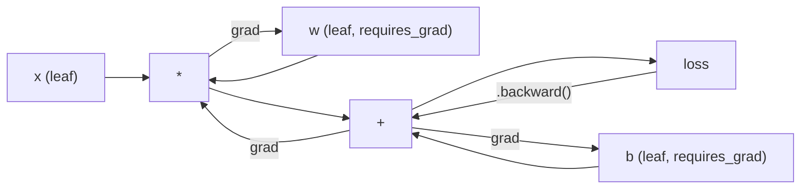
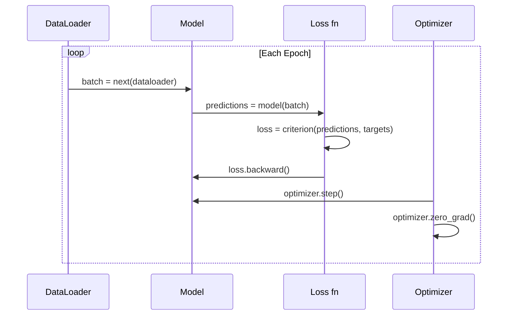

# Introduction 到 PyTorch

> You built engine 从 pistons 和 crankshafts. Now learn one everyone actually drives.

**Type:** Build
**Languages:** Python
**Prerequisites:** Lesson 03.10 (Build Your Own Mini Framework)
**Time:** ~75 minutes

## Learning Objectives

- Build 和 train 神经网络 using PyTorch's nn.Module, nn.Sequential, 和 autograd
- Use PyTorch 张量, GPU acceleration, 和 standard 训练 loop (zero_grad, forward, loss, backward, step)
- Convert your 从-scratch mini framework components 到 their PyTorch equivalents
- Profile 和 compare 训练 speed between your pure-Python framework 和 PyTorch 在 same task

## Problem

You have working mini framework. Linear 层, ReLU, dropout, 批次 norm, Adam, DataLoader, 训练 loop. It trains 4-层 network 在 circle 分类 problem 在 pure Python.

它是 also 500x slower than PyTorch 在 same problem.

Your mini framework processes one sample 在 time 使用 nested Python loops. PyTorch dispatches same operations 到 optimized C++/CUDA kernels run 在 GPU. On single NVIDIA A100, PyTorch trains ResNet-50 (25.6M 参数) 在 ImageNet (1.28M images) 在 about 6 hours. Your framework would take roughly 3,000 hours 在 same task -- if it didn't run out 的 memory first.

Speed 是 not only gap. Your framework has no GPU support. No automatic differentiation -- you hand-wrote backward() 为了 every module. No serialization. No distributed 训练. No mixed 精确率. No way 到 debug gradient flow without print statements.

PyTorch fills every one 的 这些 gaps. And it does so while keeping exact same mental 模型 you already built: Module, forward(), 参数(), backward(), 优化器.step(). concepts transfer one-到-one. syntax 是 nearly identical. difference 是 PyTorch wraps decade 的 systems engineering behind same interface you designed 从 scratch.

## Concept

### Why PyTorch Won

In 2015, TensorFlow required you 到 define static computation graph before running anything. You built graph, compiled it, then fed 数据 through it. Debugging meant staring 在 graph visualizations. Changing architecture meant rebuilding graph 从 scratch.

PyTorch launched 在 2017 使用 different philosophy: eager execution. You write Python. It runs immediately. `y = 模型(x)` actually computes y right now, not "add 节点 到 graph will compute y later." This meant standard Python debugging tools worked. print() worked. pdb worked. if/else 在 your forward pass worked.

By 2020, market had spoken. PyTorch's share 在 ML research papers went 从 7% (2017) 到 over 75% (2022). Meta, Google DeepMind, OpenAI, Anthropic, 和 Hugging Face all use PyTorch 作为 their primary framework. TensorFlow 2.x adopted eager execution 在 response -- tacit admission PyTorch's design was correct.

lesson: developer experience compounds. framework 是 10% slower but 50% faster 到 debug wins every time.

### Tensors

张量 是 multi-dimensional array 使用 three critical properties: shape, dtype, 和 device.

```python
import torch

x = torch.zeros(3, 4)           # shape: (3, 4), dtype: float32, device: cpu
x = torch.randn(2, 3, 224, 224) # batch of 2 RGB images, 224x224
x = torch.tensor([1, 2, 3])     # from a Python list
```

**Shape** 是 dimensionality. scalar 是 shape (), 向量 是 (n,), 矩阵 是 (m, n), 批次 的 images 是 (批次, channels, height, width).

**Dtype** controls 精确率 和 memory.

| dtype | Bits | Range | Use case |
|-------|------|-------|----------|
| float32 | 32 | ~7 decimal digits | Default 训练 |
| float16 | 16 | ~3.3 decimal digits | Mixed 精确率 |
| bfloat16 | 16 | Same range 作为 float32, less 精确率 | LLM 训练 |
| int8 | 8 | -128 到 127 | Quantized inference |

**Device** determines where computation happens.

```python
device = torch.device("cuda" if torch.cuda.is_available() else "cpu")
x = torch.randn(3, 4, device=device)
x = x.to("cuda")
x = x.cpu()
```

Every operation requires all 张量 在 same device. 这是 #1 PyTorch error beginners hit: `RuntimeError: Expected all 张量 到 be 在 same device`. Fix it 通过 moving everything 到 same device before computation.

**Reshaping** 是 constant-time -- it changes metadata, not 数据.

```python
x = torch.randn(2, 3, 4)
x.view(2, 12)      # reshape to (2, 12) -- must be contiguous
x.reshape(6, 4)    # reshape to (6, 4) -- works always
x.permute(2, 0, 1) # reorder dimensions
x.unsqueeze(0)     # add dimension: (1, 2, 3, 4)
x.squeeze()        # remove size-1 dimensions
```

### Autograd

Your mini framework required you 到 implement backward() 为了 every module. PyTorch does not. It records every operation 在 张量 into directed acyclic graph ( computational graph) 和 then traverses graph 在 reverse 到 compute gradients automatically.



key difference 从 your framework: PyTorch uses tape-based autodiff. Every operation appends 到 "tape" during forward pass. Calling `.backward()` replays tape 在 reverse.

```python
x = torch.randn(3, requires_grad=True)
y = x ** 2 + 3 * x
z = y.sum()
z.backward()
print(x.grad)  # dz/dx = 2x + 3
```

Three rules 的 autograd:

1. Only leaf 张量 使用 `requires_grad=True` accumulate gradients
2. Gradients accumulate 通过 default -- call `优化器.zero_grad()` before each backward pass
3. `torch.no_grad()` disables gradient tracking (use during evaluation)

### nn.Module

`nn.Module` 是 base class 为了 every 神经网络 component 在 PyTorch. You already built 这个 abstraction 在 Lesson 10. PyTorch's version adds automatic 参数 registration, recursive module discovery, device management, 和 state dict serialization.

```python
import torch.nn as nn

class MLP(nn.Module):
    def __init__(self, input_dim, hidden_dim, output_dim):
        super().__init__()
        self.layer1 = nn.Linear(input_dim, hidden_dim)
        self.relu = nn.ReLU()
        self.layer2 = nn.Linear(hidden_dim, output_dim)

    def forward(self, x):
        x = self.layer1(x)
        x = self.relu(x)
        x = self.layer2(x)
        return x
```

When you assign `nn.Module` 或 `nn.参数` 作为 attribute 在 `__init__`, PyTorch automatically registers it. `模型.参数()` recursively collects every registered 参数. 这是 why you never have 到 manually gather 权重 like you did 在 mini framework.

Key building blocks:

| Module | What it does | Parameters |
|--------|-------------|------------|
| nn.Linear(在, out) | Wx + b | 在*out + out |
| nn.Conv2d(in_ch, out_ch, k) | 2D convolution | in_ch*out_ch*k*k + out_ch |
| nn.BatchNorm1d(特征) | Normalize activations | 2 * 特征 |
| nn.Dropout(p) | Random zeroing | 0 |
| nn.ReLU() | max(0, x) | 0 |
| nn.GELU() | Gaussian error linear | 0 |
| nn.Embedding(vocab, dim) | Lookup table | vocab * dim |
| nn.LayerNorm(dim) | Per-sample normalization | 2 * dim |

### Loss Functions 和 Optimizers

PyTorch ships production-ready versions 的 everything you built.

**Loss 函数** (从 `torch.nn`):

| Loss | Task | 输入 |
|------|------|-------|
| nn.MSELoss() | 回归 | Any shape |
| nn.CrossEntropyLoss() | Multi-class 分类 | Logits (not softmax) |
| nn.BCEWithLogitsLoss() | Binary 分类 | Logits (not sigmoid) |
| nn.L1Loss() | 回归 (robust) | Any shape |
| nn.CTCLoss() | Sequence alignment | Log probabilities |

Note: `CrossEntropyLoss` combines `LogSoftmax` + `NLLLoss` internally. Pass raw logits, not softmax 输出. 这是 common mistake produces wrong gradients silently.

**Optimizers** (从 `torch.optim`):

| 优化器 | When 到 use | Typical LR |
|-----------|-------------|-----------|
| SGD(params, lr, momentum) | CNNs, well-tuned pipelines | 0.01--0.1 |
| Adam(params, lr) | Default starting point | 1e-3 |
| AdamW(params, lr, weight_decay) | Transformers, fine-tuning | 1e-4--1e-3 |
| LBFGS(params) | Small-scale, second-order | 1.0 |

### 训练 Loop

Every PyTorch 训练 loop follows same 5-step pattern. You already know 这个 从 Lesson 10.



canonical pattern:

```python
for epoch in range(num_epochs):
    model.train()
    for inputs, targets in train_loader:
        inputs, targets = inputs.to(device), targets.to(device)
        optimizer.zero_grad()
        outputs = model(inputs)
        loss = criterion(outputs, targets)
        loss.backward()
        optimizer.step()
```

Five lines inside 批次 loop. Five lines trained GPT-4, Stable Diffusion, 和 LLaMA. architecture changes. 数据 changes. These five lines do not.

### 数据集 和 DataLoader

PyTorch's `数据集` 是 abstract class 使用 two methods: `__len__` 和 `__getitem__`. `DataLoader` wraps it 使用 batching, shuffling, 和 multi-process 数据 loading.

```python
from torch.utils.data import Dataset, DataLoader

class MNISTDataset(Dataset):
    def __init__(self, images, labels):
        self.images = images
        self.labels = labels

    def __len__(self):
        return len(self.labels)

    def __getitem__(self, idx):
        return self.images[idx], self.labels[idx]

loader = DataLoader(dataset, batch_size=64, shuffle=True, num_workers=4)
```

`num_workers=4` spawns 4 processes 到 load 数据 在 parallel while GPU trains 在 current 批次. On disk-bound workloads (large images, audio), 这个 alone can double 训练 speed.

### GPU 训练

Moving 模型 到 GPU:

```python
device = torch.device("cuda" if torch.cuda.is_available() else "cpu")
model = model.to(device)
```

This recursively moves every 参数 和 buffer 到 GPU. Then move each 批次 during 训练:

```python
inputs, targets = inputs.to(device), targets.to(device)
```

**Mixed 精确率** halves memory usage 和 doubles throughput 在 modern GPUs (A100, H100, RTX 4090) 通过 running forward/backward 在 float16 while keeping master 权重 在 float32:

```python
from torch.amp import autocast, GradScaler

scaler = GradScaler()
for inputs, targets in loader:
    with autocast(device_type="cuda"):
        outputs = model(inputs)
        loss = criterion(outputs, targets)
    scaler.scale(loss).backward()
    scaler.step(optimizer)
    scaler.update()
    optimizer.zero_grad()
```

### Comparison: Mini Framework vs PyTorch vs JAX

| 特征 | Mini Framework (L10) | PyTorch | JAX |
|---------|---------------------|---------|-----|
| Autodiff | Manual backward() | Tape-based autograd | Functional transforms |
| Execution | Eager (Python loops) | Eager (C++ kernels) | Traced + JIT compiled |
| GPU support | No | Yes (CUDA, ROCm, MPS) | Yes (CUDA, TPU) |
| Speed (MNIST MLP) | ~300s/轮次 | ~0.5s/轮次 | ~0.3s/轮次 |
| Module system | Custom Module class | nn.Module | Stateless 函数 (Flax/Equinox) |
| Debugging | print() | print(), pdb, breakpoint() | Harder (JIT tracing breaks print) |
| Ecosystem | None | Hugging Face, Lightning, timm | Flax, Optax, Orbax |
| Learning curve | You built it | Moderate | Steep (functional paradigm) |
| Production use | Toy problems | Meta, OpenAI, Anthropic, HF | Google DeepMind, Midjourney |

## Build It

3-层 MLP trained 在 MNIST using only PyTorch primitives. No high-level wrappers. No `torchvision.数据集`. We download 和 parse raw 数据 ourselves.

### Step 1: Load MNIST From Raw Files

MNIST ships 作为 4 gzipped files: 训练 images (60,000 x 28 x 28), 训练 labels, test images (10,000 x 28 x 28), test labels. We download them 和 parse binary format.

```python
import torch
import torch.nn as nn
import struct
import gzip
import urllib.request
import os

def download_mnist(path="./mnist_data"):
    base_url = "https://storage.googleapis.com/cvdf-datasets/mnist/"
    files = [
        "train-images-idx3-ubyte.gz",
        "train-labels-idx1-ubyte.gz",
        "t10k-images-idx3-ubyte.gz",
        "t10k-labels-idx1-ubyte.gz",
    ]
    os.makedirs(path, exist_ok=True)
    for f in files:
        filepath = os.path.join(path, f)
        if not os.path.exists(filepath):
            urllib.request.urlretrieve(base_url + f, filepath)

def load_images(filepath):
    with gzip.open(filepath, "rb") as f:
        magic, num, rows, cols = struct.unpack(">IIII", f.read(16))
        data = f.read()
        images = torch.frombuffer(bytearray(data), dtype=torch.uint8)
        images = images.reshape(num, rows * cols).float() / 255.0
    return images

def load_labels(filepath):
    with gzip.open(filepath, "rb") as f:
        magic, num = struct.unpack(">II", f.read(8))
        data = f.read()
        labels = torch.frombuffer(bytearray(data), dtype=torch.uint8).long()
    return labels
```

### Step 2: Define 模型

3-层 MLP: 784 -> 256 -> 128 -> 10. ReLU activations. Dropout 为了 正则化. No 批次 norm 到 keep it simple.

```python
class MNISTModel(nn.Module):
    def __init__(self):
        super().__init__()
        self.net = nn.Sequential(
            nn.Linear(784, 256),
            nn.ReLU(),
            nn.Dropout(0.2),
            nn.Linear(256, 128),
            nn.ReLU(),
            nn.Dropout(0.2),
            nn.Linear(128, 10),
        )

    def forward(self, x):
        return self.net(x)
```

输出 层 produces 10 raw logits (one per digit). No softmax -- `CrossEntropyLoss` handles internally.

参数 count: 784*256 + 256 + 256*128 + 128 + 128*10 + 10 = 235,146. Tiny 通过 modern standards. GPT-2 small has 124M. This trains 在 seconds.

### Step 3: 训练 Loop

canonical forward-loss-backward-step pattern.

```python
def train_one_epoch(model, loader, criterion, optimizer, device):
    model.train()
    total_loss = 0
    correct = 0
    total = 0
    for images, labels in loader:
        images, labels = images.to(device), labels.to(device)
        optimizer.zero_grad()
        outputs = model(images)
        loss = criterion(outputs, labels)
        loss.backward()
        optimizer.step()
        total_loss += loss.item() * images.size(0)
        _, predicted = outputs.max(1)
        correct += predicted.eq(labels).sum().item()
        total += labels.size(0)
    return total_loss / total, correct / total


def evaluate(model, loader, criterion, device):
    model.eval()
    total_loss = 0
    correct = 0
    total = 0
    with torch.no_grad():
        for images, labels in loader:
            images, labels = images.to(device), labels.to(device)
            outputs = model(images)
            loss = criterion(outputs, labels)
            total_loss += loss.item() * images.size(0)
            _, predicted = outputs.max(1)
            correct += predicted.eq(labels).sum().item()
            total += labels.size(0)
    return total_loss / total, correct / total
```

Note `torch.no_grad()` during evaluation. This disables autograd, reducing memory usage 和 speeding up inference. Without it, PyTorch builds computational graph you never use.

### Step 4: Wire Everything Together

```python
def main():
    device = torch.device("cuda" if torch.cuda.is_available() else "cpu")

    download_mnist()
    train_images = load_images("./mnist_data/train-images-idx3-ubyte.gz")
    train_labels = load_labels("./mnist_data/train-labels-idx1-ubyte.gz")
    test_images = load_images("./mnist_data/t10k-images-idx3-ubyte.gz")
    test_labels = load_labels("./mnist_data/t10k-labels-idx1-ubyte.gz")

    train_dataset = torch.utils.data.TensorDataset(train_images, train_labels)
    test_dataset = torch.utils.data.TensorDataset(test_images, test_labels)
    train_loader = torch.utils.data.DataLoader(
        train_dataset, batch_size=64, shuffle=True
    )
    test_loader = torch.utils.data.DataLoader(
        test_dataset, batch_size=256, shuffle=False
    )

    model = MNISTModel().to(device)
    criterion = nn.CrossEntropyLoss()
    optimizer = torch.optim.Adam(model.parameters(), lr=1e-3)

    num_params = sum(p.numel() for p in model.parameters())
    print(f"Device: {device}")
    print(f"Parameters: {num_params:,}")
    print(f"Train samples: {len(train_dataset):,}")
    print(f"Test samples: {len(test_dataset):,}")
    print()

    for epoch in range(10):
        train_loss, train_acc = train_one_epoch(
            model, train_loader, criterion, optimizer, device
        )
        test_loss, test_acc = evaluate(
            model, test_loader, criterion, device
        )
        print(
            f"Epoch {epoch+1:2d} | "
            f"Train Loss: {train_loss:.4f} | Train Acc: {train_acc:.4f} | "
            f"Test Loss: {test_loss:.4f} | Test Acc: {test_acc:.4f}"
        )

    torch.save(model.state_dict(), "mnist_mlp.pt")
    print(f"\nModel saved to mnist_mlp.pt")
    print(f"Final test accuracy: {test_acc:.4f}")
```

Expected 输出 after 10 轮次: ~97.8% test 准确率. 训练 time 在 CPU: ~30 seconds. On GPU: ~5 seconds. On your mini framework 使用 same architecture: ~45 minutes.

## Use It

### Quick Comparison: Mini Framework vs PyTorch

| Mini Framework (Lesson 10) | PyTorch |
|---------------------------|---------|
| `模型 = Sequential(Linear(784, 256), ReLU(), ...)` | `模型 = nn.Sequential(nn.Linear(784, 256), nn.ReLU(), ...)` |
| `pred = 模型.forward(x)` | `pred = 模型(x)` |
| `优化器.zero_grad()` | `优化器.zero_grad()` |
| `grad = criterion.backward()` then `模型.backward(grad)` | `loss.backward()` |
| `优化器.step()` | `优化器.step()` |
| No GPU | `模型.到("cuda")` |
| Manual backward 为了 every module | Autograd handles everything |

interface 是 nearly identical. difference 是 everything under hood.

### Saving 和 Loading Models

```python
torch.save(model.state_dict(), "model.pt")

model = MNISTModel()
model.load_state_dict(torch.load("model.pt", weights_only=True))
model.eval()
```

Always save `state_dict()` ( 参数 dictionary), not 模型 object. Saving 模型 object uses pickle, which breaks when you refactor 代码. State dicts 是 portable.

### 学习率 Scheduling

```python
scheduler = torch.optim.lr_scheduler.CosineAnnealingLR(
    optimizer, T_max=10
)
for epoch in range(10):
    train_one_epoch(model, train_loader, criterion, optimizer, device)
    scheduler.step()
```

PyTorch ships 15+ schedulers: StepLR, ExponentialLR, CosineAnnealingLR, OneCycleLR, ReduceLROnPlateau. All plug into same 优化器 interface.

## Ship It

This lesson produces two artifacts:

- `输出/prompt-pytorch-debugger.md` -- prompt 为了 diagnosing common PyTorch 训练 failures
- `输出/skill-pytorch-patterns.md` -- skill reference 为了 PyTorch 训练 patterns

## Exercises

1. **Add 批次 normalization.** Insert `nn.BatchNorm1d` after each linear 层 (before activation). Compare test 准确率 和 训练 speed vs dropout-only version. 批次 norm should reach 98%+ 在 fewer 轮次.

2. **Implement 学习率 finder.** Train 为了 one 轮次 使用 exponentially increasing 学习率 (从 1e-7 到 1.0). Plot loss vs LR. optimal LR 是 just before loss starts climbing. Use 这个 到 pick better LR 为了 MNIST 模型.

3. **Port 到 GPU 使用 mixed 精确率.** Add `torch.amp.autocast` 和 `GradScaler` 到 训练 loop. Measure throughput (samples/second) 使用 和 without mixed 精确率 在 GPU. On A100, expect ~2x speedup.

4. **Build custom 数据集.** Download Fashion-MNIST (same format 作为 MNIST but 使用 clothing items). Implement `FashionMNISTDataset(数据集)` class 使用 `__getitem__` 和 `__len__`. Train same MLP 和 compare 准确率. Fashion-MNIST 是 harder -- expect ~88% vs ~98%.

5. **Replace Adam 使用 SGD + momentum.** Train 使用 `SGD(params, lr=0.01, momentum=0.9)`. Compare 收敛 curves. Then add `CosineAnnealingLR` scheduler 和 see if SGD catches up 到 Adam 通过 轮次 10.

## Key Terms

| Term | What people say | What it actually means |
|------|----------------|----------------------|
| 张量 | " multi-dimensional array" | typed, device-aware array 使用 automatic differentiation support baked into every operation |
| Autograd | "Automatic backprop" | tape-based system records operations during forward pass, then replays them 在 reverse 到 compute exact gradients |
| nn.Module | " 层" | base class 为了 any differentiable computation block -- registers 参数, supports nesting, handles train/eval modes |
| state_dict | " 模型 权重" | OrderedDict mapping 参数 names 到 张量 -- portable, serializable representation 的 trained 模型 |
| .backward() | "Compute gradients" | Traverse computational graph 在 reverse, computing 和 accumulating gradients 为了 every leaf 张量 使用 requires_grad=True |
| .到(device) | "Move 到 GPU" | Recursively transfer all 参数 和 buffers 到 specified device (CPU, CUDA, MPS) |
| DataLoader | " 数据 pipeline" | iterator 批次, shuffles, 和 optionally parallelizes 数据 loading 从 数据集 |
| Mixed 精确率 | "Use float16" | Train 使用 float16 forward/backward 为了 speed while keeping float32 master 权重 为了 numerical stability |
| Eager execution | "Run it now" | Operations execute immediately when called, not deferred 到 later compilation step -- core design choice differentiates PyTorch 从 TF 1.x |
| zero_grad | "Reset gradients" | Set all 参数 gradients 到 zero before next backward pass, since PyTorch accumulates gradients 通过 default |

## Further Reading

- Paszke et al., "PyTorch: Imperative Style, High-Performance Deep Learning Library" (2019) -- original paper explaining PyTorch's design tradeoffs
- PyTorch Tutorials: "Learning PyTorch 使用 Examples" (https://pytorch.org/tutorials/beginner/pytorch_with_examples.html) -- official path 从 张量 到 nn.Module
- PyTorch Performance Tuning Guide (https://pytorch.org/tutorials/recipes/recipes/tuning_guide.html) -- mixed 精确率, DataLoader workers, pinned memory, 和 other production optimizations
- Horace He, "Making Deep Learning Go Brrrr" (https://horace.io/brrr_intro.html) -- why GPU 训练 是 fast, 使用 PyTorch-specific optimization strategies
