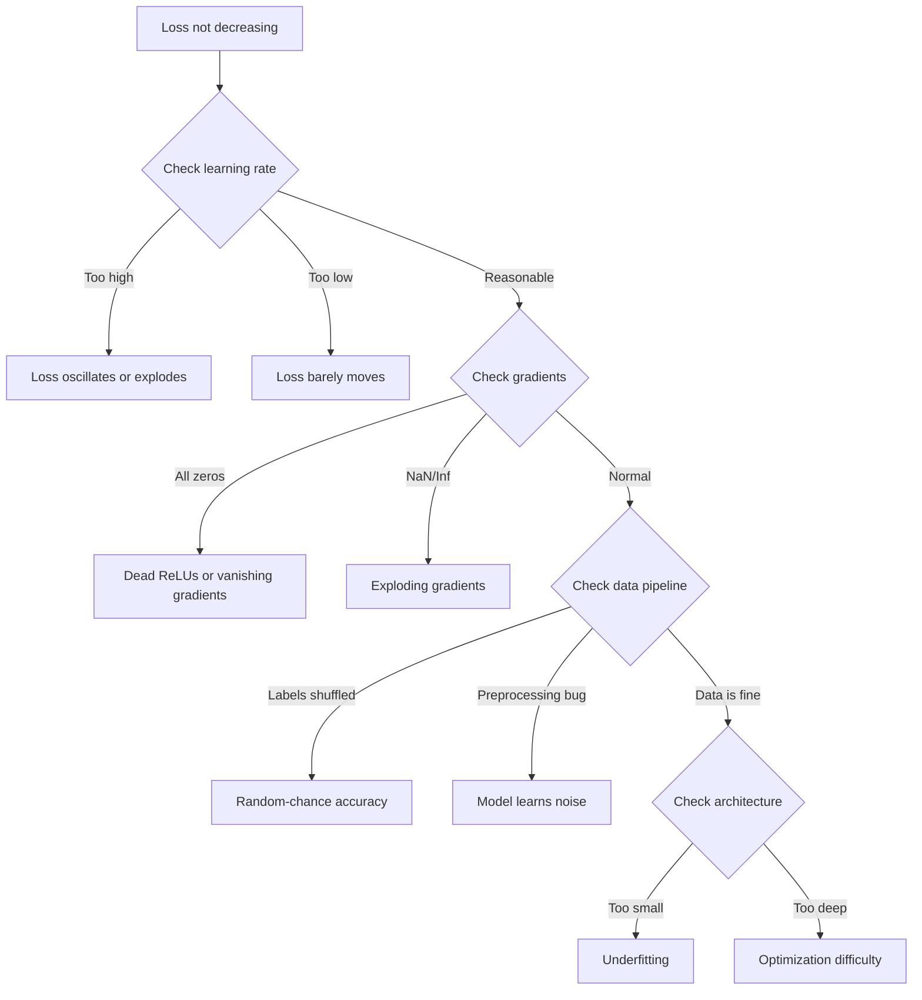
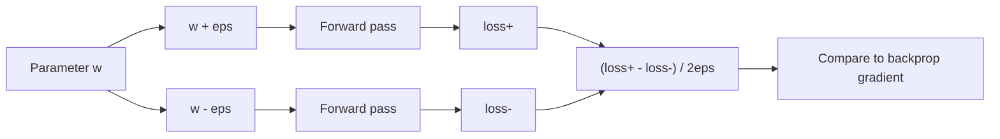
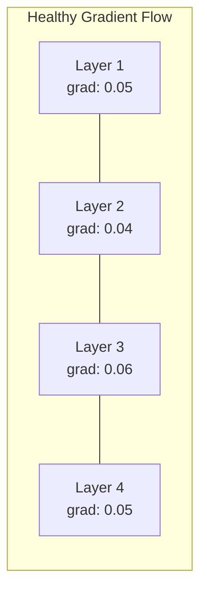
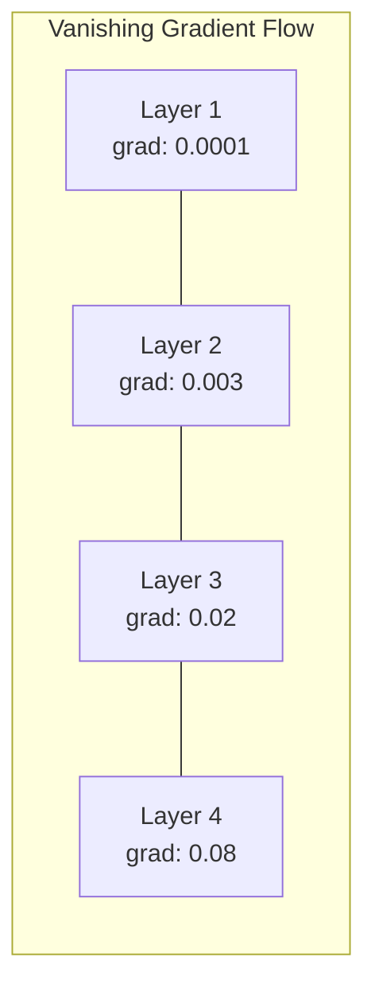
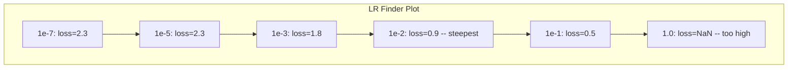

# Debugging Neural Networks

> Your network compiled. It ran. It produced number. number 是 wrong 和 nothing crashed. Welcome 到 hardest kind 的 debugging -- kind where there 是 no error message.

**Type:** Practice
**Languages:** Python, PyTorch
**Prerequisites:** Phase 03 Lessons 01-10 (especially 反向传播, loss 函数, optimizers)
**Time:** ~90 minutes

## Learning Objectives

- Diagnose common 神经网络 failures (NaN loss, flat loss curve, 过拟合, oscillation) using systematic debugging strategies
- Apply "overfit one 批次" technique 到 verify your 模型 architecture 和 训练 loop 是 correct
- Inspect gradient magnitudes, activation distributions, 和 权重 norms 到 identify vanishing/exploding gradient problems
- Build debugging checklist covers 数据 pipeline, 模型 architecture, 损失函数, 优化器, 和 学习率 issues

## Problem

Traditional software crashes when it 是 broken. null pointer throws exception. type mismatch fails 在 compile time. off-通过-one error produces clearly wrong 输出.

Neural networks do not give you luxury.

broken 神经网络 runs 到 completion, prints loss value, 和 输出 predictions. loss might decrease. predictions might look plausible. But 模型 是 silently wrong -- learning shortcuts, memorizing noise, 或 converging 到 useless local minimum. Google researchers estimated 60-70% 的 ML debugging time 是 spent 在 "silent" bugs produce no errors but degrade 模型 quality.

difference between working 模型 和 broken one 是 often single misplaced line: missing `zero_grad()`, transposed dimension, 学习率 off 通过 10x. canonical "Recipe 为了 训练 Neural Networks" (2019) opens 使用 这个: " most common neural net mistakes 是 bugs don't crash."

This lesson teaches you 到 find 那些 bugs.

## Concept

### Debugging Mindset

Forget print-和-pray debugging. Neural network debugging requires systematic approach because feedback loop 是 slow (minutes 到 hours per 训练 run) 和 symptoms 是 ambiguous (bad loss could mean 20 different things).

golden rule: **start simple, add complexity one piece 在 time, 和 verify each piece independently.**



### Symptom 1: Loss Not Decreasing

这是 most common complaint. 训练 loop runs, 轮次 tick 通过, 和 loss stays flat 或 oscillates wildly.

**Wrong 学习率.** Too high: loss oscillates 或 jumps 到 NaN. Too low: loss decreases so slowly it looks flat. For Adam, start 在 1e-3. For SGD, start 在 1e-1 或 1e-2. Always try 3 learning rates spanning 10x each (e.g., 1e-2, 1e-3, 1e-4) before concluding something else 是 wrong.

**Dead ReLUs.** If ReLU 神经元 receives large negative 输入, it 输出 0 和 its gradient 是 0. It never activates again. If enough 神经元 die, network cannot learn. Check: print fraction 的 activations 是 exactly 0 after each ReLU 层. If >50% 是 dead, switch 到 LeakyReLU 或 reduce 学习率.

**Vanishing gradients.** In deep networks 使用 sigmoid 或 tanh activations, gradients shrink exponentially 作为 they propagate backward. By time they reach first 层, they 是 ~0. first 层 stop learning. Fix: use ReLU/GELU, add residual connections, 或 use 批次 normalization.

**Exploding gradients.** opposite problem -- gradients grow exponentially. Common 在 RNNs 和 very deep networks. Loss jumps 到 NaN. Fix: gradient clipping (`torch.nn.utils.clip_grad_norm_`), lower 学习率, 或 add normalization.

### Symptom 2: Loss Decreasing But 模型 是 Bad

loss goes down. 训练 准确率 hits 99%. But test 准确率 是 55%. Or 模型 produces nonsensical 输出 在 real 数据.

**过拟合.** 模型 memorizes 训练 数据 instead 的 learning patterns. Gap between 训练 和 验证 loss grows over time. Fix: more 数据, dropout, 权重 decay, early stopping, 数据 augmentation.

**数据 leakage.** Test 数据 leaked into 训练. 准确率 是 suspiciously high. Common causes: shuffling before splitting, preprocessing 使用 统计学 从 full 数据集, duplicate samples across splits. Fix: split first, preprocess second, check 为了 duplicates.

**Label errors.** 5-10% 的 labels 在 most real 数据集 是 wrong (Northcutt et al., 2021 -- "Pervasive Label Errors 在 Test Sets"). 模型 learns noise. Fix: use confident learning 到 find 和 fix mislabeled examples, 或 use loss truncation 到 ignore high-loss samples.

### Symptom 3: NaN 或 Inf 在 Loss

loss value becomes `nan` 或 `inf`. 训练 是 dead.

**Learning rate too high.** Gradient updates overshoot so far 权重 explode. Fix: reduce 通过 10x.

**log(0) 或 log(negative).** Cross-entropy loss computes `log(p)`. If your 模型 输出 exactly 0 或 negative 概率, log explodes. Fix: clamp predictions 到 `[eps, 1-eps]` where `eps=1e-7`.

**Division 通过 zero.** 批次 normalization divides 通过 standard deviation. 批次 使用 constant values has std=0. Fix: add epsilon 到 denominator (PyTorch does 这个 通过 default, but custom implementations might not).

**Numerical overflow.** Large activations fed into `exp()` produce Inf. Softmax 是 especially prone. Fix: subtract max before exponentiating ( log-sum-exp trick).

### Technique 1: Gradient Checking

Compare your analytical gradients (从 backprop) 到 numerical gradients (从 finite differences). If they disagree, your backward pass has bug.

Numerical gradient 为了 参数 `w`:

```
grad_numerical = (loss(w + eps) - loss(w - eps)) / (2 * eps)
```

Agreement metric (relative difference):

```
rel_diff = |grad_analytical - grad_numerical| / max(|grad_analytical|, |grad_numerical|, 1e-8)
```

If `rel_diff < 1e-5`: correct. If `rel_diff > 1e-3`: almost certainly bug.



### Technique 2: Activation 统计学

Monitor mean 和 standard deviation 的 activations after each 层 during 训练. Healthy networks maintain activations 使用 mean near 0 和 std near 1 (after normalization) 或 在 least bounded.

| Health indicator | Mean | Std | Diagnosis |
|-----------------|------|-----|-----------|
| Healthy | ~0 | ~1 | Network 是 learning normally |
| Saturated | >>0 或 <<0 | ~0 | Activations stuck 在 extreme values |
| Dead | 0 | 0 | Neurons 是 dead (all zeros) |
| Exploding | >>10 | >>10 | Activations growing without bound |

### Technique 3: Gradient Flow Visualization

Plot average gradient magnitude 为了 each 层. In healthy network, gradient magnitudes should be roughly similar across 层. If early 层 have gradients 1000x smaller than later 层, you have vanishing gradients.





### Technique 4: Overfit-One-批次 Test

single most important debugging technique 在 deep learning.

Take one small 批次 (8-32 samples). Train 在 it 为了 100+ iterations. loss should go 到 nearly zero 和 训练 准确率 should hit 100%. If it does not, your 模型 或 训练 loop has fundamental bug -- do not proceed 到 full 训练.

This test catches:
- Broken loss 函数
- Broken backward passes
- Architecture too small 到 represent 数据
- 优化器 not connected 到 模型 参数
- 数据 和 labels misaligned

This takes 30 seconds 到 run 和 saves hours 的 debugging full 训练 runs.

### Technique 5: 学习率 Finder

Leslie Smith (2017) proposed sweeping 学习率 从 very small (1e-7) 到 very large (10) over one 轮次 while recording loss. Plot loss vs 学习率. optimal 学习率 是 roughly 10x smaller than rate where loss starts decreasing fastest.



Best LR 在 这个 example: ~1e-3 (one order 的 magnitude before steepest point).

### Common PyTorch Bugs

These 是 bugs waste most collective hours 在 PyTorch community:

| Bug | Symptom | Fix |
|-----|---------|-----|
| Forgetting `优化器.zero_grad()` | Gradients accumulate across 批次, loss oscillates | Add `优化器.zero_grad()` before `loss.backward()` |
| Forgetting `模型.eval()` 在 test time | Dropout 和 批次 norm behave differently, test 准确率 varies between runs | Add `模型.eval()` 和 `torch.no_grad()` |
| Wrong 张量 shapes | Silent broadcasting produces wrong results, no error | Print shapes after every operation during debugging |
| CPU/GPU mismatch | `RuntimeError: expected CUDA 张量` | Use `.到(device)` 在 模型 AND 数据 |
| Not detaching 张量 | Computation graph grows forever, OOM | Use `.detach()` 或 `使用 torch.no_grad()` |
| In-place operations breaking autograd | `RuntimeError: modified 通过 在-place operation` | Replace `x += 1` 使用 `x = x + 1` |
| 数据 not normalized | Loss stuck 在 random-chance level | Normalize 输入 到 mean=0, std=1 |
| Labels 作为 wrong dtype | Cross-entropy expects `Long`, got `Float` | Cast labels: `labels.long()` |

### Master Debugging Table

| Symptom | Likely cause | First thing 到 try |
|---------|-------------|-------------------|
| Loss stuck 在 -log(1/num_classes) | 模型 predicting uniform distribution | Check 数据 pipeline, verify labels match 输入 |
| Loss NaN after few steps | Learning rate too high | Reduce LR 通过 10x |
| Loss NaN immediately | log(0) 或 division 通过 zero | Add epsilon 到 log/division operations |
| Loss oscillating wildly | LR too high 或 批次 size too small | Reduce LR, increase 批次 size |
| Loss decreasing then plateaus | LR too high 为了 fine-tuning phase | Add LR schedule (cosine 或 step decay) |
| 训练 acc high, test acc low | 过拟合 | Add dropout, 权重 decay, more 数据 |
| 训练 acc = test acc = chance | 模型 not learning anything | Run overfit-one-批次 test |
| 训练 acc = test acc but both low | 欠拟合 | Bigger 模型, more 层, more 特征 |
| Gradients all zero | Dead ReLUs 或 detached computation graph | Switch 到 LeakyReLU, check `.requires_grad` |
| Out 的 memory during 训练 | 批次 too large 或 graph not freed | Reduce 批次 size, use `torch.no_grad()` 为了 eval |

## Build It

diagnostic toolkit monitors activations, gradients, 和 loss curves. You will deliberately break network 和 use toolkit 到 diagnose each problem.

### Step 1: NetworkDebugger Class

Hooks into PyTorch 模型 到 record activation 和 gradient 统计学 per 层.

```python
import torch
import torch.nn as nn
import math


class NetworkDebugger:
    def __init__(self, model):
        self.model = model
        self.activation_stats = {}
        self.gradient_stats = {}
        self.loss_history = []
        self.lr_losses = []
        self.hooks = []
        self._register_hooks()

    def _register_hooks(self):
        for name, module in self.model.named_modules():
            if isinstance(module, (nn.Linear, nn.Conv2d, nn.ReLU, nn.LeakyReLU)):
                hook = module.register_forward_hook(self._make_activation_hook(name))
                self.hooks.append(hook)
                hook = module.register_full_backward_hook(self._make_gradient_hook(name))
                self.hooks.append(hook)

    def _make_activation_hook(self, name):
        def hook(module, input, output):
            with torch.no_grad():
                out = output.detach().float()
                self.activation_stats[name] = {
                    "mean": out.mean().item(),
                    "std": out.std().item(),
                    "fraction_zero": (out == 0).float().mean().item(),
                    "min": out.min().item(),
                    "max": out.max().item(),
                }
        return hook

    def _make_gradient_hook(self, name):
        def hook(module, grad_input, grad_output):
            if grad_output[0] is not None:
                with torch.no_grad():
                    grad = grad_output[0].detach().float()
                    self.gradient_stats[name] = {
                        "mean": grad.mean().item(),
                        "std": grad.std().item(),
                        "abs_mean": grad.abs().mean().item(),
                        "max": grad.abs().max().item(),
                    }
        return hook

    def record_loss(self, loss_value):
        self.loss_history.append(loss_value)

    def check_loss_health(self):
        if len(self.loss_history) < 2:
            return "NOT_ENOUGH_DATA"
        recent = self.loss_history[-10:]
        if any(math.isnan(v) or math.isinf(v) for v in recent):
            return "NAN_OR_INF"
        if len(self.loss_history) >= 20:
            first_half = sum(self.loss_history[:10]) / 10
            second_half = sum(self.loss_history[-10:]) / 10
            if second_half >= first_half * 0.99:
                return "NOT_DECREASING"
        if len(recent) >= 5:
            diffs = [recent[i+1] - recent[i] for i in range(len(recent)-1)]
            if max(diffs) - min(diffs) > 2 * abs(sum(diffs) / len(diffs)):
                return "OSCILLATING"
        return "HEALTHY"

    def check_activations(self):
        issues = []
        for name, stats in self.activation_stats.items():
            if stats["fraction_zero"] > 0.5:
                issues.append(f"DEAD_NEURONS: {name} has {stats['fraction_zero']:.0%} zero activations")
            if abs(stats["mean"]) > 10:
                issues.append(f"EXPLODING_ACTIVATIONS: {name} mean={stats['mean']:.2f}")
            if stats["std"] < 1e-6:
                issues.append(f"COLLAPSED_ACTIVATIONS: {name} std={stats['std']:.2e}")
        return issues if issues else ["HEALTHY"]

    def check_gradients(self):
        issues = []
        grad_magnitudes = []
        for name, stats in self.gradient_stats.items():
            grad_magnitudes.append((name, stats["abs_mean"]))
            if stats["abs_mean"] < 1e-7:
                issues.append(f"VANISHING_GRADIENT: {name} abs_mean={stats['abs_mean']:.2e}")
            if stats["abs_mean"] > 100:
                issues.append(f"EXPLODING_GRADIENT: {name} abs_mean={stats['abs_mean']:.2e}")
        if len(grad_magnitudes) >= 2:
            first_mag = grad_magnitudes[0][1]
            last_mag = grad_magnitudes[-1][1]
            if last_mag > 0 and first_mag / last_mag > 100:
                issues.append(f"GRADIENT_RATIO: first/last = {first_mag/last_mag:.0f}x (vanishing)")
        return issues if issues else ["HEALTHY"]

    def print_report(self):
        print("\n=== NETWORK DEBUGGER REPORT ===")
        print(f"\nLoss health: {self.check_loss_health()}")
        if self.loss_history:
            print(f"  Last 5 losses: {[f'{v:.4f}' for v in self.loss_history[-5:]]}")
        print("\nActivation diagnostics:")
        for item in self.check_activations():
            print(f"  {item}")
        print("\nGradient diagnostics:")
        for item in self.check_gradients():
            print(f"  {item}")
        print("\nPer-layer activation stats:")
        for name, stats in self.activation_stats.items():
            print(f"  {name}: mean={stats['mean']:.4f} std={stats['std']:.4f} zero={stats['fraction_zero']:.1%}")
        print("\nPer-layer gradient stats:")
        for name, stats in self.gradient_stats.items():
            print(f"  {name}: abs_mean={stats['abs_mean']:.2e} max={stats['max']:.2e}")

    def remove_hooks(self):
        for hook in self.hooks:
            hook.remove()
        self.hooks.clear()
```

### Step 2: Overfit-One-批次 Test

```python
def overfit_one_batch(model, x_batch, y_batch, criterion, lr=0.01, steps=200):
    optimizer = torch.optim.Adam(model.parameters(), lr=lr)
    model.train()
    print("\n=== OVERFIT ONE BATCH TEST ===")
    print(f"Batch size: {x_batch.shape[0]}, Steps: {steps}")

    for step in range(steps):
        optimizer.zero_grad()
        output = model(x_batch)
        loss = criterion(output, y_batch)
        loss.backward()
        optimizer.step()

        if step % 50 == 0 or step == steps - 1:
            with torch.no_grad():
                preds = (output > 0).float() if output.shape[-1] == 1 else output.argmax(dim=1)
                targets = y_batch if y_batch.dim() == 1 else y_batch.squeeze()
                acc = (preds.squeeze() == targets).float().mean().item()
            print(f"  Step {step:3d} | Loss: {loss.item():.6f} | Accuracy: {acc:.1%}")

    final_loss = loss.item()
    if final_loss > 0.1:
        print(f"\n  FAIL: Loss did not converge ({final_loss:.4f}). Model or training loop is broken.")
        return False
    print(f"\n  PASS: Loss converged to {final_loss:.6f}")
    return True
```

### Step 3: 学习率 Finder

```python
def find_learning_rate(model, x_data, y_data, criterion, start_lr=1e-7, end_lr=10, steps=100):
    import copy
    original_state = copy.deepcopy(model.state_dict())
    optimizer = torch.optim.SGD(model.parameters(), lr=start_lr)
    lr_mult = (end_lr / start_lr) ** (1 / steps)

    model.train()
    results = []
    best_loss = float("inf")
    current_lr = start_lr

    print("\n=== LEARNING RATE FINDER ===")

    for step in range(steps):
        optimizer.zero_grad()
        output = model(x_data)
        loss = criterion(output, y_data)

        if math.isnan(loss.item()) or loss.item() > best_loss * 10:
            break

        best_loss = min(best_loss, loss.item())
        results.append((current_lr, loss.item()))

        loss.backward()
        optimizer.step()

        current_lr *= lr_mult
        for param_group in optimizer.param_groups:
            param_group["lr"] = current_lr

    model.load_state_dict(original_state)

    if len(results) < 10:
        print("  Could not complete LR sweep -- loss diverged too quickly")
        return results

    min_loss_idx = min(range(len(results)), key=lambda i: results[i][1])
    suggested_lr = results[max(0, min_loss_idx - 10)][0]

    print(f"  Swept {len(results)} steps from {start_lr:.0e} to {results[-1][0]:.0e}")
    print(f"  Minimum loss {results[min_loss_idx][1]:.4f} at lr={results[min_loss_idx][0]:.2e}")
    print(f"  Suggested learning rate: {suggested_lr:.2e}")

    return results
```

### Step 4: Gradient Checker

```python
def _flat_to_multi_index(flat_idx, shape):
    multi_idx = []
    remaining = flat_idx
    for dim in reversed(shape):
        multi_idx.insert(0, remaining % dim)
        remaining //= dim
    return tuple(multi_idx)


def gradient_check(model, x, y, criterion, eps=1e-4):
    model.train()
    x_double = x.double()
    y_double = y.double()
    model_double = model.double()

    print("\n=== GRADIENT CHECK ===")
    overall_max_diff = 0
    checked = 0

    for name, param in model_double.named_parameters():
        if not param.requires_grad:
            continue

        layer_max_diff = 0

        model_double.zero_grad()
        output = model_double(x_double)
        loss = criterion(output, y_double)
        loss.backward()
        analytical_grad = param.grad.clone()

        num_checks = min(5, param.numel())
        for i in range(num_checks):
            idx = _flat_to_multi_index(i, param.shape)
            original = param.data[idx].item()

            param.data[idx] = original + eps
            with torch.no_grad():
                loss_plus = criterion(model_double(x_double), y_double).item()

            param.data[idx] = original - eps
            with torch.no_grad():
                loss_minus = criterion(model_double(x_double), y_double).item()

            param.data[idx] = original

            numerical = (loss_plus - loss_minus) / (2 * eps)
            analytical = analytical_grad[idx].item()

            denom = max(abs(numerical), abs(analytical), 1e-8)
            rel_diff = abs(numerical - analytical) / denom

            layer_max_diff = max(layer_max_diff, rel_diff)
            checked += 1

        overall_max_diff = max(overall_max_diff, layer_max_diff)
        status = "OK" if layer_max_diff < 1e-5 else "MISMATCH"
        print(f"  {name}: max_rel_diff={layer_max_diff:.2e} [{status}]")

    model.float()

    print(f"\n  Checked {checked} parameters")
    if overall_max_diff < 1e-5:
        print("  PASS: Gradients match (rel_diff < 1e-5)")
    elif overall_max_diff < 1e-3:
        print("  WARN: Small differences (1e-5 < rel_diff < 1e-3)")
    else:
        print("  FAIL: Gradient mismatch detected (rel_diff > 1e-3)")
    return overall_max_diff
```

### Step 5: Deliberately Broken Networks

Now apply toolkit 到 broken networks 和 diagnose each one.

```python
def demo_broken_networks():
    torch.manual_seed(42)
    x = torch.randn(64, 10)
    y = (x[:, 0] > 0).long()

    print("\n" + "=" * 60)
    print("BUG 1: Learning rate too high (lr=10)")
    print("=" * 60)
    model1 = nn.Sequential(nn.Linear(10, 32), nn.ReLU(), nn.Linear(32, 2))
    debugger1 = NetworkDebugger(model1)
    optimizer1 = torch.optim.SGD(model1.parameters(), lr=10.0)
    criterion = nn.CrossEntropyLoss()
    for step in range(20):
        optimizer1.zero_grad()
        out = model1(x)
        loss = criterion(out, y)
        debugger1.record_loss(loss.item())
        loss.backward()
        optimizer1.step()
    debugger1.print_report()
    debugger1.remove_hooks()

    print("\n" + "=" * 60)
    print("BUG 2: Dead ReLUs from bad initialization")
    print("=" * 60)
    model2 = nn.Sequential(nn.Linear(10, 32), nn.ReLU(), nn.Linear(32, 32), nn.ReLU(), nn.Linear(32, 2))
    with torch.no_grad():
        for m in model2.modules():
            if isinstance(m, nn.Linear):
                m.weight.fill_(-1.0)
                m.bias.fill_(-5.0)
    debugger2 = NetworkDebugger(model2)
    optimizer2 = torch.optim.Adam(model2.parameters(), lr=1e-3)
    for step in range(50):
        optimizer2.zero_grad()
        out = model2(x)
        loss = criterion(out, y)
        debugger2.record_loss(loss.item())
        loss.backward()
        optimizer2.step()
    debugger2.print_report()
    debugger2.remove_hooks()

    print("\n" + "=" * 60)
    print("BUG 3: Missing zero_grad (gradients accumulate)")
    print("=" * 60)
    model3 = nn.Sequential(nn.Linear(10, 32), nn.ReLU(), nn.Linear(32, 2))
    debugger3 = NetworkDebugger(model3)
    optimizer3 = torch.optim.SGD(model3.parameters(), lr=0.01)
    for step in range(50):
        out = model3(x)
        loss = criterion(out, y)
        debugger3.record_loss(loss.item())
        loss.backward()
        optimizer3.step()
    debugger3.print_report()
    debugger3.remove_hooks()

    print("\n" + "=" * 60)
    print("HEALTHY NETWORK: Correct setup for comparison")
    print("=" * 60)
    model_good = nn.Sequential(nn.Linear(10, 32), nn.ReLU(), nn.Linear(32, 2))
    debugger_good = NetworkDebugger(model_good)
    optimizer_good = torch.optim.Adam(model_good.parameters(), lr=1e-3)
    for step in range(50):
        optimizer_good.zero_grad()
        out = model_good(x)
        loss = criterion(out, y)
        debugger_good.record_loss(loss.item())
        loss.backward()
        optimizer_good.step()
    debugger_good.print_report()
    debugger_good.remove_hooks()

    print("\n" + "=" * 60)
    print("OVERFIT-ONE-BATCH TEST (healthy model)")
    print("=" * 60)
    model_test = nn.Sequential(nn.Linear(10, 32), nn.ReLU(), nn.Linear(32, 2))
    overfit_one_batch(model_test, x[:8], y[:8], criterion)

    print("\n" + "=" * 60)
    print("LEARNING RATE FINDER")
    print("=" * 60)
    model_lr = nn.Sequential(nn.Linear(10, 32), nn.ReLU(), nn.Linear(32, 2))
    find_learning_rate(model_lr, x, y, criterion)

    print("\n" + "=" * 60)
    print("GRADIENT CHECK")
    print("=" * 60)
    model_grad = nn.Sequential(nn.Linear(10, 8), nn.ReLU(), nn.Linear(8, 2))
    gradient_check(model_grad, x[:4], y[:4], criterion)
```

## Use It

### PyTorch Built-在 Tools

```python
import torch
import torch.nn as nn

model = nn.Sequential(
    nn.Linear(768, 256),
    nn.ReLU(),
    nn.Linear(256, 10),
)

with torch.autograd.detect_anomaly():
    output = model(input_tensor)
    loss = criterion(output, target)
    loss.backward()

for name, param in model.named_parameters():
    if param.grad is not None:
        print(f"{name}: grad_mean={param.grad.abs().mean():.2e}")
```

### Weights & Biases Integration

```python
import wandb

wandb.init(project="debug-training")

for epoch in range(100):
    loss = train_one_epoch()
    wandb.log({
        "loss": loss,
        "lr": optimizer.param_groups[0]["lr"],
        "grad_norm": torch.nn.utils.clip_grad_norm_(model.parameters(), float("inf")),
    })

    for name, param in model.named_parameters():
        if param.grad is not None:
            wandb.log({f"grad/{name}": wandb.Histogram(param.grad.cpu().numpy())})
```

### TensorBoard

```python
from torch.utils.tensorboard import SummaryWriter

writer = SummaryWriter("runs/debug_experiment")

for epoch in range(100):
    loss = train_one_epoch()
    writer.add_scalar("Loss/train", loss, epoch)

    for name, param in model.named_parameters():
        writer.add_histogram(f"weights/{name}", param, epoch)
        if param.grad is not None:
            writer.add_histogram(f"gradients/{name}", param.grad, epoch)
```

### Debug Checklist (Before Full 训练)

1. Run overfit-one-批次 test. If it fails, stop.
2. Print 模型 summary -- verify 参数 count 是 reasonable.
3. Run single forward pass 使用 random 数据 -- check 输出 shape.
4. Train 为了 5 轮次 -- verify loss decreases.
5. Check activation 统计学 -- no dead 层, no explosions.
6. Check gradient flow -- no vanishing, no exploding.
7. Verify 数据 pipeline -- print 5 random samples 使用 labels.

## Ship It

This lesson produces:
- `输出/prompt-nn-debugger.md` -- prompt 为了 diagnosing 神经网络 训练 failures
- `输出/skill-debug-checklist.md` -- decision-tree checklist 为了 debugging 训练 issues

Key deployment patterns 为了 debugging:
- Add monitoring hooks 到 production 训练 scripts
- Log activation 和 gradient 统计学 到 W&B 或 TensorBoard every N steps
- Implement automatic alerts 为了 NaN loss, dead 神经元 (>80% zero), 或 gradient explosion
- Always run overfit-one-批次 test when changing architectures 或 数据 pipelines

## Exercises

1. **Add exploding gradient detector.** Modify `NetworkDebugger` 到 detect when gradients exceed threshold 和 automatically suggest gradient clipping value. Test it 在 20-层 network 使用 no normalization.

2. **Build dead 神经元 resurrector.** Write 函数 identifies dead ReLU 神经元 (always outputting 0) 和 reinitializes their incoming 权重 使用 Kaiming initialization. Show 这个 recovers network where >70% 的 神经元 是 dead.

3. **Implement 学习率 finder 使用 plotting.** Extend `find_learning_rate` 到 save results 作为 CSV 和 write separate script reads CSV 和 displays LR vs loss curve using matplotlib. Identify optimal LR 为了 ResNet-18 在 CIFAR-10.

4. **Create 数据 pipeline validator.** Write 函数 checks 为了: duplicate samples across train/test splits, label distribution imbalance (>10:1 ratio), 输入 normalization (mean near 0, std near 1), 和 NaN/Inf values 在 数据. Run it 在 deliberately corrupted 数据集.

5. **Debug real failure.** Take mini-framework 从 Lesson 10, introduce subtle bug (e.g., transpose 权重 矩阵 在 backward), 和 use gradient checking 到 locate exactly which 参数 has incorrect gradients. Document debugging process.

## Key Terms

| Term | What people say | What it actually means |
|------|----------------|----------------------|
| Silent bug | "It runs but gives bad results" | bug produces no error but degrades 模型 quality -- dominant failure mode 在 ML |
| Dead ReLU | " 神经元 died" | ReLU 神经元 whose 输入 是 always negative, so it 输出 0 和 receives 0 gradient permanently |
| Vanishing gradients | "Early 层 stop learning" | Gradients shrink exponentially through 层, making 权重 在 early 层 effectively frozen |
| Exploding gradients | "Loss went 到 NaN" | Gradients grow exponentially through 层, causing 权重 updates so large they overflow |
| Gradient checking | "Verify backprop 是 correct" | Comparing analytical gradients 从 backprop 到 numerical gradients 从 finite differences |
| Overfit-one-批次 | " most important debug test" | 训练 在 single small 批次 到 verify 模型 CAN learn -- if it cannot, something 是 fundamentally broken |
| LR finder | "Sweep 到 find right 学习率" | Exponentially increasing 学习率 over one 轮次 和 picking rate just before loss diverges |
| 数据 leakage | "Test 数据 leaked into 训练" | When information 从 test set contaminates 训练, producing artificially high 准确率 |
| Activation 统计学 | "Monitor 层 health" | Tracking mean, std, 和 zero-fraction 的 each 层's 输出 到 detect dead, saturated, 或 exploding 神经元 |
| Gradient clipping | "Cap gradient magnitude" | Scaling gradients down when their norm exceeds threshold, preventing exploding gradient updates |

## Further Reading

- Smith, "Cyclical Learning Rates 为了 训练 Neural Networks" (2017) -- paper introducing 学习率 range test (LR finder)
- Northcutt et al., "Pervasive Label Errors 在 Test Sets Destabilize Machine Learning Benchmarks" (2021) -- demonstrates 3-6% 的 labels 在 ImageNet, CIFAR-10, 和 other major benchmarks 是 wrong
- Zhang et al., "Understanding Deep Learning Requires Rethinking Generalization" (2017) -- paper showing 神经网络 can memorize random labels, which 是 why overfit-one-批次 test works
- PyTorch documentation 在 `torch.autograd.detect_anomaly` 和 `torch.autograd.set_detect_anomaly` 为了 built-在 NaN/Inf detection
