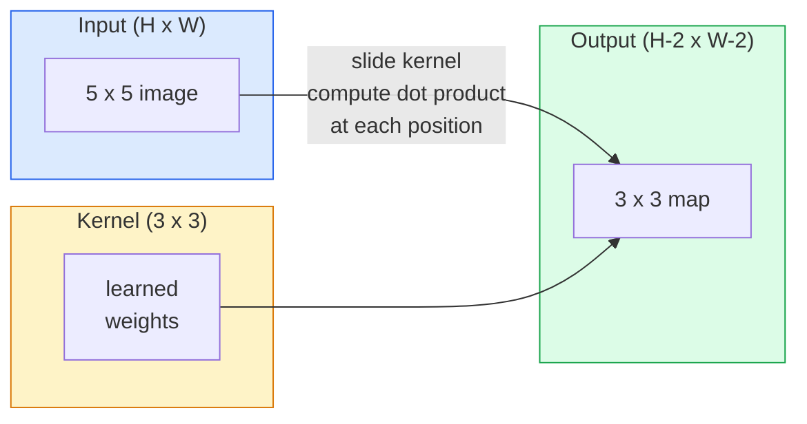
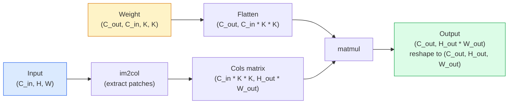

# Convolutions from Scratch

> A 卷积 is a tiny dense 层 you slide across an 图像, sharing the same 权重 at every location.

**Type:** Build
**Languages:** Python
**Prerequisites:** Phase 3 (Deep Learning Core), Phase 4 Lesson 01 (图像 Fundamentals)
**Time:** ~75 minutes

## Learning Objectives

- Implement 2D 卷积 from scratch using only NumPy, including the nested-loop version and a vectorised `im2col` version
- Compute 输出 spatial size for any combination of 输入 size, 卷积核 size, 填充, and 步长, and justify the `(H - K + 2P) / S + 1` formula
- Hand-design 卷积核 (edge, blur, sharpen, Sobel) and explain why each one produces the pattern of activations it does
- Stack 卷积 into a 特征 extractor and connect the depth-of-the-stack to the size of the receptive field

## The Problem

A fully connected 层 on a 224x224 RGB 图像 would need 224 * 224 * 3 = 150,528 输入 权重 per 神经元. A single hidden 层 with 1,000 units is already 150 million 参数 — before you have learnt anything useful. Worse, that 层 has no notion that a dog in the top-left and a dog in the bottom-right are the same pattern. It treats every 像素 position as independent, which is exactly wrong for 图像: translating a cat by three 像素 should not force the network to relearn the concept.

The two properties an 图像 模型 needs are **translation equivariance** (the 输出 shifts when the 输入 shifts) and **参数 sharing** (the same 特征 detector runs everywhere). Dense 层 give you neither. 卷积 gives you both for free.

卷积 was not invented for deep learning. 它是 the same operation that powers JPEG compression, Gaussian blur in Photoshop, edge detection in industrial vision, and every audio 滤波器 ever shipped. The reason CNNs dominated ImageNet from 2012 to 2020 is that 卷积 is the correct prior for 数据 where nearby values are related and the same pattern can appear anywhere.

## The Concept

### One 卷积核, sliding

A 2D 卷积 takes a small 权重 矩阵 called the 卷积核 (or 滤波器), slides it across the 输入, and at each location computes the sum of element-wise products. That sum becomes one 输出 像素.



A concrete 3x3 example on a 5x5 输入 (no 填充, 步长 1):

```
Input X (5 x 5):                Kernel W (3 x 3):

  1  2  0  1  2                   1  0 -1
  0  1  3  1  0                   2  0 -2
  2  1  0  2  1                   1  0 -1
  1  0  2  1  3
  2  1  1  0  1

The kernel slides across every valid 3 x 3 window. Output Y is 3 x 3:

 Y[0,0] = sum( W * X[0:3, 0:3] )
 Y[0,1] = sum( W * X[0:3, 1:4] )
 Y[0,2] = sum( W * X[0:3, 2:5] )
 Y[1,0] = sum( W * X[1:4, 0:3] )
 ... and so on
```

That one formula — **shared 权重, locality, sliding window** — is the entire idea. Everything else is bookkeeping.

### 输出 size formula

Given 输入 spatial size `H`, 卷积核 size `K`, 填充 `P`, 步长 `S`:

```
H_out = floor( (H - K + 2P) / S ) + 1
```

Memorise this. You will compute it dozens of times per architecture.

| Scenario | H | K | P | S | H_out |
|----------|---|---|---|---|-------|
| Valid conv, no 填充 | 32 | 3 | 0 | 1 | 30 |
| Same conv (preserves size) | 32 | 3 | 1 | 1 | 32 |
| Downsample by 2 | 32 | 3 | 1 | 2 | 16 |
| Pool 2x2 | 32 | 2 | 0 | 2 | 16 |
| Large receptive field | 32 | 7 | 3 | 2 | 16 |

"Same 填充" means pick P so that H_out == H when S == 1. For odd K, that is P = (K - 1) / 2. 那是 why 3x3 卷积核 dominate — they are the smallest odd 卷积核 that still has a centre.

### 填充

Without 填充, every 卷积 shrinks the 特征图. Stack 20 of them and your 224x224 图像 becomes 184x184, which wastes compute on the border and complicates residual connections that need matching shapes.

```
Zero padding (P = 1) on a 5 x 5 input:

  0  0  0  0  0  0  0
  0  1  2  0  1  2  0
  0  0  1  3  1  0  0
  0  2  1  0  2  1  0       Now the kernel can centre on pixel
  0  1  0  2  1  3  0       (0, 0) and still have three rows and
  0  2  1  1  0  1  0       three columns of values to multiply.
  0  0  0  0  0  0  0
```

Modes you meet in practice: `zero` (most common), `reflect` (mirror the edge, avoids hard borders in generative 模型), `replicate` (copy the edge), `circular` (wrap around, used in toroidal problems).

### 步长

步长 is the step size of the slide. `步长=1` is the default. `步长=2` halves the spatial dimensions and is the classic way to downsample inside a CNN without a separate 池化 层 — every modern architecture (ResNet, ConvNeXt, MobileNet) uses strided convs in place of max-pool somewhere.

```
Stride 1 on a 5 x 5 input, 3 x 3 kernel:

  starts: (0,0) (0,1) (0,2)        -> output row 0
          (1,0) (1,1) (1,2)        -> output row 1
          (2,0) (2,1) (2,2)        -> output row 2

  Output: 3 x 3

Stride 2 on the same input:

  starts: (0,0) (0,2)              -> output row 0
          (2,0) (2,2)              -> output row 1

  Output: 2 x 2
```

### Multiple 输入 通道

Real 图像 have three 通道. A 3x3 卷积 on an RGB 输入 is actually a 3x3x3 volume: one 3x3 slice per 输入 通道. At each spatial position, you multiply and sum across all three slices and add a 偏置.

```
Input:   (C_in,  H,  W)        3 x 5 x 5
Kernel:  (C_in,  K,  K)        3 x 3 x 3 (one kernel)
Output:  (1,     H', W')       2D map

For a layer that produces C_out output channels, you stack C_out kernels:

Weight:  (C_out, C_in, K, K)   e.g. 64 x 3 x 3 x 3
Output:  (C_out, H', W')       64 x 3 x 3

Parameter count: C_out * C_in * K * K + C_out   (the + C_out is biases)
```

That last line is the one you will calculate when planning a 模型. A 64-通道 3x3 conv on a 3-通道 输入 has `64 * 3 * 3 * 3 + 64 = 1,792` 参数. Cheap.

### The im2col trick

Nested loops are easy to read but slow. GPUs want big 矩阵 multiplies. The trick: flatten every receptive-field window of the 输入 into one column of a big 矩阵, flatten the 卷积核 into a row, and the whole 卷积 becomes a single matmul.



Every production conv implementation is some variant of this plus cache-tiling tricks (direct conv, Winograd, FFT conv for large 卷积核). Understand im2col and you understand the core.

### Receptive field

A single 3x3 conv looks at 9 输入 像素. Stack two 3x3 convs and a 神经元 in the second 层 looks at 5x5 输入 像素. Three 3x3 convs give 7x7. In general:

```
RF after L stacked K x K convs (stride 1) = 1 + L * (K - 1)

With strides:   RF grows multiplicatively with stride along each layer.
```

The entire reason "3x3 all the way down" works (VGG, ResNet, ConvNeXt) is that two 3x3 convs see the same 输入 area as one 5x5 conv but with fewer 参数 and an extra non-linearity in between.

## Build It

### Step 1: Pad an array

Start with the smallest primitive: a 函数 that pads with zeros around an H x W array.

```python
import numpy as np

def pad2d(x, p):
    if p == 0:
        return x
    h, w = x.shape[-2:]
    out = np.zeros(x.shape[:-2] + (h + 2 * p, w + 2 * p), dtype=x.dtype)
    out[..., p:p + h, p:p + w] = x
    return out

x = np.arange(9).reshape(3, 3)
print(x)
print()
print(pad2d(x, 1))
```

The trailing-axes trick `x.shape[:-2]` means the same 函数 works on `(H, W)`, `(C, H, W)`, or `(N, C, H, W)` without modification.

### Step 2: 2D 卷积 with nested loops

The reference implementation — slow, but unambiguous. 这是 what `torch.nn.functional.conv2d` does in principle.

```python
def conv2d_naive(x, w, b=None, stride=1, padding=0):
    c_in, h, w_in = x.shape
    c_out, c_in_w, kh, kw = w.shape
    assert c_in == c_in_w

    x_pad = pad2d(x, padding)
    h_out = (h + 2 * padding - kh) // stride + 1
    w_out = (w_in + 2 * padding - kw) // stride + 1

    out = np.zeros((c_out, h_out, w_out), dtype=np.float32)
    for oc in range(c_out):
        for i in range(h_out):
            for j in range(w_out):
                hs = i * stride
                ws = j * stride
                patch = x_pad[:, hs:hs + kh, ws:ws + kw]
                out[oc, i, j] = np.sum(patch * w[oc])
        if b is not None:
            out[oc] += b[oc]
    return out
```

Four nested loops (输出 通道, row, column, plus the implicit sum over C_in, kh, kw). 这是 the ground truth you will check every faster implementation against.

### Step 3: Verify with a hand-designed 卷积核

Build a vertical Sobel 卷积核, apply it to a synthetic step 图像, and watch the vertical edge light up.

```python
def synthetic_step_image():
    img = np.zeros((1, 16, 16), dtype=np.float32)
    img[:, :, 8:] = 1.0
    return img

sobel_x = np.array([
    [[-1, 0, 1],
     [-2, 0, 2],
     [-1, 0, 1]]
], dtype=np.float32)[None]

x = synthetic_step_image()
y = conv2d_naive(x, sobel_x, padding=1)
print(y[0].round(1))
```

Expect large positive values on column 7 (left-to-right brightness increase) and zeros everywhere else. That single print is your sanity check that the math is right.

### Step 4: im2col

Convert every 卷积核-sized window in the 输入 into a column of a 矩阵. For `C_in=3, K=3`, each column is 27 numbers.

```python
def im2col(x, kh, kw, stride=1, padding=0):
    c_in, h, w = x.shape
    x_pad = pad2d(x, padding)
    h_out = (h + 2 * padding - kh) // stride + 1
    w_out = (w + 2 * padding - kw) // stride + 1

    cols = np.zeros((c_in * kh * kw, h_out * w_out), dtype=x.dtype)
    col = 0
    for i in range(h_out):
        for j in range(w_out):
            hs = i * stride
            ws = j * stride
            patch = x_pad[:, hs:hs + kh, ws:ws + kw]
            cols[:, col] = patch.reshape(-1)
            col += 1
    return cols, h_out, w_out
```

它是 still a Python loop, but now the heavy lifting will be a single vectorised matmul.

### Step 5: Fast conv via im2col + matmul

Replace the quadruple loop with one 矩阵 multiplication.

```python
def conv2d_im2col(x, w, b=None, stride=1, padding=0):
    c_out, c_in, kh, kw = w.shape
    cols, h_out, w_out = im2col(x, kh, kw, stride, padding)
    w_flat = w.reshape(c_out, -1)
    out = w_flat @ cols
    if b is not None:
        out += b[:, None]
    return out.reshape(c_out, h_out, w_out)
```

Correctness check: run both implementations and compare.

```python
rng = np.random.default_rng(0)
x = rng.normal(0, 1, (3, 16, 16)).astype(np.float32)
w = rng.normal(0, 1, (8, 3, 3, 3)).astype(np.float32)
b = rng.normal(0, 1, (8,)).astype(np.float32)

y_naive = conv2d_naive(x, w, b, padding=1)
y_im2col = conv2d_im2col(x, w, b, padding=1)

print(f"max abs diff: {np.max(np.abs(y_naive - y_im2col)):.2e}")
```

`max abs diff` should be around `1e-5` — the difference is floating-point accumulation order, not a bug.

### Step 6: A bank of hand-designed 卷积核

Five 滤波器 that show what a single conv 层 can express before any 训练.

```python
KERNELS = {
    "identity": np.array([[0, 0, 0], [0, 1, 0], [0, 0, 0]], dtype=np.float32),
    "blur_3x3": np.ones((3, 3), dtype=np.float32) / 9.0,
    "sharpen": np.array([[0, -1, 0], [-1, 5, -1], [0, -1, 0]], dtype=np.float32),
    "sobel_x": np.array([[-1, 0, 1], [-2, 0, 2], [-1, 0, 1]], dtype=np.float32),
    "sobel_y": np.array([[-1, -2, -1], [0, 0, 0], [1, 2, 1]], dtype=np.float32),
}

def apply_kernel(img2d, kernel):
    x = img2d[None].astype(np.float32)
    w = kernel[None, None]
    return conv2d_im2col(x, w, padding=1)[0]
```

Applied to any grayscale 图像, blur softens, sharpen crisps up edges, Sobel-x lights up vertical edges, Sobel-y lights up horizontal edges. These are exactly the patterns that the *first* trained conv 层 in AlexNet and VGG ended up learning — because a good 图像 模型 needs edge and blob detectors no matter what task comes later.

## Use It

PyTorch's `nn.Conv2d` wraps the same operation with autograd, CUDA 卷积核, and cuDNN optimisation. Shape semantics are identical.

```python
import torch
import torch.nn as nn

conv = nn.Conv2d(in_channels=3, out_channels=64, kernel_size=3, stride=1, padding=1)
print(conv)
print(f"weight shape: {tuple(conv.weight.shape)}   # (C_out, C_in, K, K)")
print(f"bias shape:   {tuple(conv.bias.shape)}")
print(f"param count:  {sum(p.numel() for p in conv.parameters())}")

x = torch.randn(8, 3, 224, 224)
y = conv(x)
print(f"\ninput  shape: {tuple(x.shape)}")
print(f"output shape: {tuple(y.shape)}")
```

Swap `填充=1` for `填充=0` and the 输出 drops to 222x222. Swap `步长=1` for `步长=2` and it drops to 112x112. Same formula you memorised above.

## Ship It

This lesson produces:

- `输出/prompt-cnn-architect.md` — a prompt that, given 输入 size, 参数 budget, and target receptive field, designs a stack of `Conv2d` 层 with the right K/S/P at every step.
- `输出/skill-conv-shape-calculator.md` — a skill that walks a network spec 层 by 层 and returns the 输出 shape, receptive field, and 参数 count for every block.

## Exercises

1. **(Easy)** Given a 128x128 grayscale 输入 and a stack of `[Conv3x3(s=1,p=1), Conv3x3(s=2,p=1), Conv3x3(s=1,p=1), Conv3x3(s=2,p=1)]`, compute the 输出 spatial size and the receptive field at each 层 by hand. Verify with a PyTorch `nn.Sequential` of dummy convs.
2. **(Medium)** Extend `conv2d_naive` and `conv2d_im2col` to accept a `groups` argument. Show that `groups=C_in=C_out` reproduces a depthwise 卷积 and that its 参数 count is `C * K * K` instead of `C * C * K * K`.
3. **(Hard)** Implement the backward pass of `conv2d_im2col` by hand: given the 梯度 of the 输出, compute the 梯度 of `x` and `w`. Verify against `torch.autograd.grad` on the same 输入 and 权重. The trick: the 梯度 of im2col is `col2im`, and it has to accumulate overlapping windows.

## Key Terms

| Term | What people say | What it actually means |
|------|----------------|----------------------|
| 卷积 | "Sliding a 滤波器" | A learnable dot product applied at every spatial location with shared 权重; mathematically a cross-correlation, but everyone calls it 卷积 |
| 卷积核 / 滤波器 | "The 特征 detector" | A small 权重 张量 of shape (C_in, K, K) whose dot product with a window of 输入 produces one 输出 像素 |
| 步长 | "How far you jump" | The step size between consecutive 卷积核 placements; 步长 2 halves each spatial dimension |
| 填充 | "Zeros on the edges" | Extra values added around the 输入 so the 卷积核 can centre on border 像素; `same` 填充 keeps 输出 size equal to 输入 size |
| Receptive field | "How much the 神经元 sees" | The patch of original 输入 that a given 输出 activation depends on, growing with depth and 步长 |
| im2col | "The GEMM trick" | Rearranging every receptive window into columns so 卷积 becomes one big 矩阵 multiply — the core of every fast conv 卷积核 |
| Depthwise conv | "One 卷积核 per 通道" | A conv with `groups == C_in`, computing each 输出 通道 from only its matching 输入 通道; the 骨干网络 of MobileNet and ConvNeXt |
| Translation equivariance | "Shift in, shift out" | Property that shifting the 输入 by k 像素 shifts the 输出 by k 像素; comes for free with shared 权重 |

## Further Reading

- [A guide to 卷积 arithmetic for deep learning (Dumoulin & Visin, 2016)](https://arxiv.org/abs/1603.07285) — the definitive diagrams of 填充/步长/dilation that every course quietly copies
- [CS231n: Convolutional Neural Networks for Visual Recognition](https://cs231n.github.io/convolutional-networks/) — the canonical lecture notes, including the original im2col explanation
- [The Annotated ConvNet (fast.ai)](https://nbviewer.org/github/fastai/fastbook/blob/master/13_convolutions.ipynb) — a notebook that walks from manual 卷积 to a trained digit classifier
- [Receptive Field Arithmetic for CNNs (Dang Ha The Hien)](https://distill.pub/2019/computing-receptive-fields/) — the paper-quality interactive explainer of receptive field calculations
