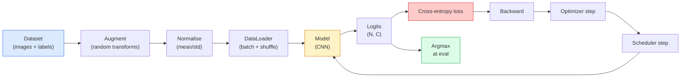

# 图像 Classification

> A classifier is a 函数 from 像素 to a probability distribution over classes. Everything else is plumbing.

**Type:** Build
**Languages:** Python
**Prerequisites:** Phase 2 Lesson 09 (模型 Evaluation), Phase 3 Lesson 10 (Mini Framework), Phase 4 Lesson 03 (CNNs)
**Time:** ~75 minutes

## Learning Objectives

- Build an end-to-end 图像 classification pipeline on CIFAR-10: 数据集, augmentation, 模型, 训练 loop, evaluation
- Explain the role of each component (dataloader, loss, 优化器, scheduler, augmentation) and predict how breaking any one of them manifests in the loss curve
- Implement mixup, cutout, and label smoothing from scratch and justify when each is worth adding
- Read a confusion 矩阵 and a per-class 精确率/召回率 table to diagnose 数据集 and 模型 failures beyond aggregate accuracy

## The Problem

Every vision task that ships reduces to 图像 classification at some level. Detection classifies regions. 分割 classifies 像素. Retrieval ranks by similarity to class centroids. Getting classification right — the 数据集 loop, the augmentation policy, the loss, the evaluation — is the skill that transfers to every other task in the phase.

Most classification bugs are not in the 模型. They live in the pipeline: a broken normalisation, an unshuffled 训练 set, augmentation that distorts labels, a 验证 split contaminated by 训练 数据, a 学习率 that silently diverges after 轮次 30. A CNN that would hit 93% on CIFAR-10 with a correct setup commonly scores 70-75% with a broken one, and the loss curve looks plausible the whole time.

This lesson wires the entire pipeline by hand so every part is inspectable. You will not use anything from `torchvision.数据集` that could hide a bug.

## The Concept

### The classification pipeline



Every line in this loop is where a bug can live. Cross-entropy takes raw logits, not softmax 输出, so any `模型(x).softmax()` before the loss quietly computes the wrong 梯度. Augmentations apply to 输入 only, not labels — except for mixup, which mixes both. `优化器.zero_grad()` must happen once per step; skipping it accumulates 梯度 and looks like a wildly unstable 学习率. Each of those bugs flattens the learning curve without throwing an error.

### Cross-entropy, logits, and softmax

A classifier produces `C` numbers per 图像 called logits. Applying softmax converts them into a probability distribution:

```
softmax(z)_i = exp(z_i) / sum_j exp(z_j)
```

Cross-entropy measures the negative log probability of the correct class:

```
CE(z, y) = -log( softmax(z)_y )
        = -z_y + log( sum_j exp(z_j) )
```

The right-hand form is the numerically stable one (log-sum-exp). PyTorch's `nn.CrossEntropyLoss` fuses softmax + NLL in one op and takes raw logits directly. Applying softmax yourself first is almost always a bug — you compute log(softmax(softmax(z))), a meaningless quantity.

### Why augmentation works

A CNN has inductive 偏置 for translation (from 权重 sharing) but no built-in invariance to crops, flips, colour jitter, or occlusion. The only way to teach it those invariances is to show it 像素 that exercise them. Every random transform during 训练 is a way of saying: "these two 图像 have the same label; learn the 特征 that ignore the difference."

```
Original crop:  "dog facing left"
Flip:           "dog facing right"       <- same label, different pixels
Rotate(+15):    "dog, slight tilt"
Colour jitter:  "dog in warmer light"
RandomErasing:  "dog with patch missing"
```

The rule: augmentation must preserve the label. Cutout and rotation on a digit can flip "6" into "9"; for that 数据集 you use smaller rotation ranges and pick augmentations that respect digit-specific invariances.

### Mixup and cutmix

Ordinary augmentation transforms 像素 but keeps labels one-hot. **Mixup** and **cutmix** break that by interpolating both.

```
Mixup:
  lambda ~ Beta(a, a)
  x = lambda * x_i + (1 - lambda) * x_j
  y = lambda * y_i + (1 - lambda) * y_j

Cutmix:
  paste a random rectangle of x_j into x_i
  y = area-weighted mix of y_i and y_j
```

Why it helps: the 模型 stops memorising spiky one-hot targets and learns to interpolate between classes. 训练 loss goes up, test accuracy goes up. 它是 the single cheapest robustness upgrade for any classifier.

### Label smoothing

A cousin of mixup. Instead of 训练 against `[0, 0, 1, 0, 0]`, train against `[eps/C, eps/C, 1-eps, eps/C, eps/C]` for a small `eps` like 0.1. Stops the 模型 from producing arbitrarily sharp logits and improves calibration at almost no cost. Built into `nn.CrossEntropyLoss(label_smoothing=0.1)` since PyTorch 1.10.

### Evaluation beyond accuracy

Aggregate accuracy hides imbalance. A 90-10 binary classifier that always predicts the majority class scores 90%. The tools that actually tell you what is happening:

- **Per-class accuracy** — one number per class; immediately surfaces underperforming categories.
- **Confusion 矩阵** — C x C grid with row i col j = count of true class i predicted as class j; the diagonal is correct, the off-diagonals are where your 模型 lives.
- **Top-1 / Top-5** — whether the correct class is in the top 1 or top 5 predictions; Top-5 matters for ImageNet because classes like "Norwich terrier" vs "Norfolk terrier" are genuinely ambiguous.
- **Calibration (ECE)** — does a 0.8 confidence prediction get it right 80% of the time? Modern networks are systematically over-confident; fix with temperature scaling or label smoothing.

## Build It

### Step 1: A deterministic synthetic 数据集

CIFAR-10 lives on disk. To make this lesson reproducible and fast we build a synthetic 数据集 that looks like CIFAR — 32x32 RGB 图像 with class-specific structure the 模型 must learn. The exact same pipeline works unchanged on real CIFAR-10.

```python
import numpy as np
import torch
from torch.utils.data import Dataset


def synthetic_cifar(num_per_class=1000, num_classes=10, seed=0):
    rng = np.random.default_rng(seed)
    X = []
    Y = []
    for c in range(num_classes):
        centre = rng.uniform(0, 1, (3,))
        freq = 2 + c
        for _ in range(num_per_class):
            yy, xx = np.meshgrid(np.linspace(0, 1, 32), np.linspace(0, 1, 32), indexing="ij")
            r = np.sin(xx * freq) * 0.5 + centre[0]
            g = np.cos(yy * freq) * 0.5 + centre[1]
            b = (xx + yy) * 0.5 * centre[2]
            img = np.stack([r, g, b], axis=-1)
            img += rng.normal(0, 0.08, img.shape)
            img = np.clip(img, 0, 1)
            X.append(img.astype(np.float32))
            Y.append(c)
    X = np.stack(X)
    Y = np.array(Y)
    idx = rng.permutation(len(X))
    return X[idx], Y[idx]


class ArrayDataset(Dataset):
    def __init__(self, X, Y, transform=None):
        self.X = X
        self.Y = Y
        self.transform = transform

    def __len__(self):
        return len(self.X)

    def __getitem__(self, i):
        img = self.X[i]
        if self.transform is not None:
            img = self.transform(img)
        img = torch.from_numpy(img).permute(2, 0, 1)
        return img, int(self.Y[i])
```

Each class gets its own colour palette and frequency pattern, plus Gaussian noise to force the 模型 to learn the signal rather than memorise 像素. Ten classes, one thousand 图像 each, permuted.

### Step 2: Normalisation and augmentation

The two transforms that every vision pipeline has.

```python
def standardize(mean, std):
    mean = np.array(mean, dtype=np.float32)
    std = np.array(std, dtype=np.float32)
    def _fn(img):
        return (img - mean) / std
    return _fn


def random_hflip(p=0.5):
    def _fn(img):
        if np.random.random() < p:
            return img[:, ::-1, :].copy()
        return img
    return _fn


def random_crop(pad=4):
    def _fn(img):
        h, w = img.shape[:2]
        padded = np.pad(img, ((pad, pad), (pad, pad), (0, 0)), mode="reflect")
        y = np.random.randint(0, 2 * pad)
        x = np.random.randint(0, 2 * pad)
        return padded[y:y + h, x:x + w, :]
    return _fn


def compose(*fns):
    def _fn(img):
        for fn in fns:
            img = fn(img)
        return img
    return _fn
```

Reflect-pad before crop, not zero-pad, because black borders are a signal the 模型 would learn to ignore in a non-useful way.

### Step 3: Mixup

Mixes two 图像 and two labels inside the 训练 step. Implemented as a 批次 transform so it lives next to the forward pass rather than inside the 数据集.

```python
def mixup_batch(x, y, num_classes, alpha=0.2):
    if alpha <= 0:
        return x, torch.nn.functional.one_hot(y, num_classes).float()
    lam = float(np.random.beta(alpha, alpha))
    idx = torch.randperm(x.size(0), device=x.device)
    x_mixed = lam * x + (1 - lam) * x[idx]
    y_onehot = torch.nn.functional.one_hot(y, num_classes).float()
    y_mixed = lam * y_onehot + (1 - lam) * y_onehot[idx]
    return x_mixed, y_mixed


def soft_cross_entropy(logits, soft_targets):
    log_probs = torch.log_softmax(logits, dim=-1)
    return -(soft_targets * log_probs).sum(dim=-1).mean()
```

`soft_cross_entropy` is cross-entropy against a soft-label distribution. It reduces to the usual one-hot case when the target is exactly one-hot.

### Step 4: The 训练 loop

The complete recipe: one pass over the 数据, 梯度 once per 批次, scheduler stepped once per 轮次.

```python
import torch
import torch.nn as nn
from torch.utils.data import DataLoader
from torch.optim import SGD
from torch.optim.lr_scheduler import CosineAnnealingLR

def train_one_epoch(model, loader, optimizer, device, num_classes, use_mixup=True):
    model.train()
    total, correct, loss_sum = 0, 0, 0.0
    for x, y in loader:
        x, y = x.to(device), y.to(device)
        if use_mixup:
            x_m, y_soft = mixup_batch(x, y, num_classes)
            logits = model(x_m)
            loss = soft_cross_entropy(logits, y_soft)
        else:
            logits = model(x)
            loss = nn.functional.cross_entropy(logits, y, label_smoothing=0.1)
        optimizer.zero_grad()
        loss.backward()
        optimizer.step()
        loss_sum += loss.item() * x.size(0)
        total += x.size(0)
        # Training accuracy vs the un-mixed labels `y` is only an approximation
        # when mixup is on (the model saw soft targets, not y). Treat it as a
        # rough progress signal; rely on val accuracy for real performance.
        with torch.no_grad():
            pred = logits.argmax(dim=-1)
            correct += (pred == y).sum().item()
    return loss_sum / total, correct / total


@torch.no_grad()
def evaluate(model, loader, device, num_classes):
    model.eval()
    total, correct = 0, 0
    loss_sum = 0.0
    cm = torch.zeros(num_classes, num_classes, dtype=torch.long)
    for x, y in loader:
        x, y = x.to(device), y.to(device)
        logits = model(x)
        loss = nn.functional.cross_entropy(logits, y)
        pred = logits.argmax(dim=-1)
        for t, p in zip(y.cpu(), pred.cpu()):
            cm[t, p] += 1
        loss_sum += loss.item() * x.size(0)
        total += x.size(0)
        correct += (pred == y).sum().item()
    return loss_sum / total, correct / total, cm
```

Five invariants you check every time you write a 训练 loop:

1. `模型.train()` before 训练, `模型.eval()` before evaluation — flips dropout and batchnorm behaviour.
2. `.zero_grad()` before `.backward()`.
3. `.item()` when accumulating metrics so nothing keeps the computation graph alive.
4. `@torch.no_grad()` during evaluation — saves memory and time, prevents subtle accidents.
5. Argmax against raw logits, not softmax — same result, one fewer op.

### Step 5: Put it together

Use the `TinyResNet` from the previous lesson, train for a few 轮次, evaluate.

```python
from main import synthetic_cifar, ArrayDataset
from main import standardize, random_hflip, random_crop, compose
from main import mixup_batch, soft_cross_entropy
from main import train_one_epoch, evaluate
# TinyResNet comes from the previous lesson (03-cnns-lenet-to-resnet).
# Adjust the import path to wherever you stored the previous lesson's code.
from cnns_lenet_to_resnet import TinyResNet  # example placeholder

X, Y = synthetic_cifar(num_per_class=500)
split = int(0.9 * len(X))
X_train, Y_train = X[:split], Y[:split]
X_val, Y_val = X[split:], Y[split:]

mean = [0.5, 0.5, 0.5]
std = [0.25, 0.25, 0.25]
train_tf = compose(random_hflip(), random_crop(pad=4), standardize(mean, std))
eval_tf = standardize(mean, std)

train_ds = ArrayDataset(X_train, Y_train, transform=train_tf)
val_ds = ArrayDataset(X_val, Y_val, transform=eval_tf)

train_loader = DataLoader(train_ds, batch_size=128, shuffle=True, num_workers=0)
val_loader = DataLoader(val_ds, batch_size=256, shuffle=False, num_workers=0)

device = "cuda" if torch.cuda.is_available() else "cpu"
model = TinyResNet(num_classes=10).to(device)
optimizer = SGD(model.parameters(), lr=0.1, momentum=0.9, weight_decay=5e-4, nesterov=True)
scheduler = CosineAnnealingLR(optimizer, T_max=10)

for epoch in range(10):
    tr_loss, tr_acc = train_one_epoch(model, train_loader, optimizer, device, 10, use_mixup=True)
    va_loss, va_acc, _ = evaluate(model, val_loader, device, 10)
    scheduler.step()
    print(f"epoch {epoch:2d}  lr {scheduler.get_last_lr()[0]:.4f}  "
          f"train {tr_loss:.3f}/{tr_acc:.3f}  val {va_loss:.3f}/{va_acc:.3f}")
```

On the synthetic 数据集, this gets to near-perfect 验证 accuracy within five 轮次, which is the point: the pipeline is correct, the 模型 can learn what is learnable. Swap the 数据集 for real CIFAR-10 and the same loop trains to ~90% without changes.

### Step 6: Read the confusion 矩阵

Accuracy alone never tells you where the 模型 is failing. The confusion 矩阵 does.

```python
def print_confusion(cm, labels=None):
    c = cm.shape[0]
    labels = labels or [str(i) for i in range(c)]
    print(f"{'':>6}" + "".join(f"{l:>5}" for l in labels))
    for i in range(c):
        row = cm[i].tolist()
        print(f"{labels[i]:>6}" + "".join(f"{v:>5}" for v in row))
    print()
    tp = cm.diag().float()
    fp = cm.sum(dim=0).float() - tp
    fn = cm.sum(dim=1).float() - tp
    prec = tp / (tp + fp).clamp_min(1)
    rec = tp / (tp + fn).clamp_min(1)
    f1 = 2 * prec * rec / (prec + rec).clamp_min(1e-9)
    for i in range(c):
        print(f"{labels[i]:>6}  prec {prec[i]:.3f}  rec {rec[i]:.3f}  f1 {f1[i]:.3f}")

_, _, cm = evaluate(model, val_loader, device, 10)
print_confusion(cm)
```

Rows are true classes, columns are predictions. A cluster of off-diagonal counts between classes 3 and 5 means the 模型 confuses those two and gives you a starting point for targeted 数据 collection or a class-specific augmentation.

## Use It

`torchvision` wraps everything above into idiomatic components. For real CIFAR-10 the full pipeline is four lines plus a 训练 loop.

```python
from torchvision.datasets import CIFAR10
from torchvision.transforms import Compose, RandomCrop, RandomHorizontalFlip, ToTensor, Normalize

mean = (0.4914, 0.4822, 0.4465)
std = (0.2470, 0.2435, 0.2616)
train_tf = Compose([
    RandomCrop(32, padding=4, padding_mode="reflect"),
    RandomHorizontalFlip(),
    ToTensor(),
    Normalize(mean, std),
])
eval_tf = Compose([ToTensor(), Normalize(mean, std)])

train_ds = CIFAR10(root="./data", train=True,  download=True, transform=train_tf)
val_ds   = CIFAR10(root="./data", train=False, download=True, transform=eval_tf)
```

Two things to notice: the mean/std are **数据集-specific** — computed on the CIFAR-10 训练 set, not ImageNet — and the reflect pad is the community-default crop policy. Copy-pasting ImageNet stats here is a ~1% accuracy leak that nobody catches until someone profiles the 模型.

## Ship It

This lesson produces:

- `输出/prompt-classifier-pipeline-auditor.md` — a prompt that audits a 训练 script for the five invariants above and surfaces the first violation.
- `输出/skill-classification-diagnostics.md` — a skill that, given a confusion 矩阵 and a list of class names, summarises per-class failures and proposes the single most impactful fix.

## Exercises

1. **(Easy)** Train the same 模型 with and without mixup for five 轮次 on the synthetic 数据集. Plot train and val loss for both. Explain why train loss with mixup is higher yet val accuracy is similar or better.
2. **(Medium)** Implement Cutout — zero out a random 8x8 square in each 训练 图像 — and run an ablation vs no augmentation, hflip+crop, hflip+crop+cutout, hflip+crop+mixup. Report val accuracy for each.
3. **(Hard)** Build a CIFAR-100 pipeline (100 classes, same 输入 size) and reproduce a ResNet-34 训练 run to within 1% of published accuracy. Extras: sweep three learning rates and two 权重 decays, log to a local CSV, produce the final confusion-矩阵-top-confusions table.

## Key Terms

| Term | What people say | What it actually means |
|------|----------------|----------------------|
| Logits | "Raw 输出" | The pre-softmax 向量 of C numbers per 图像; cross-entropy expects these, not softmaxed values |
| Cross-entropy | "The loss" | Negative log-probability of the correct class; combines log-softmax and NLL in one stable op |
| DataLoader | "The batcher" | Wraps a 数据集 with shuffling, batching, and (optional) multi-worker loading; gets blamed for half of 训练 bugs |
| Augmentation | "Random transforms" | Any 像素-level transform at 训练 time that preserves the label; teaches invariances the CNN does not have natively |
| Mixup / Cutmix | "Mix two 图像" | Blend both 输入 and labels so the classifier learns smooth interpolations instead of hard boundaries |
| Label smoothing | "Softer targets" | Replace one-hot with (1-eps, eps/(C-1), ...); improves calibration and slightly boosts accuracy |
| Top-k accuracy | "Top-5" | The correct class is in the k highest-probability predictions; used on 数据集 with genuinely ambiguous classes |
| Confusion 矩阵 | "Where errors live" | C x C table where entry (i, j) counts 图像 of true class i predicted as j; diagonal is right, off-diagonal tells you what to fix |

## Further Reading

- [CS231n: 训练 Neural Networks](https://cs231n.github.io/neural-networks-3/) — still the clearest tour of the 训练 pipeline at a single page
- [Bag of Tricks for 图像 Classification (He et al., 2019)](https://arxiv.org/abs/1812.01187) — every small trick that together adds 3-4% to ResNet accuracy on ImageNet
- [mixup: Beyond Empirical Risk Minimization (Zhang et al., 2017)](https://arxiv.org/abs/1710.09412) — the original mixup paper; three pages of theory plus convincing experiments
- [Why temperature scaling matters (Guo et al., 2017)](https://arxiv.org/abs/1706.04599) — the paper that proved modern networks are miscalibrated and fixed it with one scalar 参数
