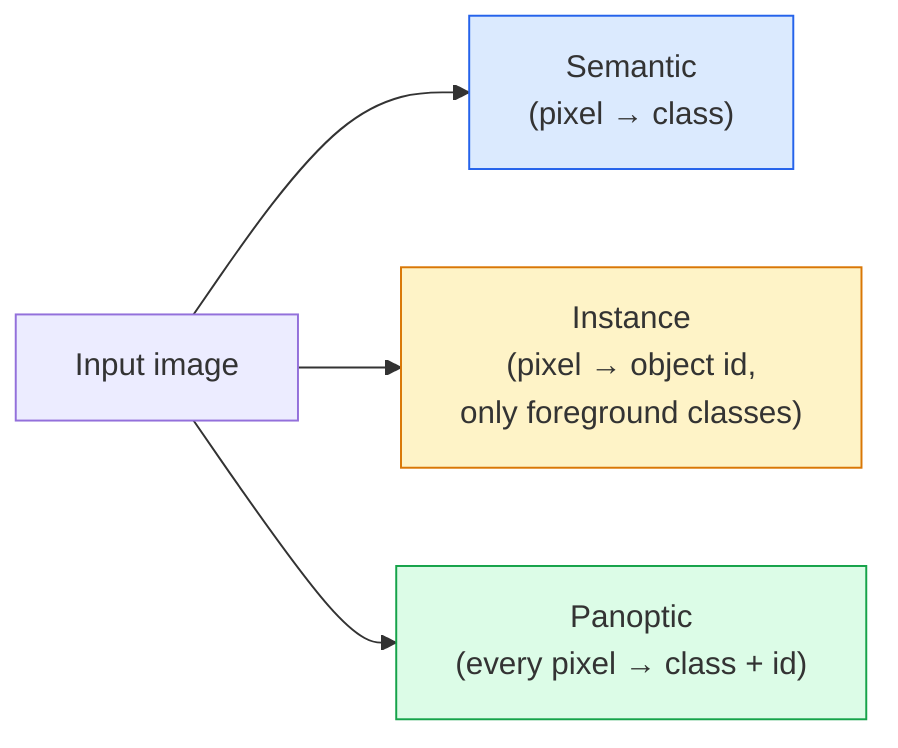
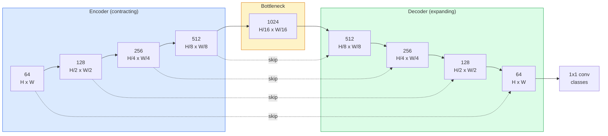

# Semantic 分割 — U-Net

> 分割 is classification at every 像素. U-Net makes it work by pairing a downsampling encoder with an upsampling decoder and wiring skip connections between them.

**Type:** Build
**Languages:** Python
**Prerequisites:** Phase 4 Lesson 03 (CNNs), Phase 4 Lesson 04 (图像 Classification)
**Time:** ~75 minutes

## Learning Objectives

- Distinguish semantic, instance, and panoptic 分割 and pick the right task for a given problem
- Build a U-Net from scratch in PyTorch with encoder blocks, a bottleneck, a decoder with transposed 卷积, and skip connections
- Implement 像素-wise cross-entropy, Dice loss, and the combined loss that is the current default for medical and industrial 分割
- Read IoU and Dice metrics per class and diagnose whether a bad score comes from small-object 召回率, boundary accuracy, or class imbalance

## The Problem

Classification 输出 one label per 图像. Detection 输出 a handful of boxes per 图像. 分割 输出 one label per 像素. For an 输入 of size `H x W`, the 输出 is a 张量 of shape `H x W` (semantic) or `H x W x N_instances` (instance). 那是 millions of predictions per 图像, not one.

The structure of 分割 is why it powers almost every dense-prediction vision product: medical imaging (tumour masks), autonomous driving (road, lane, obstacle), satellite (building footprints, crop boundaries), document parsing (layout zones), robotics (graspable regions). None of those tasks can be solved by putting a box around the object; they need the exact silhouette.

The architectural problem is simple to state and not simple to solve: you need the network to see the global context of an 图像 (what kind of scene is this) and the local 像素 detail (exactly which 像素 is road vs pavement) simultaneously. A standard CNN compresses spatially to gain context, which throws away the detail. U-Net was the design that got both.

## The Concept

### Semantic vs instance vs panoptic



- **Semantic** says "this 像素 is road, that 像素 is car." Two cars next to each other collapse into a single blob.
- **Instance** says "this 像素 is car #3, that 像素 is car #5." Ignores background stuff ("stuff" = sky, road, grass).
- **Panoptic** unifies both: every 像素 gets a class label, every instance gets a unique id, stuff and things both segmented.

This lesson covers semantic. The next lesson (Mask R-CNN) covers instance.

### The U-Net shape



The encoder halves spatial resolution four times and doubles 通道. The decoder reverses: doubles spatial resolution four times and halves 通道. The skip connections concatenate matching encoder 特征 with decoder 特征 at every resolution. The final 1x1 conv maps `64 -> num_classes` at full resolution.

Why skip connections are necessary: the decoder has seen only small 特征图 by the time it tries to 输出 像素-level predictions. Without the skips it cannot localise edges accurately because that information was compressed away in the encoder. Skip connections hand it the high-resolution 特征图 the encoder computed on the way down.

### Transposed vs bilinear upsample

The decoder has to expand spatial dimensions. Two options:

- **Transposed 卷积** (`nn.ConvTranspose2d`) — learnable upsample. Historical U-Net default. Can produce checkerboard artifacts if 步长 and 卷积核 size do not divide evenly.
- **Bilinear upsample + 3x3 conv** — smooth upsample followed by a conv. Fewer artifacts, fewer 参数, now the modern default.

Both appear in the wild. For a first U-Net, bilinear is safer.

### Cross-entropy on a 像素 grid

For semantic 分割 with C classes, the 模型 输出 is `(N, C, H, W)`. The target is `(N, H, W)` with integer class IDs. Cross-entropy is identical to the classification case, just applied at every spatial position:

```
Loss = mean over (n, h, w) of -log( softmax(logits[n, :, h, w])[target[n, h, w]] )
```

`F.cross_entropy` in PyTorch handles this shape natively. No reshape needed.

### Dice loss and why you need it

Cross-entropy treats every 像素 equally. 那是 wrong when one class dominates the frame (medical imaging: 99% background, 1% tumour). The network can score 99% accuracy by predicting background everywhere and still be useless.

Dice loss solves this by directly optimising the overlap between predicted and true mask:

```
Dice(p, y) = 2 * sum(p * y) / (sum(p) + sum(y) + epsilon)
Dice_loss = 1 - Dice
```

where `p` is the sigmoid/softmax probability map for a class and `y` is the binary ground-truth mask. The loss is zero only when the overlap is perfect. Because it is ratio-based, class imbalance is irrelevant.

In practice, use the **combined loss**:

```
L = L_cross_entropy + lambda * L_dice       (lambda ~ 1)
```

Cross-entropy gives stable 梯度 early in 训练; Dice focuses the tail of 训练 on actually matching the mask shape. This combination is the medical-imaging default and hard to beat on any class-imbalanced 数据集.

### Evaluation metrics

- **像素 accuracy** — percent of 像素 predicted correctly. Cheap. Broken on imbalanced 数据 for the same reason as accuracy in classification.
- **IoU per class** — intersection over union for each class's mask; average across classes = mIoU.
- **Dice (F1 on 像素)** — similar to IoU; `Dice = 2 * IoU / (1 + IoU)`. Medical imaging prefers Dice, driving community prefers IoU; they are monotonically related.
- **Boundary F1** — measures how close predicted boundaries are to ground-truth boundaries, penalising even small shifts. Important for high-精确率 tasks like semiconductor inspection.

Report IoU per class, not just mIoU. Mean IoU hides a class at 15% when nine others are at 85%.

### 输入 resolution trade-off

U-Net's encoder halves resolution four times, so the 输入 must be divisible by 16. Medical 图像 are often 512x512 or 1024x1024. Autonomous-driving crops are 2048x1024. The memory cost of U-Net scales with `H * W * C_max`, and at 1024x1024 with 1024 bottleneck 通道 the forward pass already uses gigabytes of VRAM.

Two standard workarounds:
1. Tile the 输入 — process 256x256 tiles with overlap and stitch.
2. Replace the bottleneck with dilated 卷积 that keep spatial resolution higher but widen receptive field (the DeepLab family).

For a first 模型, a 256x256 输入 with a 64-通道-base U-Net trains comfortably on 8 GB VRAM.

## Build It

### Step 1: Encoder block

Two 3x3 convs with 批次 norm and ReLU. The first conv changes 通道 count; the second keeps it.

```python
import torch
import torch.nn as nn
import torch.nn.functional as F

class DoubleConv(nn.Module):
    def __init__(self, in_c, out_c):
        super().__init__()
        self.net = nn.Sequential(
            nn.Conv2d(in_c, out_c, kernel_size=3, padding=1, bias=False),
            nn.BatchNorm2d(out_c),
            nn.ReLU(inplace=True),
            nn.Conv2d(out_c, out_c, kernel_size=3, padding=1, bias=False),
            nn.BatchNorm2d(out_c),
            nn.ReLU(inplace=True),
        )

    def forward(self, x):
        return self.net(x)
```

This block is reused throughout. `偏置=False` because BN's beta handles the 偏置.

### Step 2: Down and up blocks

```python
class Down(nn.Module):
    def __init__(self, in_c, out_c):
        super().__init__()
        self.net = nn.Sequential(
            nn.MaxPool2d(2),
            DoubleConv(in_c, out_c),
        )

    def forward(self, x):
        return self.net(x)


class Up(nn.Module):
    def __init__(self, in_c, out_c):
        super().__init__()
        self.up = nn.Upsample(scale_factor=2, mode="bilinear", align_corners=False)
        self.conv = DoubleConv(in_c, out_c)

    def forward(self, x, skip):
        x = self.up(x)
        if x.shape[-2:] != skip.shape[-2:]:
            x = F.interpolate(x, size=skip.shape[-2:], mode="bilinear", align_corners=False)
        x = torch.cat([skip, x], dim=1)
        return self.conv(x)
```

The spatial-only shape check (`shape[-2:]`) handles 输入 whose dimensions are not divisible by 16; a safe `F.interpolate` aligns the 张量 before the concat. Comparing the full shape would also trigger on 通道-count differences, which should be a loud error, not a silent interpolate.

### Step 3: The U-Net

```python
class UNet(nn.Module):
    def __init__(self, in_channels=3, num_classes=2, base=64):
        super().__init__()
        self.inc = DoubleConv(in_channels, base)
        self.d1 = Down(base, base * 2)
        self.d2 = Down(base * 2, base * 4)
        self.d3 = Down(base * 4, base * 8)
        self.d4 = Down(base * 8, base * 16)
        self.u1 = Up(base * 16 + base * 8, base * 8)
        self.u2 = Up(base * 8 + base * 4, base * 4)
        self.u3 = Up(base * 4 + base * 2, base * 2)
        self.u4 = Up(base * 2 + base, base)
        self.outc = nn.Conv2d(base, num_classes, kernel_size=1)

    def forward(self, x):
        x1 = self.inc(x)
        x2 = self.d1(x1)
        x3 = self.d2(x2)
        x4 = self.d3(x3)
        x5 = self.d4(x4)
        x = self.u1(x5, x4)
        x = self.u2(x, x3)
        x = self.u3(x, x2)
        x = self.u4(x, x1)
        return self.outc(x)

net = UNet(in_channels=3, num_classes=2, base=32)
x = torch.randn(1, 3, 256, 256)
print(f"output: {net(x).shape}")
print(f"params: {sum(p.numel() for p in net.parameters()):,}")
```

输出 shape `(1, 2, 256, 256)` — same spatial size as the 输入, `num_classes` 通道. About 7.7M 参数 at `base=32`.

### Step 4: Losses

```python
def dice_loss(logits, targets, num_classes, eps=1e-6):
    probs = F.softmax(logits, dim=1)
    targets_one_hot = F.one_hot(targets, num_classes).permute(0, 3, 1, 2).float()
    dims = (0, 2, 3)
    intersection = (probs * targets_one_hot).sum(dim=dims)
    denom = probs.sum(dim=dims) + targets_one_hot.sum(dim=dims)
    dice = (2 * intersection + eps) / (denom + eps)
    return 1 - dice.mean()


def combined_loss(logits, targets, num_classes, lam=1.0):
    ce = F.cross_entropy(logits, targets)
    dc = dice_loss(logits, targets, num_classes)
    return ce + lam * dc, {"ce": ce.item(), "dice": dc.item()}
```

Dice is computed per class then averaged (macro Dice). The `eps` prevents division by zero on classes absent from the 批次.

### Step 5: IoU metric

```python
@torch.no_grad()
def iou_per_class(logits, targets, num_classes):
    preds = logits.argmax(dim=1)
    ious = torch.zeros(num_classes)
    for c in range(num_classes):
        pred_c = (preds == c)
        true_c = (targets == c)
        inter = (pred_c & true_c).sum().float()
        union = (pred_c | true_c).sum().float()
        ious[c] = (inter / union) if union > 0 else torch.tensor(float("nan"))
    return ious
```

Returns a 向量 of length C. `nan` marks classes absent from the 批次 — do not average over those when computing mIoU.

### Step 6: Synthetic 数据集 for end-to-end verification

Generate shapes on coloured backgrounds so the network has to learn shape, not 像素 colour.

```python
import numpy as np
from torch.utils.data import Dataset, DataLoader

def synthetic_segmentation(num_samples=200, size=64, seed=0):
    rng = np.random.default_rng(seed)
    images = np.zeros((num_samples, size, size, 3), dtype=np.float32)
    masks = np.zeros((num_samples, size, size), dtype=np.int64)
    for i in range(num_samples):
        bg = rng.uniform(0, 1, (3,))
        images[i] = bg
        masks[i] = 0
        num_shapes = rng.integers(1, 4)
        for _ in range(num_shapes):
            cls = int(rng.integers(1, 3))
            color = rng.uniform(0, 1, (3,))
            cx, cy = rng.integers(10, size - 10, size=2)
            r = int(rng.integers(4, 12))
            yy, xx = np.meshgrid(np.arange(size), np.arange(size), indexing="ij")
            if cls == 1:
                mask = (xx - cx) ** 2 + (yy - cy) ** 2 < r ** 2
            else:
                mask = (np.abs(xx - cx) < r) & (np.abs(yy - cy) < r)
            images[i][mask] = color
            masks[i][mask] = cls
        images[i] += rng.normal(0, 0.02, images[i].shape)
        images[i] = np.clip(images[i], 0, 1)
    return images, masks


class SegDataset(Dataset):
    def __init__(self, images, masks):
        self.images = images
        self.masks = masks

    def __len__(self):
        return len(self.images)

    def __getitem__(self, i):
        img = torch.from_numpy(self.images[i]).permute(2, 0, 1).float()
        mask = torch.from_numpy(self.masks[i]).long()
        return img, mask
```

Three classes: background (0), circles (1), squares (2). The network must learn to distinguish shape.

### Step 7: 训练 loop

```python
def train_one_epoch(model, loader, optimizer, device, num_classes):
    model.train()
    loss_sum, total = 0.0, 0
    iou_sum = torch.zeros(num_classes)
    for x, y in loader:
        x, y = x.to(device), y.to(device)
        logits = model(x)
        loss, _ = combined_loss(logits, y, num_classes)
        optimizer.zero_grad()
        loss.backward()
        optimizer.step()
        loss_sum += loss.item() * x.size(0)
        total += x.size(0)
        iou_sum += iou_per_class(logits, y, num_classes).nan_to_num(0)
    return loss_sum / total, iou_sum / len(loader)
```

Run this for 10-30 轮次 on the synthetic 数据集 and watch mIoU climb past 0.9 for the shape classes. Note the `nan_to_num(0)` treats classes absent from a 批次 as zero; for accurate per-class IoU, mask by presence and use `torch.nanmean` across 批次 at evaluation time rather than averaging here.

## Use It

For production, `segmentation_models_pytorch` ("smp") wraps every standard 分割 architecture with any torchvision or timm 骨干网络. Three lines:

```python
import segmentation_models_pytorch as smp

model = smp.Unet(
    encoder_name="resnet34",
    encoder_weights="imagenet",
    in_channels=3,
    classes=3,
)
```

Also worth knowing for real work:
- **DeepLabV3+** replaces max-pool-based downsampling with dilated convs so the bottleneck keeps resolution; faster boundaries on satellite and driving 数据.
- **SegFormer** swaps the conv encoder for a hierarchical transformer; current SOTA on many benchmarks.
- **Mask2Former** / **OneFormer** unify semantic, instance, and panoptic 分割 in a single architecture.

All three are drop-in replacements in `smp` or `transformers` with the same 数据 loader.

## Ship It

This lesson produces:

- `输出/prompt-分割-task-picker.md` — a prompt that picks between semantic, instance, and panoptic 分割 and names the architecture for a given task.
- `输出/skill-分割-mask-inspector.md` — a skill that reports class distribution, predicted-mask statistics, and the classes that are under-predicted or boundary-blurred.

## Exercises

1. **(Easy)** Implement `bce_dice_loss` for a binary 分割 task (foreground vs background). Verify on a synthetic two-class 数据集 that the combined loss converges faster than BCE alone when the foreground is 5% of 像素.
2. **(Medium)** Replace the `nn.Upsample + conv` up-block with a `nn.ConvTranspose2d` up-block. Train both on the synthetic 数据集 and compare mIoU. Observe where checkerboard artifacts appear in the transposed-conv version.
3. **(Hard)** Take a real 分割 数据集 (Oxford-IIIT Pets, Cityscapes mini split, or a medical subset) and train the U-Net to within 2 IoU points of the `smp.Unet` reference. Report per-class IoU and identify which classes benefit most from adding Dice to the loss.

## Key Terms

| Term | What people say | What it actually means |
|------|----------------|----------------------|
| Semantic 分割 | "Label every 像素" | Per-像素 classification into C classes; instances of the same class merge |
| Instance 分割 | "Label every object" | Separates distinct instances of the same class; foreground-only |
| Panoptic 分割 | "Semantic + instance" | Every 像素 gets a class; every thing instance also gets a unique id |
| Skip connection | "U-Net bridge" | Concatenation of encoder 特征 into matching-resolution decoder 特征; preserves high-frequency detail |
| Transposed conv | "Deconvolution" | Learnable upsampling; can produce checkerboard artifacts |
| Dice loss | "Overlap loss" | 1 - 2|A ∩ B| / (|A| + |B|); optimises mask overlap directly and is robust to class imbalance |
| mIoU | "Mean intersection over union" | Average IoU across classes; the community-standard metric for 分割 |
| Boundary F1 | "Boundary accuracy" | F1 score computed on boundary 像素 only; matters for 精确率-critical tasks |

## Further Reading

- [U-Net: Convolutional Networks for Biomedical 图像 分割 (Ronneberger et al., 2015)](https://arxiv.org/abs/1505.04597) — the original paper; the figure everyone copies is on page 2
- [Fully Convolutional Networks (Long et al., 2015)](https://arxiv.org/abs/1411.4038) — the paper that first made 分割 an end-to-end conv problem
- [segmentation_models_pytorch](https://github.com/qubvel/segmentation_models.pytorch) — the reference for production 分割; every standard architecture plus every standard loss
- [Lessons learned from 训练 SOTA 分割 (kaggle.com competitions)](https://www.kaggle.com/代码/iafoss/carvana-unet-pytorch) — a walkthrough of why TTA, pseudo-labeling, and class 权重 matter on real 数据
