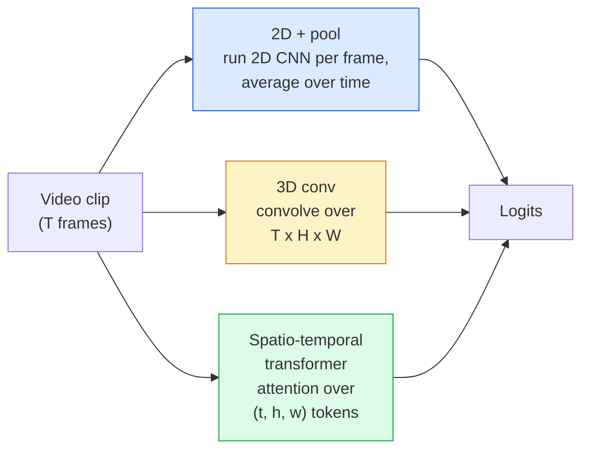

# Video Understanding — Temporal Modeling

> A video is a sequence of 图像 plus the physics that connects them. Every video 模型 either treats time as an extra axis (3D conv), a sequence to attend over (transformer), or a 特征 to extract once and pool (2D+pool).

**Type:** Learn + Build
**Languages:** Python
**Prerequisites:** Phase 4 Lesson 03 (CNNs), Phase 4 Lesson 04 (图像 Classification)
**Time:** ~45 minutes

## Learning Objectives

- Distinguish the three main video-modelling approaches (2D+pool, 3D conv, spatio-temporal transformer) and predict their cost and accuracy trade-offs
- Implement frame sampling, temporal 池化, and a 2D+pool baseline classifier in PyTorch
- Explain why I3D's "inflated" 3D 卷积核 transfer well from ImageNet 权重 and what a factorised (2+1)D conv does differently
- Read the standard action-recognition 数据集 and metrics: Kinetics-400/600, UCF101, Something-Something V2; top-1 accuracy at the clip and video level

## The Problem

A 30-second video at 30 fps is 900 图像. Naively, video classification is 图像 classification run 900 times followed by some kind of aggregation. That works when the action is visible in almost every frame (sports, cooking, exercise videos) and fails badly when the action is defined by motion itself: "pushing something from left to right" looks like two still objects in every single frame.

The core question for every video architecture is: when does temporal structure get modelled, and how? The answer drives everything else — compute cost, pretraining strategy, whether you can reuse ImageNet 权重, what 数据集 the 模型 trains on.

This lesson is deliberately shorter than the static-图像 lessons. The core 图像 machinery is already in place, and video understanding is mostly about the temporal story: sampling, modelling, and aggregating.

## The Concept

### The three architectural families



### 2D + pool

Take a 2D CNN (ResNet, EfficientNet, ViT). Run it independently on every sampled frame. Average (or max-pool, or attention-pool) the per-frame embeddings. Feed the pooled 向量 to a classifier.

Pros:
- ImageNet pretraining transfers directly.
- Simplest to implement.
- Cheap: T frames * single-图像 inference cost.

Cons:
- Cannot 模型 motion. Action = aggregate of appearances.
- Temporal 池化 is order-invariant; "open door" and "close door" look the same.

When to use: appearance-heavy tasks, 迁移学习 on small video 数据集, initial baselines.

### 3D 卷积

Replace 2D (H, W) 卷积核 with 3D (T, H, W) 卷积核. The network convolves over both space and time. Early family: C3D, I3D, SlowFast.

I3D trick: take a pretrained 2D ImageNet 模型, "inflate" each 2D 卷积核 by copying it along a new time axis. A 3x3 2D conv becomes a 3x3x3 3D conv. This gives the 3D 模型 strong pretrained 权重 instead of 训练 from scratch.

Pros:
- Directly 模型 motion.
- I3D inflation gives free 迁移学习.

Cons:
- T/8 more FLOPs than the 2D counterpart (for temporal 卷积核 of 3 stacked 3 times).
- Temporal 卷积核 are small; long-range motion needs a pyramid or dual-stream approach.

When to use: action recognition where motion is the signal (Something-Something V2, Kinetics with motion-heavy classes).

### Spatio-temporal transformers

Tokenise the video into a grid of space-time patches and attend across all of them. TimeSformer, ViViT, Video Swin, VideoMAE.

Attention patterns that matter:
- **Joint** — one big attention over (t, h, w). Quadratic in `T*H*W`; expensive.
- **Divided** — two attentions per block: one over time, one over space. Linear-ish scaling.
- **Factorised** — time attention alternates with space attention across blocks.

Pros:
- SOTA accuracy on every major benchmark.
- Transfers from 图像 transformers (ViT) via patch inflation.
- Supports long-context video via sparse attention.

Cons:
- Compute-hungry.
- Requires careful attention pattern choice or runtime balloons.

When to use: large 数据集, high-fidelity video understanding, multi-modal video+text tasks.

### Frame sampling

A 10-second clip at 30 fps is 300 frames; feeding all 300 to any 模型 is wasteful. Standard strategies:

- **Uniform sampling** — pick T frames evenly across the clip. Default for 2D+pool.
- **Dense sampling** — random contiguous T-frame window. Common for 3D convs because motion requires neighbouring frames.
- **Multi-clip** — sample multiple T-frame windows from the same video, classify each, average predictions at test time.

T is usually 8, 16, 32, or 64. Higher T = more temporal signal at more compute.

### Evaluation

Two levels:
- **Clip-level accuracy** — 模型 sees one T-frame clip, reports top-k.
- **Video-level accuracy** — average clip-level predictions across multiple clips per video; higher and more stable.

Always report both. A 模型 that scores 78% clip / 82% video is relying heavily on test-time averaging; one that scores 80% / 81% is more robust per-clip.

### Datasets you will meet

- **Kinetics-400 / 600 / 700** — the general-purpose action 数据集. 400k clips; YouTube URLs (many now dead).
- **Something-Something V2** — motion-defined actions ("moving X from left to right"). Cannot be solved by 2D+pool.
- **UCF-101**, **HMDB-51** — older, smaller, still reported.
- **AVA** — action *localisation* in space and time; harder than classification.

## Build It

### Step 1: Frame sampler

Uniform and dense samplers that work on a list of frames (or a video 张量).

```python
import numpy as np

def sample_uniform(num_frames_total, T):
    if num_frames_total <= T:
        return list(range(num_frames_total)) + [num_frames_total - 1] * (T - num_frames_total)
    step = num_frames_total / T
    return [int(i * step) for i in range(T)]


def sample_dense(num_frames_total, T, rng=None):
    rng = rng or np.random.default_rng()
    if num_frames_total <= T:
        return list(range(num_frames_total)) + [num_frames_total - 1] * (T - num_frames_total)
    start = int(rng.integers(0, num_frames_total - T + 1))
    return list(range(start, start + T))
```

Both return `T` indices that you use to slice the video 张量.

### Step 2: A 2D+pool baseline

Run a 2D ResNet-18 over every frame, average-pool 特征, classify.

```python
import torch
import torch.nn as nn
from torchvision.models import resnet18, ResNet18_Weights

class FramePool(nn.Module):
    def __init__(self, num_classes=400, pretrained=True):
        super().__init__()
        weights = ResNet18_Weights.IMAGENET1K_V1 if pretrained else None
        backbone = resnet18(weights=weights)
        self.features = nn.Sequential(*(list(backbone.children())[:-1]))  # global avg pool kept
        self.head = nn.Linear(512, num_classes)

    def forward(self, x):
        # x: (N, T, 3, H, W)
        N, T = x.shape[:2]
        x = x.view(N * T, *x.shape[2:])
        feats = self.features(x).view(N, T, -1)
        pooled = feats.mean(dim=1)
        return self.head(pooled)

model = FramePool(num_classes=10)
x = torch.randn(2, 8, 3, 224, 224)
print(f"output: {model(x).shape}")
print(f"params: {sum(p.numel() for p in model.parameters()):,}")
```

Eleven million 参数, ImageNet pretrained, runs per-frame, averages, classifies. This baseline is often within 5-10 points of proper 3D 模型 on appearance-heavy tasks — sometimes better, because it reuses a stronger ImageNet 骨干网络.

### Step 3: An I3D-style inflated 3D conv

Turn a single 2D conv into a 3D conv by repeating 权重 along a new time axis.

```python
def inflate_2d_to_3d(conv2d, time_kernel=3):
    out_c, in_c, kh, kw = conv2d.weight.shape
    weight_3d = conv2d.weight.data.unsqueeze(2)  # (out, in, 1, kh, kw)
    weight_3d = weight_3d.repeat(1, 1, time_kernel, 1, 1) / time_kernel
    conv3d = nn.Conv3d(in_c, out_c, kernel_size=(time_kernel, kh, kw),
                        padding=(time_kernel // 2, conv2d.padding[0], conv2d.padding[1]),
                        stride=(1, conv2d.stride[0], conv2d.stride[1]),
                        bias=False)
    conv3d.weight.data = weight_3d
    return conv3d

conv2d = nn.Conv2d(3, 64, kernel_size=3, padding=1, bias=False)
conv3d = inflate_2d_to_3d(conv2d, time_kernel=3)
print(f"2D weight shape:  {tuple(conv2d.weight.shape)}")
print(f"3D weight shape:  {tuple(conv3d.weight.shape)}")
x = torch.randn(1, 3, 8, 56, 56)
print(f"3D output shape:  {tuple(conv3d(x).shape)}")
```

The division by `time_kernel` keeps the activation magnitudes roughly constant — important for not breaking 批次-norm statistics on the first pass.

### Step 4: Factorised (2+1)D conv

Split a 3D conv into a 2D (spatial) and a 1D (temporal) conv. Same receptive field, fewer 参数, better accuracy on some benchmarks.

```python
class Conv2Plus1D(nn.Module):
    def __init__(self, in_c, out_c, kernel_size=3):
        super().__init__()
        mid_c = (in_c * out_c * kernel_size * kernel_size * kernel_size) \
                // (in_c * kernel_size * kernel_size + out_c * kernel_size)
        self.spatial = nn.Conv3d(in_c, mid_c, kernel_size=(1, kernel_size, kernel_size),
                                 padding=(0, kernel_size // 2, kernel_size // 2), bias=False)
        self.bn = nn.BatchNorm3d(mid_c)
        self.act = nn.ReLU(inplace=True)
        self.temporal = nn.Conv3d(mid_c, out_c, kernel_size=(kernel_size, 1, 1),
                                  padding=(kernel_size // 2, 0, 0), bias=False)

    def forward(self, x):
        return self.temporal(self.act(self.bn(self.spatial(x))))

c = Conv2Plus1D(3, 64)
x = torch.randn(1, 3, 8, 56, 56)
print(f"(2+1)D output: {tuple(c(x).shape)}")
```

A full R(2+1)D network is the same as a ResNet-18 with every 3x3 conv replaced by `Conv2Plus1D`.

## Use It

Two libraries cover production video work:

- `torchvision.模型.video` — R(2+1)D, MViT, Swin3D with pretrained Kinetics 权重. Same API as 图像 模型.
- `pytorchvideo` (Meta) — 模型 zoo, 数据 loaders for Kinetics / SSv2 / AVA, standard transforms.

For Vision-Language video 模型 (video captioning, video QA), use `transformers` (`VideoMAE`, `VideoLLaMA`, `InternVideo`).

## Ship It

This lesson produces:

- `输出/prompt-video-architecture-picker.md` — a prompt that picks 2D+pool / I3D / (2+1)D / transformer based on appearance-vs-motion, 数据集 size, and compute budget.
- `输出/skill-frame-sampler-auditor.md` — a skill that inspects a video pipeline's sampler and flags common bugs: off-by-one index, uneven sampling when `num_frames < T`, lack of aspect-preserving crop, etc.

## Exercises

1. **(Easy)** Compute FLOPs (approximate) for FramePool with T=8 vs an I3D-style 3D ResNet with T=8. Justify why 2D+pool is 3-5x cheaper.
2. **(Medium)** Generate a synthetic video 数据集: random balls moving in random directions, labelled by direction of motion ("left-to-right", "right-to-left", "diagonal-up"). Train FramePool on it. Show that it achieves near-chance accuracy, proving appearance alone is insufficient for motion tasks.
3. **(Hard)** Build an R(2+1)D-18 by replacing every Conv2d in a ResNet-18 with `Conv2Plus1D`. Inflate the first conv's 权重 from an ImageNet-pretrained ResNet-18. Train on the motion 数据集 from exercise 2 and beat FramePool.

## Key Terms

| Term | What people say | What it actually means |
|------|----------------|----------------------|
| 2D + pool | "Per-frame classifier" | Run a 2D CNN on every sampled frame, average-pool 特征 across time, classify |
| 3D 卷积 | "Spatio-temporal 卷积核" | 卷积核 that convolves over (T, H, W); can 模型 motion natively |
| Inflation | "Lift 2D 权重 to 3D" | Initialise 3D conv 权重 by repeating a 2D conv's 权重 along the new time axis, then divide by kernel_T to preserve activation scale |
| (2+1)D | "Factorised conv" | Split 3D into 2D spatial + 1D temporal; fewer 参数, extra non-linearity between |
| Divided attention | "Time then space" | Transformer block with two attentions per 层: one over tokens at the same frame, one over tokens at the same position |
| Clip | "T-frame window" | A sampled subsequence of T frames; the unit a video 模型 consumes |
| Clip vs video accuracy | "Two eval settings" | Clip = one sample per video, video = average across multiple sampled clips |
| Kinetics | "The ImageNet of video" | 400-700 action classes, 300k+ YouTube clips, the standard video pretraining corpus |

## Further Reading

- [I3D: Quo Vadis, Action Recognition (Carreira & Zisserman, 2017)](https://arxiv.org/abs/1705.07750) — introduces inflation and the Kinetics 数据集
- [R(2+1)D: A Closer Look at Spatiotemporal Convolutions (Tran et al., 2018)](https://arxiv.org/abs/1711.11248) — factorised conv, still a strong baseline
- [TimeSformer: Is Space-Time Attention All You Need? (Bertasius et al., 2021)](https://arxiv.org/abs/2102.05095) — the first strong video transformer
- [VideoMAE (Tong et al., 2022)](https://arxiv.org/abs/2203.12602) — masked autoencoder pretraining for video; current dominant pretraining recipe
