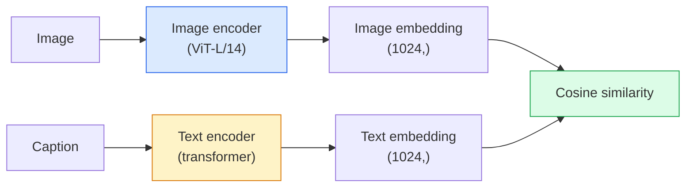

# Open-Vocabulary Vision — CLIP

> Train an 图像 encoder and a text encoder together so that matching (图像, caption) pairs land at the same point in a shared space. 那是 the whole trick.

**Type:** Build + Use
**Languages:** Python
**Prerequisites:** Phase 4 Lesson 14 (ViT), Phase 4 Lesson 17 (Self-Supervised)
**Time:** ~45 minutes

## Learning Objectives

- Explain CLIP's two-tower architecture and contrastive 训练 objective
- Use a pretrained CLIP (or SigLIP) for zero-shot classification without any task-specific 训练
- Implement zero-shot classification from scratch: encode class prompts, compute cosine similarity, take argmax
- Distinguish CLIP, SigLIP, OpenCLIP, and LLaVA/LLaMA-vision 模型 — what each is for in 2026

## The Problem

Traditional classifiers are closed-vocabulary: a 1000-class ImageNet 模型 can only predict 1000 labels. Every new category requires labelled 数据 and a retrained head.

CLIP (Radford et al., OpenAI 2021) showed that 训练 on 400M (图像, caption) pairs scraped from the web produces a 模型 that can classify into any set of categories at inference, described purely in natural language. You give it a new class by writing a sentence.

That capability — zero-shot transfer — is why every modern vision system starts with a CLIP-family checkpoint. Detection (Grounding DINO, OWL-ViT), 分割 (CLIPSeg, SAM), retrieval, content moderation, VLMs, and text-to-图像 generation all build on CLIP-style joint embeddings.

## The Concept

### Two towers



Both encoders end with a linear projection to the same embedding dimension (512 for CLIP-B/32, 1024 for CLIP-L/14). L2-normalise and compute cosine similarity.

### The objective

Given a 批次 of N (图像, caption) pairs, build an NxN similarity 矩阵. Train both encoders so the diagonal (matching pairs) has high similarity and off-diagonals (non-matching) have low similarity.

```
sim_matrix = image_embeddings @ text_embeddings.T / tau

loss_i2t = cross_entropy(sim_matrix,       targets=arange(N))
loss_t2i = cross_entropy(sim_matrix.T,     targets=arange(N))
loss = (loss_i2t + loss_t2i) / 2
```

Symmetric because both 图像-to-text and text-to-图像 retrieval should work. `tau` (temperature) is typically learned as a scalar 参数, initialised to 0.07.

### SigLIP: a better loss

SigLIP (Zhai et al., 2023) replaced the softmax with per-pair sigmoid:

```
loss = mean over pairs of log(1 + exp(-y_ij * sim_ij))
y_ij = +1 if matching, -1 otherwise
```

Per-pair loss removes the 批次-level normalisation that CLIP requires. SigLIP trains better at small 批次 sizes and matches or exceeds CLIP at equal 数据.

### Zero-shot classification

Given a trained CLIP:

1. For each class, compose a prompt: "a photo of a {class}".
2. Encode all class prompts with the text encoder -> `T` shape (C, d).
3. Encode the test 图像 -> `I` shape (1, d).
4. Similarity = `I @ T.T` shape (1, C).
5. Argmax -> predicted class.

Prompt engineering matters. OpenAI published 80 prompt templates for ImageNet ("a photo of a {}", "a blurry photo of a {}", "a sketch of a {}", ...). Average the embeddings of all templates per class for an extra 1-3% top-1 accuracy.

### Where CLIP-style 模型 are used in 2026

- **Zero-shot classification** — direct use.
- **图像 retrieval** — encode all 图像 once, embed query at inference.
- **Text-conditioned detection** — Grounding DINO, OWL-ViT wrap a CLIP text tower around a detector.
- **Text-conditioned 分割** — CLIPSeg; SAM uses text-prompt 输入 via CLIP.
- **VLMs** — LLaVA, Qwen-VL, InternVL wire a CLIP-family vision encoder into an LLM.
- **Text-to-图像 gen** — Stable 扩散模型, DALL-E 3 condition on CLIP text embeddings.

Once you have a shared embedding space, every vision+language task becomes a distance computation.

## Build It

### Step 1: A tiny two-tower 模型

Real CLIP is ViT + transformer. For this lesson the towers are small MLPs over pre-extracted 特征 so the 训练 signal is visible on CPU.

```python
import torch
import torch.nn as nn
import torch.nn.functional as F


class TwoTower(nn.Module):
    def __init__(self, img_in=128, txt_in=64, emb=64):
        super().__init__()
        self.image_proj = nn.Sequential(nn.Linear(img_in, 128), nn.ReLU(), nn.Linear(128, emb))
        self.text_proj = nn.Sequential(nn.Linear(txt_in, 128), nn.ReLU(), nn.Linear(128, emb))
        self.logit_scale = nn.Parameter(torch.ones([]) * 2.6592)  # ln(1/0.07)

    def forward(self, img_feats, txt_feats):
        i = F.normalize(self.image_proj(img_feats), dim=-1)
        t = F.normalize(self.text_proj(txt_feats), dim=-1)
        return i, t, self.logit_scale.exp()
```

Two projections, shared-dim 输出, learned temperature. Same shape as the real CLIP API.

### Step 2: Contrastive loss

```python
def clip_loss(image_emb, text_emb, logit_scale):
    N = image_emb.size(0)
    sim = logit_scale * image_emb @ text_emb.T
    targets = torch.arange(N, device=sim.device)
    l_i = F.cross_entropy(sim, targets)
    l_t = F.cross_entropy(sim.T, targets)
    return (l_i + l_t) / 2
```

Symmetric. Higher logit_scale = sharper softmax = more confident but risk of instability.

### Step 3: Zero-shot classifier

```python
@torch.no_grad()
def zero_shot_classify(model, image_feats, class_text_feats, class_names):
    """
    image_feats:      (N, img_in)
    class_text_feats: (C, txt_in)   one averaged embedding per class
    """
    i = F.normalize(model.image_proj(image_feats), dim=-1)
    t = F.normalize(model.text_proj(class_text_feats), dim=-1)
    sim = i @ t.T
    pred = sim.argmax(dim=-1)
    return [class_names[p] for p in pred.tolist()]
```

One line per step. 这是 the exact zero-shot procedure used with a production CLIP checkpoint.

### Step 4: Sanity check

```python
torch.manual_seed(0)
model = TwoTower()

img = torch.randn(8, 128)
txt = torch.randn(8, 64)
i, t, scale = model(img, txt)
loss = clip_loss(i, t, scale)
print(f"batch size: {i.size(0)}   loss: {loss.item():.3f}")
```

Loss should be close to `log(N) = log(8) = 2.08` for a randomly initialised 模型 — the symmetric cross-entropy target when no structure is learned yet.

## Use It

OpenCLIP is the community default in 2026:

```python
import open_clip
import torch
from PIL import Image

model, _, preprocess = open_clip.create_model_and_transforms("ViT-B-32", pretrained="laion2b_s34b_b79k")
tokenizer = open_clip.get_tokenizer("ViT-B-32")

image = preprocess(Image.open("dog.jpg")).unsqueeze(0)
text = tokenizer(["a photo of a dog", "a photo of a cat", "a photo of a car"])

with torch.no_grad():
    image_features = model.encode_image(image)
    text_features = model.encode_text(text)
    image_features = image_features / image_features.norm(dim=-1, keepdim=True)
    text_features = text_features / text_features.norm(dim=-1, keepdim=True)
    probs = (100.0 * image_features @ text_features.T).softmax(dim=-1)

print(probs)
```

SigLIP is newer, trains better at small scales, and is preferred for new work: `google/siglip-base-patch16-224`. Hugging Face ships both.

## Ship It

This lesson produces:

- `输出/prompt-zero-shot-class-picker.md` — a prompt that designs class templates for zero-shot CLIP given a list of classes and a domain.
- `输出/skill-图像-text-retriever.md` — a skill that builds an 图像 embedding index with any CLIP checkpoint, supports query-by-text and query-by-图像.

## Exercises

1. **(Easy)** Use a pretrained OpenCLIP ViT-B/32 and do zero-shot classification on CIFAR-10 with the 80-template prompt set. Report top-1 accuracy; it should be around 85-90%.
2. **(Medium)** Compare single-template ("a photo of a {}") vs 80-template averaged embeddings on the same CIFAR-10 task. Quantify the gap and explain why templates help.
3. **(Hard)** Build a zero-shot 图像 retrieval index: embed 1,000 图像 with CLIP, build a FAISS index, query with a natural language description. Report retrieval 召回率@5 for 20 held-out queries you write by hand.

## Key Terms

| Term | What people say | What it actually means |
|------|----------------|----------------------|
| Two-tower | "Dual encoder" | Separate 图像 and text encoders ending in a shared-dim projection head |
| Zero-shot | "No task-specific 训练" | Classify into classes described only by text at inference; no labels touched |
| Temperature / logit_scale | "tau" | Learned scalar that scales the similarity 矩阵 before softmax |
| Prompt template | "A photo of a {}" | Natural-language wrapper around class names; averaging many templates boosts zero-shot accuracy |
| CLIP | "图像+text 模型" | The 2021 OpenAI 模型; vocabulary of the field in 2026 |
| SigLIP | "Sigmoid CLIP" | Swaps softmax for per-pair sigmoid; trains better at small 批次 |
| OpenCLIP | "Open reproduction" | Community-trained CLIP variants on LAION; production default for open-source pipelines |
| VLM | "Vision-language 模型" | A CLIP-family encoder plus an LLM, trained to answer questions about 图像 |

## Further Reading

- [CLIP: Learning Transferable Visual Models from Natural Language Supervision (Radford et al., 2021)](https://arxiv.org/abs/2103.00020)
- [SigLIP: Sigmoid Loss for Language-图像 Pre-训练 (Zhai et al., 2023)](https://arxiv.org/abs/2303.15343)
- [OpenCLIP](https://github.com/mlfoundations/open_clip) — the community codebase
- [DINOv2 vs CLIP vs MAE: a 特征 comparison](https://huggingface.co/blog/dinov2) — HF guide with side-by-side use cases
