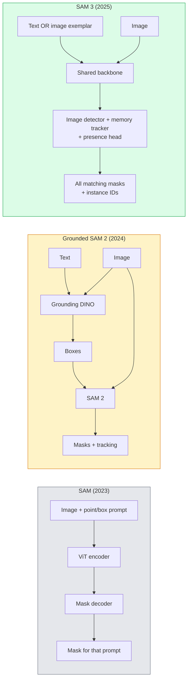

# SAM 3 & Open-Vocabulary 分割

> Give a 模型 a text prompt and an 图像 and get masks for every matching object. SAM 3 made that a single forward pass.

**Type:** Use + Build
**Languages:** Python
**Prerequisites:** Phase 4 Lesson 07 (U-Net), Phase 4 Lesson 08 (Mask R-CNN), Phase 4 Lesson 18 (CLIP)
**Time:** ~60 minutes

## Learning Objectives

- Distinguish SAM (visual prompts only), Grounded SAM / SAM 2 (detector + SAM), and SAM 3 (native text prompts via Promptable Concept 分割)
- Explain the SAM 3 architecture: shared 骨干网络 + 图像 detector + memory-based video tracker + presence head + decoupled detector-tracker design
- Use Hugging Face `transformers` SAM 3 integration for text-prompted detection, 分割, and video tracking
- Pick between SAM 3, Grounded SAM 2, YOLO-World, and SAM-MI based on latency, concept complexity, and deployment target

## The Problem

The 2023 SAM was a visual-prompt-only 模型: you click a point or draw a box and it returns a mask. For "give me all the oranges in this photo" you needed a detector (Grounding DINO) to produce boxes, then SAM to segment each. Grounded SAM turned this into a pipeline, but it was a cascade of two frozen 模型 with inevitable error accumulation.

SAM 3 (Meta, Nov 2025, ICLR 2026) collapsed the cascade. It accepts a short noun phrase or an 图像 exemplar as prompt and returns all matching masks and instance IDs in a single forward pass. 那是 **Promptable Concept 分割 (PCS)**. Combined with the March 2026 Object Multiplex update (SAM 3.1), it tracks multiple instances of the same concept through video efficiently.

This lesson is about the structural shift this represents. 2D seg, detection, and text-图像 grounding have merged into one 模型. The production question is no longer "which pipeline do I chain together" but "which promptable 模型 handles my use case end-to-end."

## The Concept

### The three generations



### Promptable Concept 分割

A "concept prompt" is a short noun phrase (`"yellow school bus"`, `"striped red umbrella"`, `"hand holding a mug"`) or an 图像 exemplar. The 模型 returns 分割 masks for every instance in the 图像 that matches the concept, plus a unique instance ID per match.

This differs from classic visual-prompt SAM in three ways:

1. No per-instance prompting required — one text prompt returns all matches.
2. Open-vocabulary — the concept can be anything describable in natural language.
3. Returns multiple instances at once rather than one mask per prompt.

### Key architectural pieces

- **Shared 骨干网络** — a single ViT processes the 图像. Both the detector head and the memory-based tracker read from it.
- **Presence head** — predicts whether the concept is present in the 图像 at all. Decouples "is this here?" from "where is it?". Reduces false positives on absent concepts.
- **Decoupled detector-tracker** — 图像-level detection and video-level tracking have separate heads so they do not interfere.
- **Memory bank** — stores per-instance 特征 across frames for video tracking (same mechanism SAM 2 used).

### 训练 at scale

SAM 3 was trained on **4 million unique concepts** generated by a 数据 engine that iteratively annotates and corrects using AI + human review. The new **SA-CO benchmark** contains 270K unique concepts, 50x larger than prior benchmarks. SAM 3 reaches 75-80% of human performance on SA-CO and doubles existing systems on 图像 + video PCS.

### SAM 3.1 Object Multiplex

March 2026 update: **Object Multiplex** introduces a shared-memory mechanism for joint tracking of many instances of the same concept at once. Previously, tracking N instances meant N separate memory banks. Multiplex collapses that into one shared memory with per-instance queries. Result: substantially faster multi-object tracking without sacrificing accuracy.

### Where Grounded SAM still matters in 2026

- When you need a specific open-vocabulary detector swapped in (DINO-X, Florence-2).
- When the SAM 3 license (gated on HF) is a blocker.
- When you need more control over the detector threshold than SAM 3 exposes.
- For research / ablation work on the detector component.

Modular pipelines still have a place. For most production work, SAM 3 is the simpler answer.

### YOLO-World vs SAM 3

- **YOLO-World** — open-vocabulary detector only (no masks). Real-time. Best when you need boxes at high fps.
- **SAM 3** — full 分割 + tracking. Slower but richer 输出.

Production split: YOLO-World for fast detection-only pipelines (robotics navigation, fast dashboards), SAM 3 for anything that needs masks or tracking.

### SAM-MI efficiency

SAM-MI (2025-2026) addresses SAM's decoder bottleneck. Key ideas:

- **Sparse point prompting** — uses a few well-chosen points instead of dense prompts; reduces decoder calls by 96%.
- **Shallow mask aggregation** — merges rough mask predictions into one sharper mask.
- **Decoupled mask injection** — decoder receives pre-computed mask 特征 instead of re-running.

Result: ~1.6× speedup over Grounded-SAM on open-vocabulary benchmarks.

### 输出 format for the three 模型

All return the same general structure (boxes + labels + scores + masks + IDs), which is helpful — your pipeline downstream does not have to branch on which 模型 ran.

## Build It

### Step 1: Prompt construction

Build a helper that turns a user sentence into a list of SAM 3 concept prompts. 这是 the boundary where "what the user typed" meets "what the 模型 consumes".

```python
def split_concepts(sentence):
    """
    Heuristic splitter for multi-concept prompts.
    Returns list of short noun phrases.
    """
    for sep in [",", ";", "and", "or", "&"]:
        if sep in sentence:
            parts = [p.strip() for p in sentence.replace("and ", ",").split(",")]
            return [p for p in parts if p]
    return [sentence.strip()]

print(split_concepts("cats, dogs and balloons"))
```

SAM 3 accepts one concept per forward pass; for multi-concept queries, loop or 批次 them.

### Step 2: Post-processing helpers

Turn SAM 3's raw 输出 into a clean list of detections that match our Phase 4 Lesson 16 pipeline contract.

```python
from dataclasses import dataclass
from typing import List

@dataclass
class ConceptDetection:
    concept: str
    instance_id: int
    box: tuple          # (x1, y1, x2, y2)
    score: float
    mask_rle: str       # run-length encoded


def rle_encode(binary_mask):
    flat = binary_mask.flatten().astype("uint8")
    runs = []
    prev, count = flat[0], 0
    for v in flat:
        if v == prev:
            count += 1
        else:
            runs.append((int(prev), count))
            prev, count = v, 1
    runs.append((int(prev), count))
    return ";".join(f"{v}x{c}" for v, c in runs)
```

RLE keeps response payloads small even for many high-resolution masks. The same format works across SAM 2, SAM 3, Grounded SAM 2.

### Step 3: A unified open-vocab 分割 interface

Wrap whatever backend you have (SAM 3, Grounded SAM 2, YOLO-World + SAM 2) behind a single method. Your downstream 代码 does not change when the backend does.

```python
from abc import ABC, abstractmethod
import numpy as np

class OpenVocabSeg(ABC):
    @abstractmethod
    def detect(self, image: np.ndarray, concept: str) -> List[ConceptDetection]:
        ...


class StubOpenVocabSeg(OpenVocabSeg):
    """
    Deterministic stub used for pipeline testing when real models are not loaded.
    """
    def detect(self, image, concept):
        h, w = image.shape[:2]
        return [
            ConceptDetection(
                concept=concept,
                instance_id=0,
                box=(w * 0.2, h * 0.3, w * 0.5, h * 0.8),
                score=0.89,
                mask_rle="0x100;1x50;0x200",
            ),
            ConceptDetection(
                concept=concept,
                instance_id=1,
                box=(w * 0.55, h * 0.25, w * 0.85, h * 0.75),
                score=0.74,
                mask_rle="0x80;1x40;0x220",
            ),
        ]
```

The real `SAM3OpenVocabSeg` subclass would wrap `transformers.Sam3Model` and `Sam3Processor`.

### Step 4: Hugging Face SAM 3 usage (reference)

For the actual 模型, the `transformers` integration:

```python
from transformers import Sam3Processor, Sam3Model
import torch

processor = Sam3Processor.from_pretrained("facebook/sam3")
model = Sam3Model.from_pretrained("facebook/sam3").eval()

inputs = processor(images=pil_image, return_tensors="pt")
inputs = processor.set_text_prompt(inputs, "yellow school bus")

with torch.no_grad():
    outputs = model(**inputs)

masks = processor.post_process_masks(
    outputs.masks, inputs.original_sizes, inputs.reshaped_input_sizes
)
boxes = outputs.boxes
scores = outputs.scores
```

One prompt, all matches returned in a single call.

### Step 5: Measure what Grounded SAM 2 gave you for free

An honest benchmark: what happens when you replace Grounded SAM 2 with SAM 3 in a real pipeline?

- Latency: SAM 3 saves one forward pass (no separate detector) but the 模型 itself is heavier; usually net-neutral or a slight speedup.
- Accuracy: SAM 3 substantially better on rare or compositional concepts ("striped red umbrella"). Similar on common single-word concepts.
- Flexibility: Grounded SAM 2 lets you swap detectors (DINO-X, Florence-2, Grounding DINO 1.5); SAM 3 is monolithic.

Conclusion: SAM 3 is the default for 2026 open-vocab seg. Grounded SAM 2 is still the right answer when you need detector flexibility or different license terms.

## Use It

Production deployment patterns:

- **Real-time annotation** — SAM 3 + CVAT's label-as-text-prompt 特征. Annotators select a label name; SAM 3 pre-labels every matching instance. Review and correct.
- **Video analytics** — SAM 3.1 Object Multiplex for multi-object tracking; feed frames to the memory-based tracker.
- **Robotics** — SAM 3 for open-vocab manipulation ("pick up the red cup"); runs as a planning primitive.
- **Medical imaging** — SAM 3 fine-tuned on medical concepts; requires access request on HF.

Ultralytics wraps SAM 3 in its Python package:

```python
from ultralytics import SAM

model = SAM("sam3.pt")
results = model(image_path, prompts="yellow school bus")
```

Same interface as YOLO and SAM 2.

## Ship It

This lesson produces:

- `输出/prompt-open-vocab-stack-picker.md` — a prompt that picks SAM 3 / Grounded SAM 2 / YOLO-World / SAM-MI based on latency, concept complexity, and licensing.
- `输出/skill-concept-prompt-designer.md` — a skill that turns user utterances into well-formed SAM 3 concept prompts (splitting, disambiguation, fallbacks).

## Exercises

1. **(Easy)** Run SAM 3 on 10 图像 with concept prompts you choose. Compare against SAM 2 + Grounding DINO 1.5 on the same 图像. Report which concepts each 模型 missed.
2. **(Medium)** Build a "click-to-include / click-to-exclude" UI on top of SAM 3: a text prompt returns candidate instances; user clicks keep which ones count as positive. 输出 the final concept set as JSON.
3. **(Hard)** Fine-tune SAM 3 on a custom concept set (e.g. 5 types of electronic components) with 20 labelled 图像 each. Compare to zero-shot SAM 3 on the same test set; measure mask IoU improvement.

## Key Terms

| Term | What people say | What it actually means |
|------|----------------|----------------------|
| Open-vocabulary 分割 | "Segment by text" | Produce masks for objects described in natural language, not a fixed label set |
| PCS | "Promptable Concept 分割" | SAM 3's core task — given a noun-phrase or 图像 exemplar, segment all matching instances |
| Concept prompt | "The text 输入" | Short noun phrase or 图像 exemplar; not a full sentence |
| Presence head | "Is it here?" | SAM 3 module that decides whether the concept exists in the 图像 before localisation |
| SA-CO | "SAM 3 benchmark" | 270K-concept open-vocabulary 分割 benchmark; 50x larger than prior open-vocab benchmarks |
| Object Multiplex | "SAM 3.1 update" | Shared-memory multi-object tracking; fast joint tracking of many instances |
| Grounded SAM 2 | "Modular pipeline" | Detector + SAM 2 cascade; still relevant when detector swap matters |
| SAM-MI | "Efficient SAM variant" | Mask Injection for 1.6x speedup over Grounded-SAM |

## Further Reading

- [SAM 3: Segment Anything with Concepts (arXiv 2511.16719)](https://arxiv.org/abs/2511.16719)
- [SAM 3.1 Object Multiplex (Meta AI, March 2026)](https://ai.meta.com/blog/segment-anything-模型-3/)
- [SAM 3 模型 page on Hugging Face](https://huggingface.co/facebook/sam3)
- [Grounded SAM 2 tutorial (PyImageSearch)](https://pyimagesearch.com/2026/01/19/grounded-sam-2-from-open-set-detection-to-分割-and-tracking/)
- [Ultralytics SAM 3 docs](https://docs.ultralytics.com/模型/sam-3/)
- [SAM3-I: Instruction-aware SAM (arXiv 2512.04585)](https://arxiv.org/abs/2512.04585)
